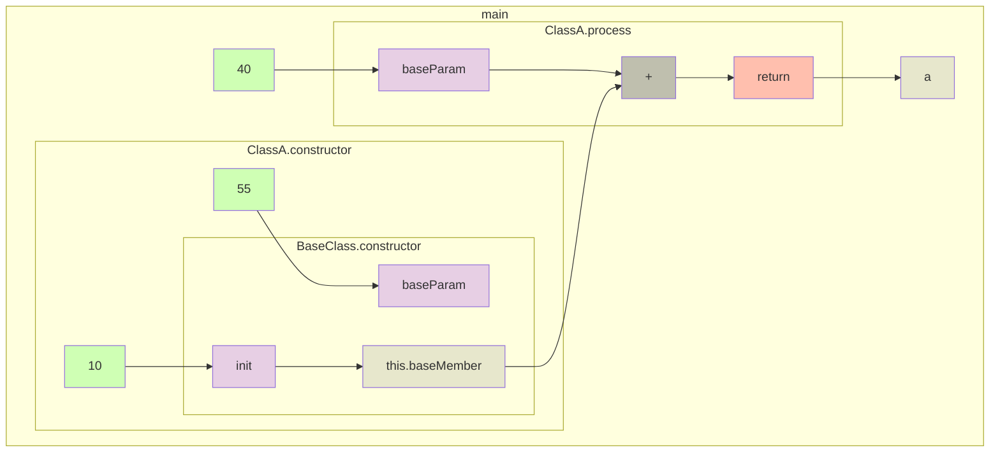

[](https://github.com/gstiebler/codeflow/actions/workflows/gradle.yml)

# codeflow
Generates a dataflow representation from Java code.

For example, converts the following Java code
```java

abstract class BaseClass {
    int baseMember;

    public BaseClass(int init, int baseParam) {
        this.baseMember = init;
    }

    public abstract int process(int baseParam);
}

class ClassA extends BaseClass {
    int aMember;

    public ClassA() {
        super(10, 55);
    }

    @Override
    public int process(int baseParam) {
        return baseMember + baseParam;
    }
}

class ClassB extends BaseClass {
    int bMember;

    public ClassB() {
        super(20, 55);
        this.bMember = 30;
    }

    @Override
    public int process(int baseParam) {
        return baseMember * bMember;
    }
}

public class Main {
    public static void main(String[] args) {
        BaseClass bcPointer;
        bcPointer = new ClassA();
        int a = bcPointer.process(40);
        System.out.println("Result from ClassA: " + a);
    }
}

```

into



## Build and run tests
```shell
./gradlew build
```

## Run the application
```shell
./gradlew run --args="path/to/java/dir"
```
