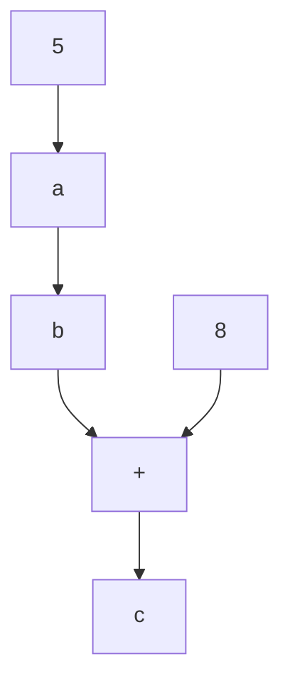

# codeflow
Generates a dataflow representation from Java code.

For example, converts the following Java code
```java
public class App {
    public static void main(String[] args) {
        final int a = 5;
        final int b = a;
        final int c = b + 8;
        System.out.println(b);
    }
}
```

into
