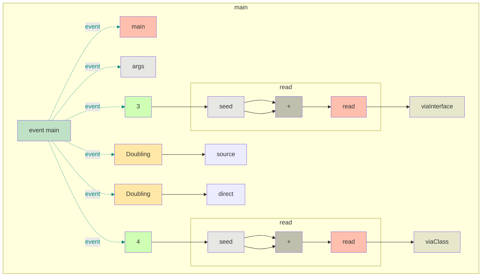

```mermaid
flowchart TD
  subgraph b0["main"]
    n1[event main]:::EVENT
    n2[main]:::RETURN
    n3[args]:::FUNC_PARAM
    n4[Doubling]:::EXTERNAL
    n5[source]:::OBJ_VARIABLE
    n6[3]:::LITERAL
    n11[viaInterface]:::VARIABLE
    n12[Doubling]:::EXTERNAL
    n13[direct]:::OBJ_VARIABLE
    n14[4]:::LITERAL
    n19[viaClass]:::VARIABLE
    n1[event main]:::EVENT -. event .-> n2[main]:::RETURN
    n1[event main]:::EVENT -. event .-> n3[args]:::FUNC_PARAM
    n1[event main]:::EVENT -. event .-> n4[Doubling]:::EXTERNAL
    n1[event main]:::EVENT -. event .-> n6[3]:::LITERAL
    n1[event main]:::EVENT -. event .-> n12[Doubling]:::EXTERNAL
    n1[event main]:::EVENT -. event .-> n14[4]:::LITERAL
    n4[Doubling]:::EXTERNAL --> n5[source]:::OBJ_VARIABLE
    n6[3]:::LITERAL --> n9[seed]:::FUNC_PARAM
    n12[Doubling]:::EXTERNAL --> n13[direct]:::OBJ_VARIABLE
    n14[4]:::LITERAL --> n17[seed]:::FUNC_PARAM
    n8[read]:::RETURN --> n11[viaInterface]:::VARIABLE
    n16[read]:::RETURN --> n19[viaClass]:::VARIABLE
    subgraph b7["read"]
      n8[read]:::RETURN
      n9[seed]:::FUNC_PARAM
      n10[+]:::BIN_OP
      n9[seed]:::FUNC_PARAM --> n10[+]:::BIN_OP
      n9[seed]:::FUNC_PARAM --> n10[+]:::BIN_OP
      n10[+]:::BIN_OP --> n8[read]:::RETURN
    end
    subgraph b15["read"]
      n16[read]:::RETURN
      n17[seed]:::FUNC_PARAM
      n18[+]:::BIN_OP
      n17[seed]:::FUNC_PARAM --> n18[+]:::BIN_OP
      n17[seed]:::FUNC_PARAM --> n18[+]:::BIN_OP
      n18[+]:::BIN_OP --> n16[read]:::RETURN
    end
  end
  linkStyle 0 stroke:#00897b,color:#00897b
  linkStyle 1 stroke:#00897b,color:#00897b
  linkStyle 2 stroke:#00897b,color:#00897b
  linkStyle 3 stroke:#00897b,color:#00897b
  linkStyle 4 stroke:#00897b,color:#00897b
  linkStyle 5 stroke:#00897b,color:#00897b
  classDef LITERAL fill:#00FF0030
  classDef VARIABLE fill:#80808030
  classDef BIN_OP fill:#80808080
  classDef FUNC_PARAM fill:#8080FF30
  classDef RETURN fill:#FF808080
  classDef EXTERNAL fill:#FFA50040
  classDef UNMODELLED fill:#FF000030,stroke-dasharray: 4 2
  classDef EVENT fill:#00897B40
```
