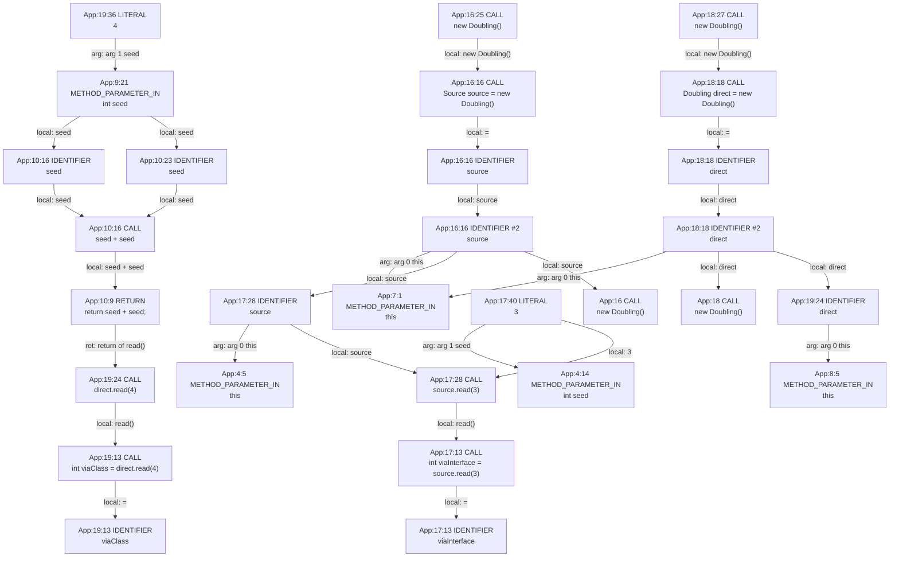

# abstractMethod: spike value graph

```mermaid
flowchart TD
  n0["App:10:16 CALL<br/>seed + seed"]
  n1["App:10:16 IDENTIFIER<br/>seed"]
  n2["App:10:23 IDENTIFIER<br/>seed"]
  n3["App:10:9 RETURN<br/>return seed + seed;"]
  n4["App:16 CALL<br/>new Doubling()"]
  n5["App:16:16 CALL<br/>Source source = new Doubling()"]
  n6["App:16:16 IDENTIFIER #2<br/>source"]
  n7["App:16:16 IDENTIFIER<br/>source"]
  n8["App:16:25 CALL<br/>new Doubling()"]
  n9["App:17:13 CALL<br/>int viaInterface = source.read(3)"]
  n10["App:17:13 IDENTIFIER<br/>viaInterface"]
  n11["App:17:28 CALL<br/>source.read(3)"]
  n12["App:17:28 IDENTIFIER<br/>source"]
  n13["App:17:40 LITERAL<br/>3"]
  n14["App:18 CALL<br/>new Doubling()"]
  n15["App:18:18 CALL<br/>Doubling direct = new Doubling()"]
  n16["App:18:18 IDENTIFIER #2<br/>direct"]
  n17["App:18:18 IDENTIFIER<br/>direct"]
  n18["App:18:27 CALL<br/>new Doubling()"]
  n19["App:19:13 CALL<br/>int viaClass = direct.read(4)"]
  n20["App:19:13 IDENTIFIER<br/>viaClass"]
  n21["App:19:24 CALL<br/>direct.read(4)"]
  n22["App:19:24 IDENTIFIER<br/>direct"]
  n23["App:19:36 LITERAL<br/>4"]
  n24["App:4:14 METHOD_PARAMETER_IN<br/>int seed"]
  n25["App:4:5 METHOD_PARAMETER_IN<br/>this"]
  n26["App:7:1 METHOD_PARAMETER_IN<br/>this"]
  n27["App:8:5 METHOD_PARAMETER_IN<br/>this"]
  n28["App:9:21 METHOD_PARAMETER_IN<br/>int seed"]
  n0 -->|"local: seed + seed"| n3
  n1 -->|"local: seed"| n0
  n11 -->|"local: read()"| n9
  n12 -->|"arg: arg 0 this"| n25
  n12 -->|"local: source"| n11
  n13 -->|"arg: arg 1 seed"| n24
  n13 -->|"local: 3"| n11
  n15 -->|"local: ="| n17
  n16 -->|"arg: arg 0 this"| n26
  n16 -->|"local: direct"| n14
  n16 -->|"local: direct"| n22
  n17 -->|"local: direct"| n16
  n18 -->|"local: new Doubling()"| n15
  n19 -->|"local: ="| n20
  n2 -->|"local: seed"| n0
  n21 -->|"local: read()"| n19
  n22 -->|"arg: arg 0 this"| n27
  n23 -->|"arg: arg 1 seed"| n28
  n28 -->|"local: seed"| n1
  n28 -->|"local: seed"| n2
  n3 -->|"ret: return of read()"| n21
  n5 -->|"local: ="| n7
  n6 -->|"arg: arg 0 this"| n26
  n6 -->|"local: source"| n12
  n6 -->|"local: source"| n4
  n7 -->|"local: source"| n6
  n8 -->|"local: new Doubling()"| n5
  n9 -->|"local: ="| n10
```
