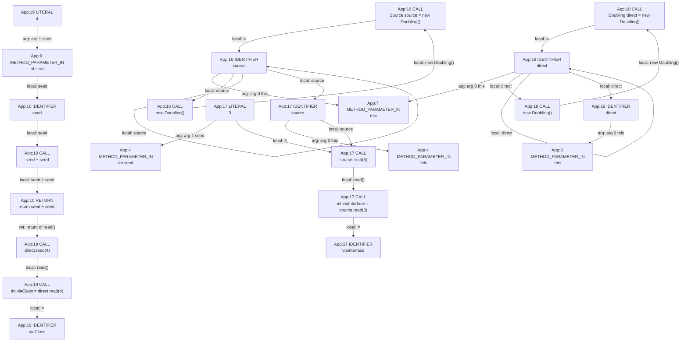

# abstractMethod: spike value graph

```mermaid
flowchart TD
  n0["App:10 CALL<br/>seed + seed"]
  n1["App:10 IDENTIFIER<br/>seed"]
  n2["App:10 RETURN<br/>return seed + seed;"]
  n3["App:16 CALL<br/>Source source = new Doubling()"]
  n4["App:16 CALL<br/>new Doubling()"]
  n5["App:16 IDENTIFIER<br/>source"]
  n6["App:17 CALL<br/>int viaInterface = source.read(3)"]
  n7["App:17 CALL<br/>source.read(3)"]
  n8["App:17 IDENTIFIER<br/>source"]
  n9["App:17 IDENTIFIER<br/>viaInterface"]
  n10["App:17 LITERAL<br/>3"]
  n11["App:18 CALL<br/>Doubling direct = new Doubling()"]
  n12["App:18 CALL<br/>new Doubling()"]
  n13["App:18 IDENTIFIER<br/>direct"]
  n14["App:19 CALL<br/>direct.read(4)"]
  n15["App:19 CALL<br/>int viaClass = direct.read(4)"]
  n16["App:19 IDENTIFIER<br/>direct"]
  n17["App:19 IDENTIFIER<br/>viaClass"]
  n18["App:19 LITERAL<br/>4"]
  n19["App:4 METHOD_PARAMETER_IN<br/>int seed"]
  n20["App:4 METHOD_PARAMETER_IN<br/>this"]
  n21["App:7 METHOD_PARAMETER_IN<br/>this"]
  n22["App:8 METHOD_PARAMETER_IN<br/>this"]
  n23["App:9 METHOD_PARAMETER_IN<br/>int seed"]
  n0 -->|"local: seed + seed"| n2
  n1 -->|"local: seed"| n0
  n10 -->|"arg: arg 1 seed"| n19
  n10 -->|"local: 3"| n7
  n11 -->|"local: ="| n13
  n12 -->|"local: new Doubling()"| n11
  n13 -->|"arg: arg 0 this"| n21
  n13 -->|"local: direct"| n12
  n13 -->|"local: direct"| n13
  n13 -->|"local: direct"| n16
  n14 -->|"local: read()"| n15
  n15 -->|"local: ="| n17
  n16 -->|"arg: arg 0 this"| n22
  n18 -->|"arg: arg 1 seed"| n23
  n2 -->|"ret: return of read()"| n14
  n23 -->|"local: seed"| n1
  n3 -->|"local: ="| n5
  n4 -->|"local: new Doubling()"| n3
  n5 -->|"arg: arg 0 this"| n21
  n5 -->|"local: source"| n4
  n5 -->|"local: source"| n5
  n5 -->|"local: source"| n8
  n6 -->|"local: ="| n9
  n7 -->|"local: read()"| n6
  n8 -->|"arg: arg 0 this"| n20
  n8 -->|"local: source"| n7
```
