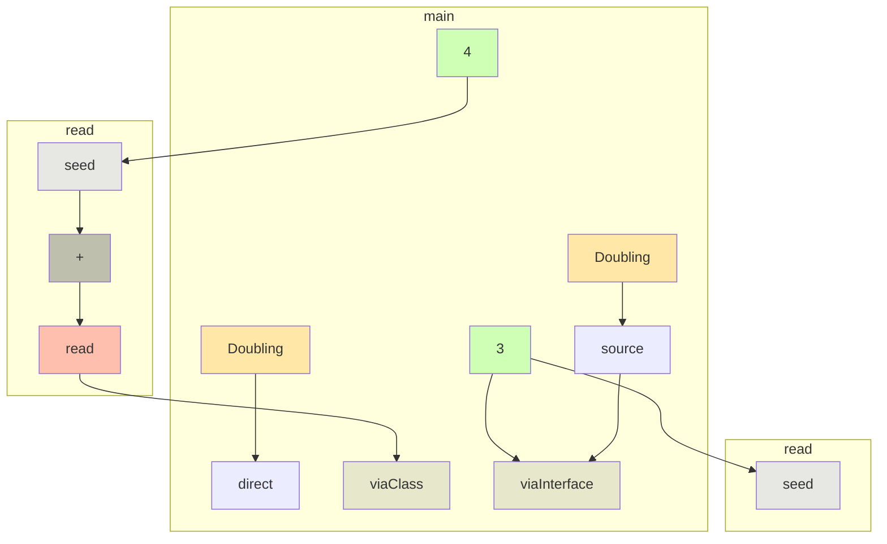

# abstractMethod: spike value graph (condensed)

```mermaid
flowchart TD
  subgraph m0["main"]
    n0["Doubling"]:::EXTERNAL
    n1["Doubling"]:::EXTERNAL
    n2["3"]:::LITERAL
    n3["4"]:::LITERAL
    n4["direct"]:::OBJ_VARIABLE
    n5["source"]:::OBJ_VARIABLE
    n6["viaClass"]:::VARIABLE
    n7["viaInterface"]:::VARIABLE
  end
  subgraph m1["read"]
    n8["+"]:::BIN_OP
    n9["seed"]:::FUNC_PARAM
    n10["read"]:::RETURN
  end
  subgraph m2["read"]
    n11["seed"]:::FUNC_PARAM
  end
  n0 --> n5
  n1 --> n4
  n10 --> n6
  n2 --> n11
  n2 --> n7
  n3 --> n9
  n5 --> n7
  n8 --> n10
  n9 --> n8
  classDef LITERAL fill:#00FF0030
  classDef VARIABLE fill:#80808030
  classDef BIN_OP fill:#80808080
  classDef FUNC_PARAM fill:#8080FF30
  classDef RETURN fill:#FF808080
  classDef EXTERNAL fill:#FFA50040
  classDef UNMODELLED fill:#FF000030,stroke-dasharray: 4 2
```
