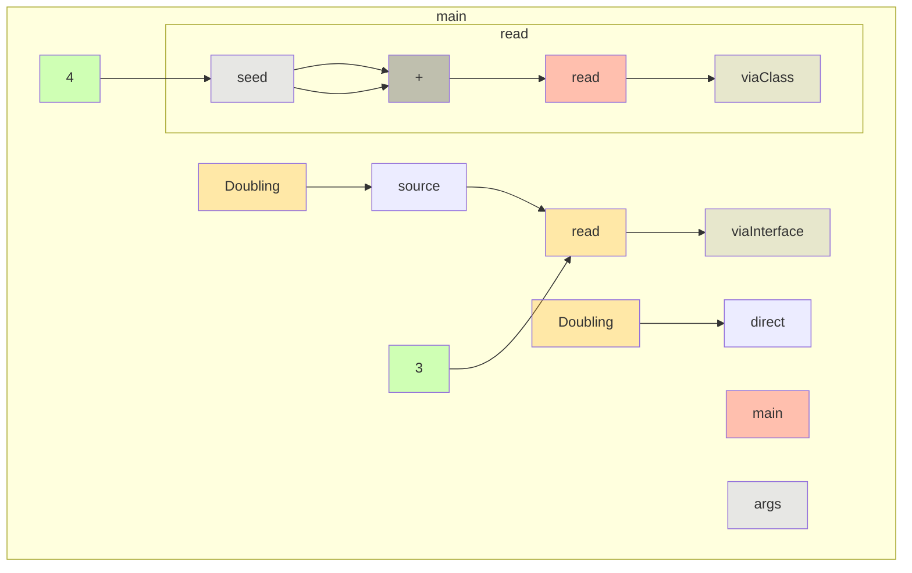

```mermaid
flowchart TD
  subgraph b0["main"]
    n1[main]:::RETURN
    n2[args]:::FUNC_PARAM
    n3[source]:::OBJ_VARIABLE
    n4[Doubling]:::EXTERNAL
    n5[viaInterface]:::VARIABLE
    n6[3]:::LITERAL
    n7[read]:::EXTERNAL
    n8[direct]:::OBJ_VARIABLE
    n9[Doubling]:::EXTERNAL
    n10[viaClass]:::VARIABLE
    n11[4]:::LITERAL
    n3[source]:::OBJ_VARIABLE --> n7[read]:::EXTERNAL
    n4[Doubling]:::EXTERNAL --> n3[source]:::OBJ_VARIABLE
    n6[3]:::LITERAL --> n7[read]:::EXTERNAL
    n7[read]:::EXTERNAL --> n5[viaInterface]:::VARIABLE
    n9[Doubling]:::EXTERNAL --> n8[direct]:::OBJ_VARIABLE
    n11[4]:::LITERAL --> n14[seed]:::FUNC_PARAM
    subgraph b12["read"]
      n13[read]:::RETURN
      n14[seed]:::FUNC_PARAM
      n15[+]:::BIN_OP
      n13[read]:::RETURN --> n10[viaClass]:::VARIABLE
      n14[seed]:::FUNC_PARAM --> n15[+]:::BIN_OP
      n14[seed]:::FUNC_PARAM --> n15[+]:::BIN_OP
      n15[+]:::BIN_OP --> n13[read]:::RETURN
    end
  end
  classDef LITERAL fill:#00FF0030
  classDef VARIABLE fill:#80808030
  classDef BIN_OP fill:#80808080
  classDef FUNC_PARAM fill:#8080FF30
  classDef RETURN fill:#FF808080
  classDef EXTERNAL fill:#FFA50040
```
