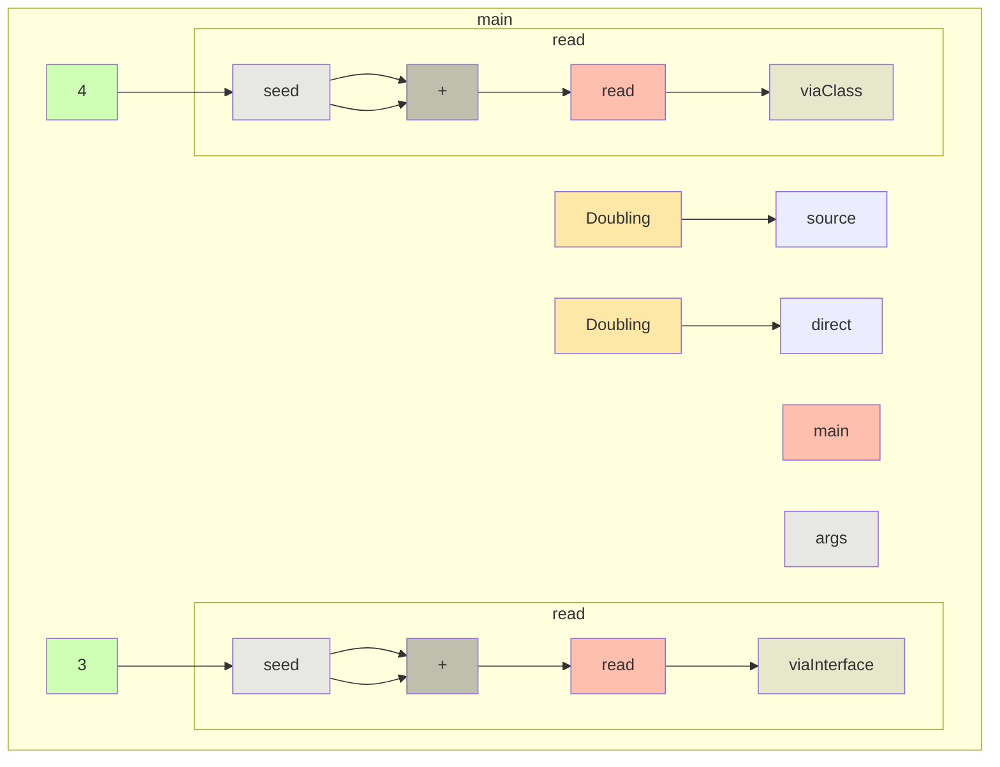

```mermaid
flowchart TD
  subgraph b0["main"]
    n1[main]:::RETURN
    n2[args]:::FUNC_PARAM
    n3[Doubling]:::EXTERNAL
    n4[source]:::OBJ_VARIABLE
    n5[3]:::LITERAL
    n10[viaInterface]:::VARIABLE
    n11[Doubling]:::EXTERNAL
    n12[direct]:::OBJ_VARIABLE
    n13[4]:::LITERAL
    n18[viaClass]:::VARIABLE
    n3[Doubling]:::EXTERNAL --> n4[source]:::OBJ_VARIABLE
    n5[3]:::LITERAL --> n8[seed]:::FUNC_PARAM
    n11[Doubling]:::EXTERNAL --> n12[direct]:::OBJ_VARIABLE
    n13[4]:::LITERAL --> n16[seed]:::FUNC_PARAM
    subgraph b6["read"]
      n7[read]:::RETURN
      n8[seed]:::FUNC_PARAM
      n9[+]:::BIN_OP
      n7[read]:::RETURN --> n10[viaInterface]:::VARIABLE
      n8[seed]:::FUNC_PARAM --> n9[+]:::BIN_OP
      n8[seed]:::FUNC_PARAM --> n9[+]:::BIN_OP
      n9[+]:::BIN_OP --> n7[read]:::RETURN
    end
    subgraph b14["read"]
      n15[read]:::RETURN
      n16[seed]:::FUNC_PARAM
      n17[+]:::BIN_OP
      n15[read]:::RETURN --> n18[viaClass]:::VARIABLE
      n16[seed]:::FUNC_PARAM --> n17[+]:::BIN_OP
      n16[seed]:::FUNC_PARAM --> n17[+]:::BIN_OP
      n17[+]:::BIN_OP --> n15[read]:::RETURN
    end
  end
  classDef LITERAL fill:#00FF0030
  classDef VARIABLE fill:#80808030
  classDef BIN_OP fill:#80808080
  classDef FUNC_PARAM fill:#8080FF30
  classDef RETURN fill:#FF808080
  classDef EXTERNAL fill:#FFA50040
  classDef UNMODELLED fill:#FF000030,stroke-dasharray: 4 2
```
