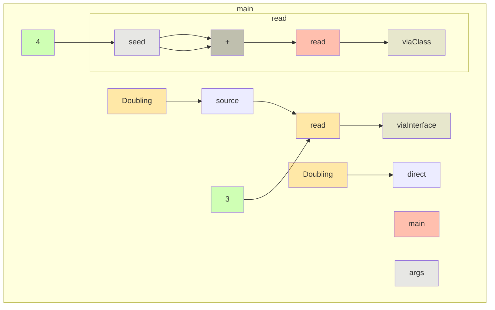

```mermaid
flowchart TD
  subgraph b0["main"]
    n1[main]:::RETURN
    n2[args]:::FUNC_PARAM
    n3[Doubling]:::EXTERNAL
    n4[source]:::OBJ_VARIABLE
    n5[3]:::LITERAL
    n6[read]:::EXTERNAL
    n7[viaInterface]:::VARIABLE
    n8[Doubling]:::EXTERNAL
    n9[direct]:::OBJ_VARIABLE
    n10[4]:::LITERAL
    n15[viaClass]:::VARIABLE
    n3[Doubling]:::EXTERNAL --> n4[source]:::OBJ_VARIABLE
    n4[source]:::OBJ_VARIABLE --> n6[read]:::EXTERNAL
    n5[3]:::LITERAL --> n6[read]:::EXTERNAL
    n6[read]:::EXTERNAL --> n7[viaInterface]:::VARIABLE
    n8[Doubling]:::EXTERNAL --> n9[direct]:::OBJ_VARIABLE
    n10[4]:::LITERAL --> n13[seed]:::FUNC_PARAM
    subgraph b11["read"]
      n12[read]:::RETURN
      n13[seed]:::FUNC_PARAM
      n14[+]:::BIN_OP
      n12[read]:::RETURN --> n15[viaClass]:::VARIABLE
      n13[seed]:::FUNC_PARAM --> n14[+]:::BIN_OP
      n13[seed]:::FUNC_PARAM --> n14[+]:::BIN_OP
      n14[+]:::BIN_OP --> n12[read]:::RETURN
    end
  end
  classDef LITERAL fill:#00FF0030
  classDef VARIABLE fill:#80808030
  classDef BIN_OP fill:#80808080
  classDef FUNC_PARAM fill:#8080FF30
  classDef RETURN fill:#FF808080
  classDef EXTERNAL fill:#FFA50040
```
