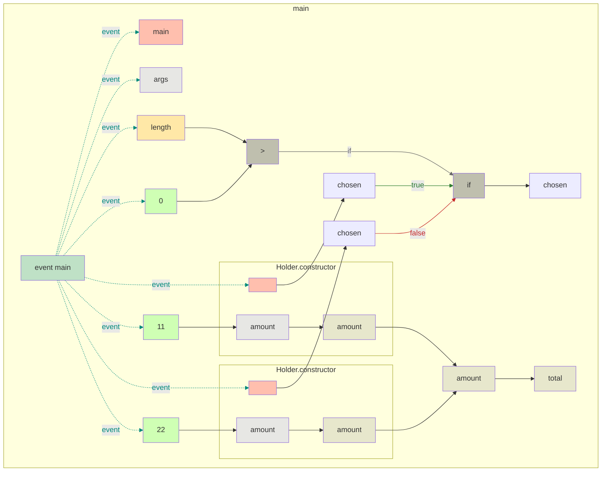

```mermaid
flowchart TD
  subgraph b0["main"]
    n1[event main]:::EVENT
    n2[main]:::RETURN
    n3[args]:::FUNC_PARAM
    n4[length]:::EXTERNAL
    n5[0]:::LITERAL
    n6[>]:::BIN_OP
    n7[11]:::LITERAL
    n12[chosen]:::OBJ_VARIABLE
    n13[22]:::LITERAL
    n18[chosen]:::OBJ_VARIABLE
    n19[if]:::BIN_OP
    n20[chosen]:::OBJ_VARIABLE
    n21[amount]:::VARIABLE
    n22[total]:::VARIABLE
    n1[event main]:::EVENT -. event .-> n2[main]:::RETURN
    n1[event main]:::EVENT -. event .-> n3[args]:::FUNC_PARAM
    n1[event main]:::EVENT -. event .-> n4[length]:::EXTERNAL
    n1[event main]:::EVENT -. event .-> n5[0]:::LITERAL
    n1[event main]:::EVENT -. event .-> n7[11]:::LITERAL
    n1[event main]:::EVENT -. event .-> n13[22]:::LITERAL
    n1[event main]:::EVENT -. event .-> n9[<init>]:::RETURN
    n1[event main]:::EVENT -. event .-> n15[<init>]:::RETURN
    n4[length]:::EXTERNAL --> n6[>]:::BIN_OP
    n5[0]:::LITERAL --> n6[>]:::BIN_OP
    n6[>]:::BIN_OP -->|if| n19[if]:::BIN_OP
    n7[11]:::LITERAL --> n10[amount]:::FUNC_PARAM
    n12[chosen]:::OBJ_VARIABLE -->|true| n19[if]:::BIN_OP
    n13[22]:::LITERAL --> n16[amount]:::FUNC_PARAM
    n18[chosen]:::OBJ_VARIABLE -->|false| n19[if]:::BIN_OP
    n19[if]:::BIN_OP --> n20[chosen]:::OBJ_VARIABLE
    n21[amount]:::VARIABLE --> n22[total]:::VARIABLE
    n9[<init>]:::RETURN --> n12[chosen]:::OBJ_VARIABLE
    n11[amount]:::VARIABLE --> n21[amount]:::VARIABLE
    n15[<init>]:::RETURN --> n18[chosen]:::OBJ_VARIABLE
    n17[amount]:::VARIABLE --> n21[amount]:::VARIABLE
    subgraph b8["Holder.constructor"]
      n9[<init>]:::RETURN
      n10[amount]:::FUNC_PARAM
      n11[amount]:::VARIABLE
      n10[amount]:::FUNC_PARAM --> n11[amount]:::VARIABLE
    end
    subgraph b14["Holder.constructor"]
      n15[<init>]:::RETURN
      n16[amount]:::FUNC_PARAM
      n17[amount]:::VARIABLE
      n16[amount]:::FUNC_PARAM --> n17[amount]:::VARIABLE
    end
  end
  linkStyle 0 stroke:#00897b,color:#00897b
  linkStyle 1 stroke:#00897b,color:#00897b
  linkStyle 2 stroke:#00897b,color:#00897b
  linkStyle 3 stroke:#00897b,color:#00897b
  linkStyle 4 stroke:#00897b,color:#00897b
  linkStyle 5 stroke:#00897b,color:#00897b
  linkStyle 6 stroke:#00897b,color:#00897b
  linkStyle 7 stroke:#00897b,color:#00897b
  linkStyle 10 stroke:#6a6a6a,color:#6a6a6a
  linkStyle 12 stroke:#2e7d32,color:#2e7d32
  linkStyle 14 stroke:#c62828,color:#c62828
  classDef LITERAL fill:#00FF0030
  classDef VARIABLE fill:#80808030
  classDef BIN_OP fill:#80808080
  classDef FUNC_PARAM fill:#8080FF30
  classDef RETURN fill:#FF808080
  classDef EXTERNAL fill:#FFA50040
  classDef UNMODELLED fill:#FF000030,stroke-dasharray: 4 2
  classDef EVENT fill:#00897B40
```
