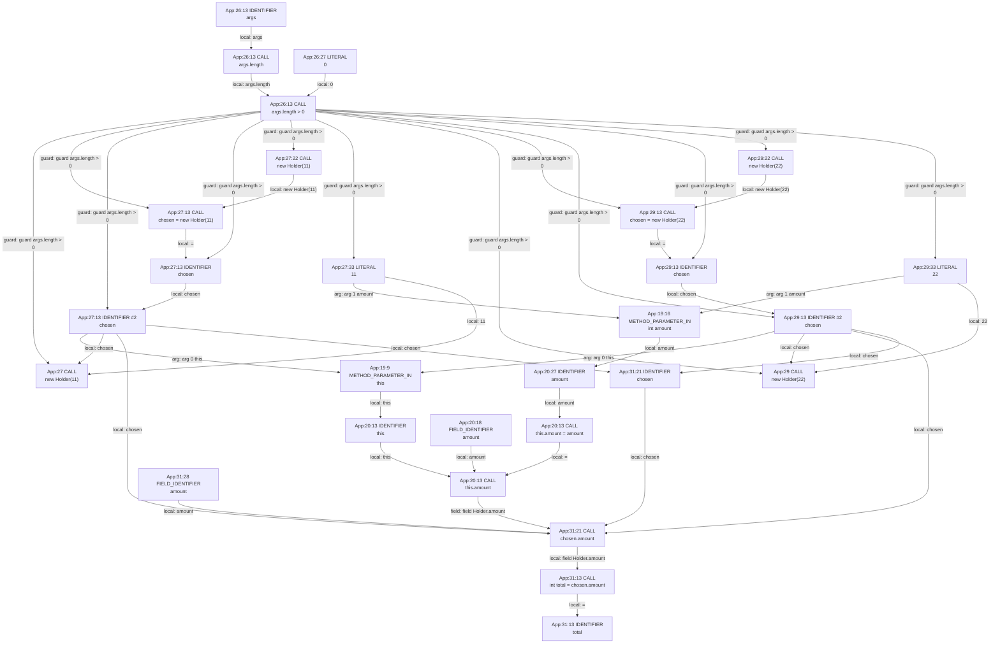

# aliasBranch: spike value graph

```mermaid
flowchart TD
  n0["App:19:16 METHOD_PARAMETER_IN<br/>int amount"]
  n1["App:19:9 METHOD_PARAMETER_IN<br/>this"]
  n2["App:20:13 CALL<br/>this.amount"]
  n3["App:20:13 CALL<br/>this.amount = amount"]
  n4["App:20:13 IDENTIFIER<br/>this"]
  n5["App:20:18 FIELD_IDENTIFIER<br/>amount"]
  n6["App:20:27 IDENTIFIER<br/>amount"]
  n7["App:26:13 CALL<br/>args.length"]
  n8["App:26:13 CALL<br/>args.length #gt; 0"]
  n9["App:26:13 IDENTIFIER<br/>args"]
  n10["App:26:27 LITERAL<br/>0"]
  n11["App:27 CALL<br/>new Holder(11)"]
  n12["App:27:13 CALL<br/>chosen = new Holder(11)"]
  n13["App:27:13 IDENTIFIER #2<br/>chosen"]
  n14["App:27:13 IDENTIFIER<br/>chosen"]
  n15["App:27:22 CALL<br/>new Holder(11)"]
  n16["App:27:33 LITERAL<br/>11"]
  n17["App:29 CALL<br/>new Holder(22)"]
  n18["App:29:13 CALL<br/>chosen = new Holder(22)"]
  n19["App:29:13 IDENTIFIER #2<br/>chosen"]
  n20["App:29:13 IDENTIFIER<br/>chosen"]
  n21["App:29:22 CALL<br/>new Holder(22)"]
  n22["App:29:33 LITERAL<br/>22"]
  n23["App:31:13 CALL<br/>int total = chosen.amount"]
  n24["App:31:13 IDENTIFIER<br/>total"]
  n25["App:31:21 CALL<br/>chosen.amount"]
  n26["App:31:21 IDENTIFIER<br/>chosen"]
  n27["App:31:28 FIELD_IDENTIFIER<br/>amount"]
  n0 -->|"local: amount"| n6
  n1 -->|"local: this"| n4
  n10 -->|"local: 0"| n8
  n12 -->|"local: ="| n14
  n13 -->|"arg: arg 0 this"| n1
  n13 -->|"local: chosen"| n11
  n13 -->|"local: chosen"| n25
  n13 -->|"local: chosen"| n26
  n14 -->|"local: chosen"| n13
  n15 -->|"local: new Holder(11)"| n12
  n16 -->|"arg: arg 1 amount"| n0
  n16 -->|"local: 11"| n11
  n18 -->|"local: ="| n20
  n19 -->|"arg: arg 0 this"| n1
  n19 -->|"local: chosen"| n17
  n19 -->|"local: chosen"| n25
  n19 -->|"local: chosen"| n26
  n2 -->|"field: field Holder.amount"| n25
  n20 -->|"local: chosen"| n19
  n21 -->|"local: new Holder(22)"| n18
  n22 -->|"arg: arg 1 amount"| n0
  n22 -->|"local: 22"| n17
  n23 -->|"local: ="| n24
  n25 -->|"local: field Holder.amount"| n23
  n26 -->|"local: chosen"| n25
  n27 -->|"local: amount"| n25
  n3 -->|"local: ="| n2
  n4 -->|"local: this"| n2
  n5 -->|"local: amount"| n2
  n6 -->|"local: amount"| n3
  n7 -->|"local: args.length"| n8
  n8 -->|"guard: guard args.length #gt; 0"| n11
  n8 -->|"guard: guard args.length #gt; 0"| n12
  n8 -->|"guard: guard args.length #gt; 0"| n13
  n8 -->|"guard: guard args.length #gt; 0"| n14
  n8 -->|"guard: guard args.length #gt; 0"| n15
  n8 -->|"guard: guard args.length #gt; 0"| n16
  n8 -->|"guard: guard args.length #gt; 0"| n17
  n8 -->|"guard: guard args.length #gt; 0"| n18
  n8 -->|"guard: guard args.length #gt; 0"| n19
  n8 -->|"guard: guard args.length #gt; 0"| n20
  n8 -->|"guard: guard args.length #gt; 0"| n21
  n8 -->|"guard: guard args.length #gt; 0"| n22
  n9 -->|"local: args"| n7
```
