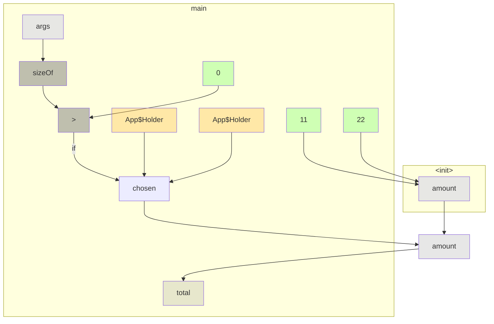

# aliasBranch: spike value graph (condensed)

```mermaid
flowchart TD
  subgraph m0["#lt;init#gt;"]
    n0["amount"]:::FUNC_PARAM
  end
  subgraph m1["main"]
    n1["#gt;"]:::BIN_OP
    n2["sizeOf"]:::BIN_OP
    n3["App$Holder"]:::EXTERNAL
    n4["App$Holder"]:::EXTERNAL
    n5["args"]:::FUNC_PARAM
    n6["0"]:::LITERAL
    n7["11"]:::LITERAL
    n8["22"]:::LITERAL
    n9["chosen"]:::OBJ_VARIABLE
    n10["total"]:::VARIABLE
  end
  n11["amount"]:::VARIABLE
  n0 --> n11
  n1 -->|if| n9
  n11 --> n10
  n2 --> n1
  n3 --> n9
  n4 --> n9
  n5 --> n2
  n6 --> n1
  n7 --> n0
  n8 --> n0
  n9 --> n11
  classDef LITERAL fill:#00FF0030
  classDef VARIABLE fill:#80808030
  classDef BIN_OP fill:#80808080
  classDef FUNC_PARAM fill:#8080FF30
  classDef RETURN fill:#FF808080
  classDef EXTERNAL fill:#FFA50040
  classDef UNMODELLED fill:#FF000030,stroke-dasharray: 4 2
```
