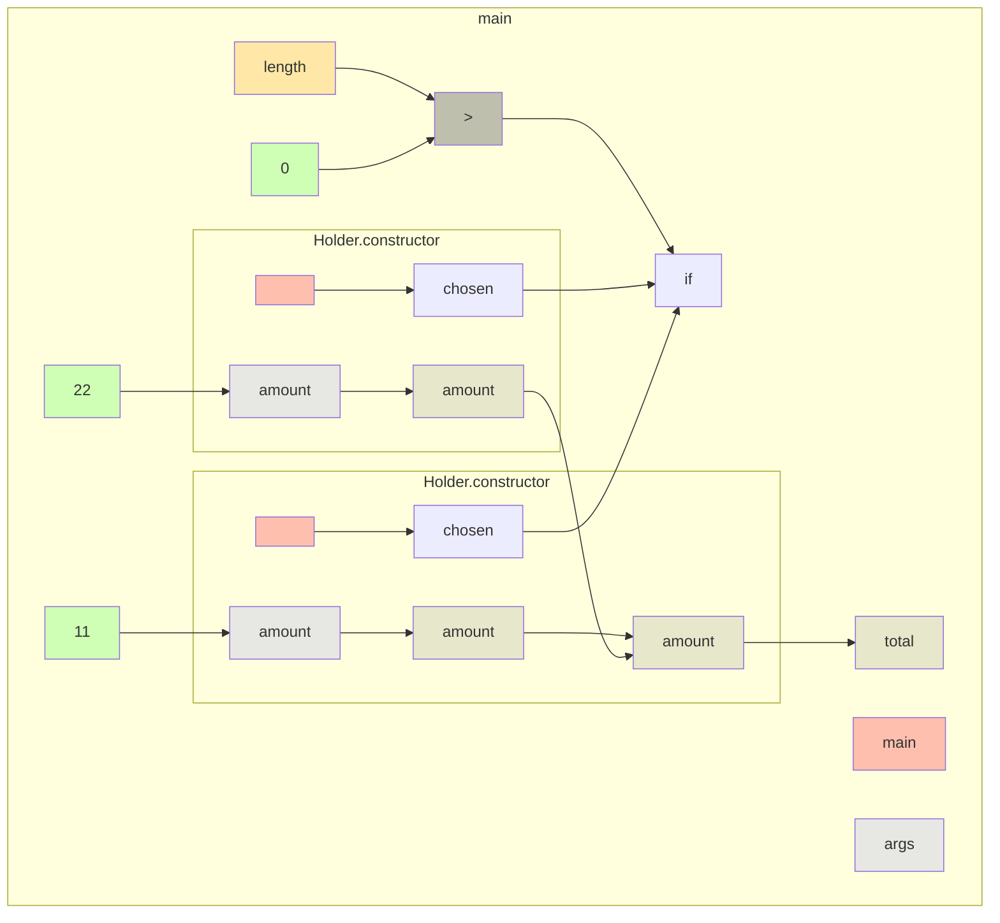

```mermaid
flowchart TD
  subgraph b0["main"]
    n1[main]:::RETURN
    n2[args]:::FUNC_PARAM
    n3[length]:::EXTERNAL
    n4[0]:::LITERAL
    n5[>]:::BIN_OP
    n6[11]:::LITERAL
    n11[chosen]:::OBJ_VARIABLE
    n12[22]:::LITERAL
    n17[chosen]:::OBJ_VARIABLE
    n18[if]:::OBJ_VARIABLE
    n19[amount]:::VARIABLE
    n20[total]:::VARIABLE
    n3[length]:::EXTERNAL --> n5[>]:::BIN_OP
    n4[0]:::LITERAL --> n5[>]:::BIN_OP
    n5[>]:::BIN_OP --> n18[if]:::OBJ_VARIABLE
    n6[11]:::LITERAL --> n9[amount]:::FUNC_PARAM
    n11[chosen]:::OBJ_VARIABLE --> n18[if]:::OBJ_VARIABLE
    n12[22]:::LITERAL --> n15[amount]:::FUNC_PARAM
    n17[chosen]:::OBJ_VARIABLE --> n18[if]:::OBJ_VARIABLE
    n19[amount]:::VARIABLE --> n20[total]:::VARIABLE
    subgraph b7["Holder.constructor"]
      n8[<init>]:::RETURN
      n9[amount]:::FUNC_PARAM
      n10[amount]:::VARIABLE
      n8[<init>]:::RETURN --> n11[chosen]:::OBJ_VARIABLE
      n9[amount]:::FUNC_PARAM --> n10[amount]:::VARIABLE
      n10[amount]:::VARIABLE --> n19[amount]:::VARIABLE
    end
    subgraph b13["Holder.constructor"]
      n14[<init>]:::RETURN
      n15[amount]:::FUNC_PARAM
      n16[amount]:::VARIABLE
      n14[<init>]:::RETURN --> n17[chosen]:::OBJ_VARIABLE
      n15[amount]:::FUNC_PARAM --> n16[amount]:::VARIABLE
      n16[amount]:::VARIABLE --> n19[amount]:::VARIABLE
    end
  end
  classDef LITERAL fill:#00FF0030
  classDef VARIABLE fill:#80808030
  classDef BIN_OP fill:#80808080
  classDef FUNC_PARAM fill:#8080FF30
  classDef RETURN fill:#FF808080
  classDef EXTERNAL fill:#FFA50040
  classDef UNMODELLED fill:#FF000030,stroke-dasharray: 4 2
```
