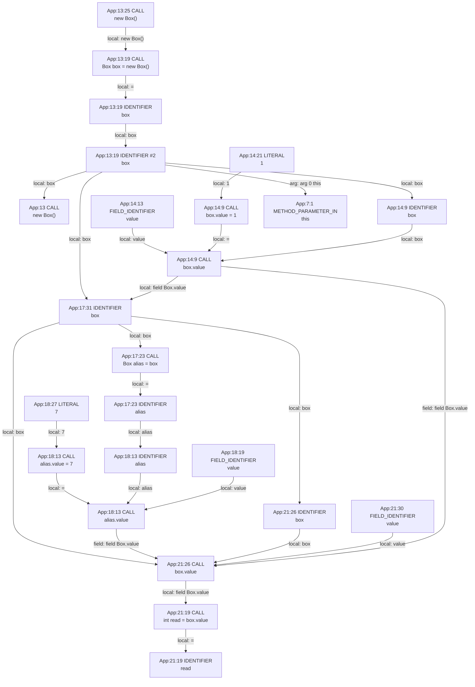

# aliasInBlock: spike value graph

```mermaid
flowchart TD
  n0["App:13 CALL<br/>new Box()"]
  n1["App:13:19 CALL<br/>Box box = new Box()"]
  n2["App:13:19 IDENTIFIER #2<br/>box"]
  n3["App:13:19 IDENTIFIER<br/>box"]
  n4["App:13:25 CALL<br/>new Box()"]
  n5["App:14:13 FIELD_IDENTIFIER<br/>value"]
  n6["App:14:21 LITERAL<br/>1"]
  n7["App:14:9 CALL<br/>box.value"]
  n8["App:14:9 CALL<br/>box.value = 1"]
  n9["App:14:9 IDENTIFIER<br/>box"]
  n10["App:17:23 CALL<br/>Box alias = box"]
  n11["App:17:23 IDENTIFIER<br/>alias"]
  n12["App:17:31 IDENTIFIER<br/>box"]
  n13["App:18:13 CALL<br/>alias.value"]
  n14["App:18:13 CALL<br/>alias.value = 7"]
  n15["App:18:13 IDENTIFIER<br/>alias"]
  n16["App:18:19 FIELD_IDENTIFIER<br/>value"]
  n17["App:18:27 LITERAL<br/>7"]
  n18["App:21:19 CALL<br/>int read = box.value"]
  n19["App:21:19 IDENTIFIER<br/>read"]
  n20["App:21:26 CALL<br/>box.value"]
  n21["App:21:26 IDENTIFIER<br/>box"]
  n22["App:21:30 FIELD_IDENTIFIER<br/>value"]
  n23["App:7:1 METHOD_PARAMETER_IN<br/>this"]
  n1 -->|"local: ="| n3
  n10 -->|"local: ="| n11
  n11 -->|"local: alias"| n15
  n12 -->|"local: box"| n10
  n12 -->|"local: box"| n20
  n12 -->|"local: box"| n21
  n13 -->|"field: field Box.value"| n20
  n14 -->|"local: ="| n13
  n15 -->|"local: alias"| n13
  n16 -->|"local: value"| n13
  n17 -->|"local: 7"| n14
  n18 -->|"local: ="| n19
  n2 -->|"arg: arg 0 this"| n23
  n2 -->|"local: box"| n0
  n2 -->|"local: box"| n12
  n2 -->|"local: box"| n9
  n20 -->|"local: field Box.value"| n18
  n21 -->|"local: box"| n20
  n22 -->|"local: value"| n20
  n3 -->|"local: box"| n2
  n4 -->|"local: new Box()"| n1
  n5 -->|"local: value"| n7
  n6 -->|"local: 1"| n8
  n7 -->|"field: field Box.value"| n20
  n7 -->|"local: field Box.value"| n12
  n8 -->|"local: ="| n7
  n9 -->|"local: box"| n7
```
