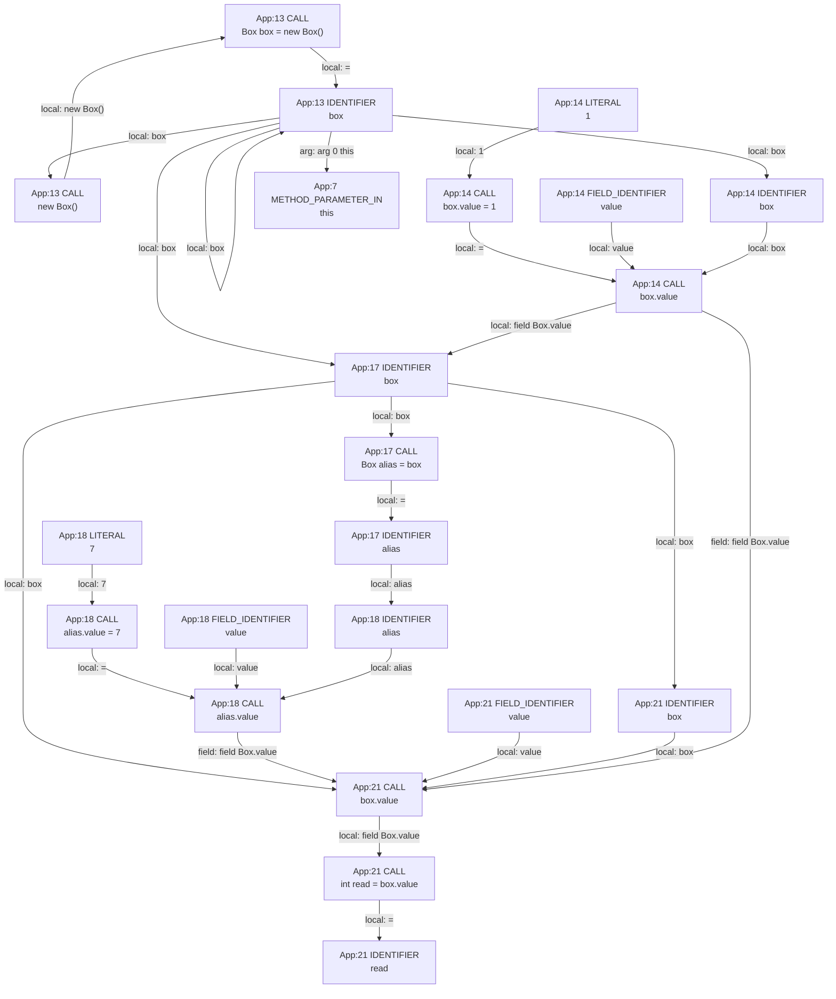

# aliasInBlock: spike value graph

```mermaid
flowchart TD
  n0["App:13 CALL<br/>Box box = new Box()"]
  n1["App:13 CALL<br/>new Box()"]
  n2["App:13 IDENTIFIER<br/>box"]
  n3["App:14 CALL<br/>box.value"]
  n4["App:14 CALL<br/>box.value = 1"]
  n5["App:14 FIELD_IDENTIFIER<br/>value"]
  n6["App:14 IDENTIFIER<br/>box"]
  n7["App:14 LITERAL<br/>1"]
  n8["App:17 CALL<br/>Box alias = box"]
  n9["App:17 IDENTIFIER<br/>alias"]
  n10["App:17 IDENTIFIER<br/>box"]
  n11["App:18 CALL<br/>alias.value"]
  n12["App:18 CALL<br/>alias.value = 7"]
  n13["App:18 FIELD_IDENTIFIER<br/>value"]
  n14["App:18 IDENTIFIER<br/>alias"]
  n15["App:18 LITERAL<br/>7"]
  n16["App:21 CALL<br/>box.value"]
  n17["App:21 CALL<br/>int read = box.value"]
  n18["App:21 FIELD_IDENTIFIER<br/>value"]
  n19["App:21 IDENTIFIER<br/>box"]
  n20["App:21 IDENTIFIER<br/>read"]
  n21["App:7 METHOD_PARAMETER_IN<br/>this"]
  n0 -->|"local: ="| n2
  n1 -->|"local: new Box()"| n0
  n10 -->|"local: box"| n16
  n10 -->|"local: box"| n19
  n10 -->|"local: box"| n8
  n11 -->|"field: field Box.value"| n16
  n12 -->|"local: ="| n11
  n13 -->|"local: value"| n11
  n14 -->|"local: alias"| n11
  n15 -->|"local: 7"| n12
  n16 -->|"local: field Box.value"| n17
  n17 -->|"local: ="| n20
  n18 -->|"local: value"| n16
  n19 -->|"local: box"| n16
  n2 -->|"arg: arg 0 this"| n21
  n2 -->|"local: box"| n1
  n2 -->|"local: box"| n10
  n2 -->|"local: box"| n2
  n2 -->|"local: box"| n6
  n3 -->|"field: field Box.value"| n16
  n3 -->|"local: field Box.value"| n10
  n4 -->|"local: ="| n3
  n5 -->|"local: value"| n3
  n6 -->|"local: box"| n3
  n7 -->|"local: 1"| n4
  n8 -->|"local: ="| n9
  n9 -->|"local: alias"| n14
```
