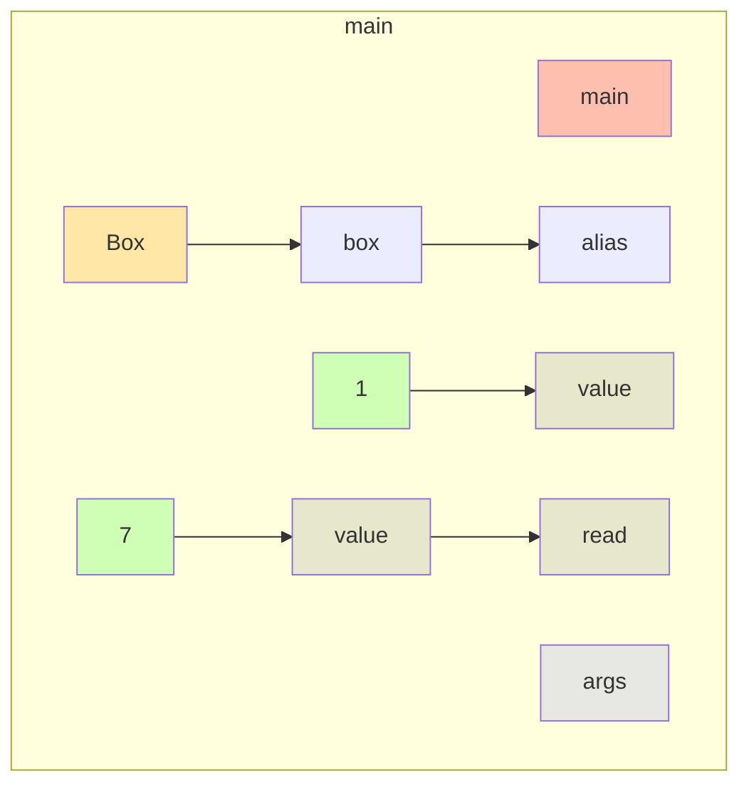

```mermaid
flowchart TD
  subgraph b0["main"]
    n1[main]:::RETURN
    n2[args]:::FUNC_PARAM
    n3[Box]:::EXTERNAL
    n4[box]:::OBJ_VARIABLE
    n5[1]:::LITERAL
    n6[value]:::VARIABLE
    n7[alias]:::OBJ_VARIABLE
    n8[7]:::LITERAL
    n9[value]:::VARIABLE
    n10[read]:::VARIABLE
    n3[Box]:::EXTERNAL --> n4[box]:::OBJ_VARIABLE
    n4[box]:::OBJ_VARIABLE --> n7[alias]:::OBJ_VARIABLE
    n5[1]:::LITERAL --> n6[value]:::VARIABLE
    n8[7]:::LITERAL --> n9[value]:::VARIABLE
    n9[value]:::VARIABLE --> n10[read]:::VARIABLE
  end
  classDef LITERAL fill:#00FF0030
  classDef VARIABLE fill:#80808030
  classDef BIN_OP fill:#80808080
  classDef FUNC_PARAM fill:#8080FF30
  classDef RETURN fill:#FF808080
  classDef EXTERNAL fill:#FFA50040
```
