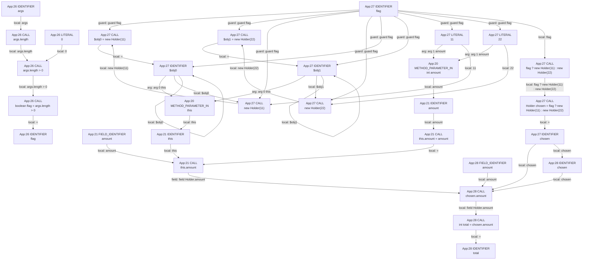

# aliasTernary: spike value graph

```mermaid
flowchart TD
  n0["App:20 METHOD_PARAMETER_IN<br/>int amount"]
  n1["App:20 METHOD_PARAMETER_IN<br/>this"]
  n2["App:21 CALL<br/>this.amount"]
  n3["App:21 CALL<br/>this.amount = amount"]
  n4["App:21 FIELD_IDENTIFIER<br/>amount"]
  n5["App:21 IDENTIFIER<br/>amount"]
  n6["App:21 IDENTIFIER<br/>this"]
  n7["App:26 CALL<br/>args.length"]
  n8["App:26 CALL<br/>args.length #gt; 0"]
  n9["App:26 CALL<br/>boolean flag = args.length #gt; 0"]
  n10["App:26 IDENTIFIER<br/>args"]
  n11["App:26 IDENTIFIER<br/>flag"]
  n12["App:26 LITERAL<br/>0"]
  n13["App:27 CALL<br/>$obj0 = new Holder(11)"]
  n14["App:27 CALL<br/>$obj1 = new Holder(22)"]
  n15["App:27 CALL<br/>Holder chosen = flag ? new Holder(11) : new Holder(22)"]
  n16["App:27 CALL<br/>flag ? new Holder(11) : new Holder(22)"]
  n17["App:27 CALL<br/>new Holder(11)"]
  n18["App:27 CALL<br/>new Holder(22)"]
  n19["App:27 IDENTIFIER<br/>$obj0"]
  n20["App:27 IDENTIFIER<br/>$obj1"]
  n21["App:27 IDENTIFIER<br/>chosen"]
  n22["App:27 IDENTIFIER<br/>flag"]
  n23["App:27 LITERAL<br/>11"]
  n24["App:27 LITERAL<br/>22"]
  n25["App:28 CALL<br/>chosen.amount"]
  n26["App:28 CALL<br/>int total = chosen.amount"]
  n27["App:28 FIELD_IDENTIFIER<br/>amount"]
  n28["App:28 IDENTIFIER<br/>chosen"]
  n29["App:28 IDENTIFIER<br/>total"]
  n0 -->|"local: amount"| n5
  n1 -->|"local: this"| n6
  n10 -->|"local: args"| n7
  n12 -->|"local: 0"| n8
  n13 -->|"local: ="| n19
  n14 -->|"local: ="| n20
  n15 -->|"local: ="| n21
  n16 -->|"local: flag ? new Holder(11) : new Holder(22)"| n15
  n17 -->|"local: new Holder(11)"| n13
  n18 -->|"local: new Holder(22)"| n14
  n19 -->|"arg: arg 0 this"| n1
  n19 -->|"local: $obj0"| n17
  n19 -->|"local: $obj0"| n19
  n2 -->|"field: field Holder.amount"| n25
  n20 -->|"arg: arg 0 this"| n1
  n20 -->|"local: $obj1"| n18
  n20 -->|"local: $obj1"| n20
  n21 -->|"local: chosen"| n25
  n21 -->|"local: chosen"| n28
  n22 -->|"guard: guard flag"| n13
  n22 -->|"guard: guard flag"| n14
  n22 -->|"guard: guard flag"| n17
  n22 -->|"guard: guard flag"| n18
  n22 -->|"guard: guard flag"| n19
  n22 -->|"guard: guard flag"| n20
  n22 -->|"guard: guard flag"| n23
  n22 -->|"guard: guard flag"| n24
  n22 -->|"local: flag"| n16
  n23 -->|"arg: arg 1 amount"| n0
  n23 -->|"local: 11"| n17
  n24 -->|"arg: arg 1 amount"| n0
  n24 -->|"local: 22"| n18
  n25 -->|"local: field Holder.amount"| n26
  n26 -->|"local: ="| n29
  n27 -->|"local: amount"| n25
  n28 -->|"local: chosen"| n25
  n3 -->|"local: ="| n2
  n4 -->|"local: amount"| n2
  n5 -->|"local: amount"| n3
  n6 -->|"local: this"| n2
  n7 -->|"local: args.length"| n8
  n8 -->|"local: args.length #gt; 0"| n9
  n9 -->|"local: ="| n11
```
