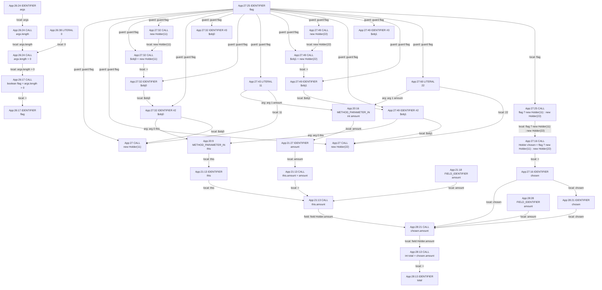

# aliasTernary: spike value graph

```mermaid
flowchart TD
  n0["App:20:16 METHOD_PARAMETER_IN<br/>int amount"]
  n1["App:20:9 METHOD_PARAMETER_IN<br/>this"]
  n2["App:21:13 CALL<br/>this.amount"]
  n3["App:21:13 CALL<br/>this.amount = amount"]
  n4["App:21:13 IDENTIFIER<br/>this"]
  n5["App:21:18 FIELD_IDENTIFIER<br/>amount"]
  n6["App:21:27 IDENTIFIER<br/>amount"]
  n7["App:26:17 CALL<br/>boolean flag = args.length #gt; 0"]
  n8["App:26:17 IDENTIFIER<br/>flag"]
  n9["App:26:24 CALL<br/>args.length"]
  n10["App:26:24 CALL<br/>args.length #gt; 0"]
  n11["App:26:24 IDENTIFIER<br/>args"]
  n12["App:26:38 LITERAL<br/>0"]
  n13["App:27 CALL<br/>new Holder(11)"]
  n14["App:27 CALL<br/>new Holder(22)"]
  n15["App:27:16 CALL<br/>Holder chosen = flag ? new Holder(11) : new Holder(22)"]
  n16["App:27:16 IDENTIFIER<br/>chosen"]
  n17["App:27:25 CALL<br/>flag ? new Holder(11) : new Holder(22)"]
  n18["App:27:25 IDENTIFIER<br/>flag"]
  n19["App:27:32 CALL<br/>$obj0 = new Holder(11)"]
  n20["App:27:32 CALL<br/>new Holder(11)"]
  n21["App:27:32 IDENTIFIER #2<br/>$obj0"]
  n22["App:27:32 IDENTIFIER #3<br/>$obj0"]
  n23["App:27:32 IDENTIFIER<br/>$obj0"]
  n24["App:27:43 LITERAL<br/>11"]
  n25["App:27:49 CALL<br/>$obj1 = new Holder(22)"]
  n26["App:27:49 CALL<br/>new Holder(22)"]
  n27["App:27:49 IDENTIFIER #2<br/>$obj1"]
  n28["App:27:49 IDENTIFIER #3<br/>$obj1"]
  n29["App:27:49 IDENTIFIER<br/>$obj1"]
  n30["App:27:60 LITERAL<br/>22"]
  n31["App:28:13 CALL<br/>int total = chosen.amount"]
  n32["App:28:13 IDENTIFIER<br/>total"]
  n33["App:28:21 CALL<br/>chosen.amount"]
  n34["App:28:21 IDENTIFIER<br/>chosen"]
  n35["App:28:28 FIELD_IDENTIFIER<br/>amount"]
  n0 -->|"local: amount"| n6
  n1 -->|"local: this"| n4
  n10 -->|"local: args.length #gt; 0"| n7
  n11 -->|"local: args"| n9
  n12 -->|"local: 0"| n10
  n15 -->|"local: ="| n16
  n16 -->|"local: chosen"| n33
  n16 -->|"local: chosen"| n34
  n17 -->|"local: flag ? new Holder(11) : new Holder(22)"| n15
  n18 -->|"guard: guard flag"| n13
  n18 -->|"guard: guard flag"| n14
  n18 -->|"guard: guard flag"| n19
  n18 -->|"guard: guard flag"| n20
  n18 -->|"guard: guard flag"| n21
  n18 -->|"guard: guard flag"| n22
  n18 -->|"guard: guard flag"| n23
  n18 -->|"guard: guard flag"| n24
  n18 -->|"guard: guard flag"| n25
  n18 -->|"guard: guard flag"| n26
  n18 -->|"guard: guard flag"| n27
  n18 -->|"guard: guard flag"| n28
  n18 -->|"guard: guard flag"| n29
  n18 -->|"guard: guard flag"| n30
  n18 -->|"local: flag"| n17
  n19 -->|"local: ="| n23
  n2 -->|"field: field Holder.amount"| n33
  n20 -->|"local: new Holder(11)"| n19
  n21 -->|"arg: arg 0 this"| n1
  n21 -->|"local: $obj0"| n13
  n23 -->|"local: $obj0"| n21
  n24 -->|"arg: arg 1 amount"| n0
  n24 -->|"local: 11"| n13
  n25 -->|"local: ="| n29
  n26 -->|"local: new Holder(22)"| n25
  n27 -->|"arg: arg 0 this"| n1
  n27 -->|"local: $obj1"| n14
  n29 -->|"local: $obj1"| n27
  n3 -->|"local: ="| n2
  n30 -->|"arg: arg 1 amount"| n0
  n30 -->|"local: 22"| n14
  n31 -->|"local: ="| n32
  n33 -->|"local: field Holder.amount"| n31
  n34 -->|"local: chosen"| n33
  n35 -->|"local: amount"| n33
  n4 -->|"local: this"| n2
  n5 -->|"local: amount"| n2
  n6 -->|"local: amount"| n3
  n7 -->|"local: ="| n8
  n9 -->|"local: args.length"| n10
```
