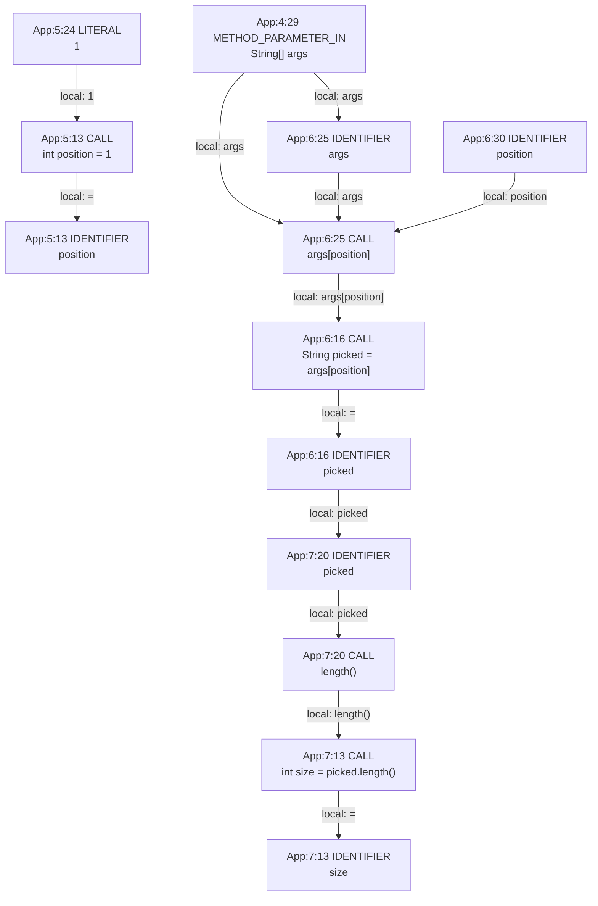

# arrayAccess: spike value graph

```mermaid
flowchart TD
  n0["App:4:29 METHOD_PARAMETER_IN<br/>String[] args"]
  n1["App:5:13 CALL<br/>int position = 1"]
  n2["App:5:13 IDENTIFIER<br/>position"]
  n3["App:5:24 LITERAL<br/>1"]
  n4["App:6:16 CALL<br/>String picked = args[position]"]
  n5["App:6:16 IDENTIFIER<br/>picked"]
  n6["App:6:25 CALL<br/>args[position]"]
  n7["App:6:25 IDENTIFIER<br/>args"]
  n8["App:6:30 IDENTIFIER<br/>position"]
  n9["App:7:13 CALL<br/>int size = picked.length()"]
  n10["App:7:13 IDENTIFIER<br/>size"]
  n11["App:7:20 CALL<br/>length()"]
  n12["App:7:20 IDENTIFIER<br/>picked"]
  n0 -->|"local: args"| n6
  n0 -->|"local: args"| n7
  n1 -->|"local: ="| n2
  n11 -->|"local: length()"| n9
  n12 -->|"local: picked"| n11
  n3 -->|"local: 1"| n1
  n4 -->|"local: ="| n5
  n5 -->|"local: picked"| n12
  n6 -->|"local: args[position]"| n4
  n7 -->|"local: args"| n6
  n8 -->|"local: position"| n6
  n9 -->|"local: ="| n10
```
