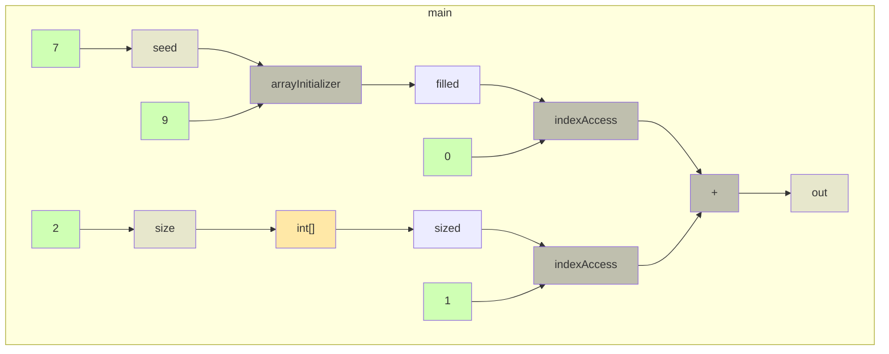

# arrayCreation: spike value graph (condensed)

```mermaid
flowchart TD
  subgraph m0["main"]
    n0["+"]:::BIN_OP
    n1["arrayInitializer"]:::BIN_OP
    n2["indexAccess"]:::BIN_OP
    n3["indexAccess"]:::BIN_OP
    n4["int[]"]:::EXTERNAL
    n5["0"]:::LITERAL
    n6["1"]:::LITERAL
    n7["2"]:::LITERAL
    n8["7"]:::LITERAL
    n9["9"]:::LITERAL
    n10["filled"]:::OBJ_VARIABLE
    n11["out"]:::VARIABLE
    n12["seed"]:::VARIABLE
    n13["size"]:::VARIABLE
    n14["sized"]:::OBJ_VARIABLE
  end
  n0 --> n11
  n1 --> n10
  n10 --> n2
  n12 --> n1
  n13 --> n4
  n14 --> n3
  n2 --> n0
  n3 --> n0
  n4 --> n14
  n5 --> n2
  n6 --> n3
  n7 --> n13
  n8 --> n12
  n9 --> n1
  classDef LITERAL fill:#00FF0030
  classDef VARIABLE fill:#80808030
  classDef BIN_OP fill:#80808080
  classDef FUNC_PARAM fill:#8080FF30
  classDef RETURN fill:#FF808080
  classDef EXTERNAL fill:#FFA50040
  classDef UNMODELLED fill:#FF000030,stroke-dasharray: 4 2
```
