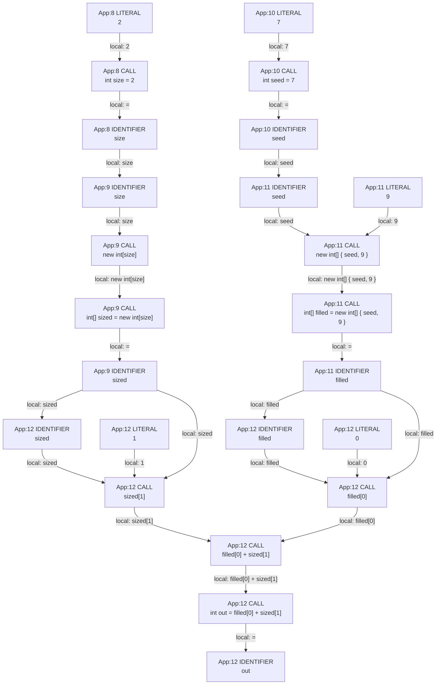

# arrayCreation: spike value graph

```mermaid
flowchart TD
  n0["App:10 CALL<br/>int seed = 7"]
  n1["App:10 IDENTIFIER<br/>seed"]
  n2["App:10 LITERAL<br/>7"]
  n3["App:11 CALL<br/>int[] filled = new int[] { seed, 9 }"]
  n4["App:11 CALL<br/>new int[] { seed, 9 }"]
  n5["App:11 IDENTIFIER<br/>filled"]
  n6["App:11 IDENTIFIER<br/>seed"]
  n7["App:11 LITERAL<br/>9"]
  n8["App:12 CALL<br/>filled[0]"]
  n9["App:12 CALL<br/>filled[0] + sized[1]"]
  n10["App:12 CALL<br/>int out = filled[0] + sized[1]"]
  n11["App:12 CALL<br/>sized[1]"]
  n12["App:12 IDENTIFIER<br/>filled"]
  n13["App:12 IDENTIFIER<br/>out"]
  n14["App:12 IDENTIFIER<br/>sized"]
  n15["App:12 LITERAL<br/>0"]
  n16["App:12 LITERAL<br/>1"]
  n17["App:8 CALL<br/>int size = 2"]
  n18["App:8 IDENTIFIER<br/>size"]
  n19["App:8 LITERAL<br/>2"]
  n20["App:9 CALL<br/>int[] sized = new int[size]"]
  n21["App:9 CALL<br/>new int[size]"]
  n22["App:9 IDENTIFIER<br/>size"]
  n23["App:9 IDENTIFIER<br/>sized"]
  n0 -->|"local: ="| n1
  n1 -->|"local: seed"| n6
  n10 -->|"local: ="| n13
  n11 -->|"local: sized[1]"| n9
  n12 -->|"local: filled"| n8
  n14 -->|"local: sized"| n11
  n15 -->|"local: 0"| n8
  n16 -->|"local: 1"| n11
  n17 -->|"local: ="| n18
  n18 -->|"local: size"| n22
  n19 -->|"local: 2"| n17
  n2 -->|"local: 7"| n0
  n20 -->|"local: ="| n23
  n21 -->|"local: new int[size]"| n20
  n22 -->|"local: size"| n21
  n23 -->|"local: sized"| n11
  n23 -->|"local: sized"| n14
  n3 -->|"local: ="| n5
  n4 -->|"local: new int[] { seed, 9 }"| n3
  n5 -->|"local: filled"| n12
  n5 -->|"local: filled"| n8
  n6 -->|"local: seed"| n4
  n7 -->|"local: 9"| n4
  n8 -->|"local: filled[0]"| n9
  n9 -->|"local: filled[0] + sized[1]"| n10
```
