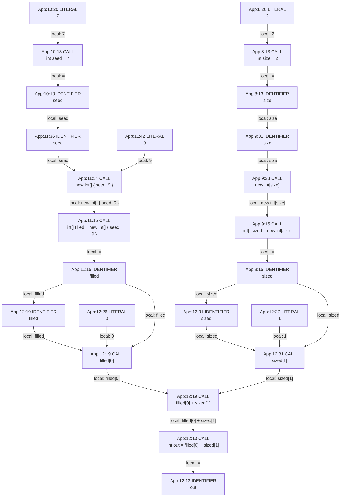

# arrayCreation: spike value graph

```mermaid
flowchart TD
  n0["App:10:13 CALL<br/>int seed = 7"]
  n1["App:10:13 IDENTIFIER<br/>seed"]
  n2["App:10:20 LITERAL<br/>7"]
  n3["App:11:15 CALL<br/>int[] filled = new int[] { seed, 9 }"]
  n4["App:11:15 IDENTIFIER<br/>filled"]
  n5["App:11:34 CALL<br/>new int[] { seed, 9 }"]
  n6["App:11:36 IDENTIFIER<br/>seed"]
  n7["App:11:42 LITERAL<br/>9"]
  n8["App:12:13 CALL<br/>int out = filled[0] + sized[1]"]
  n9["App:12:13 IDENTIFIER<br/>out"]
  n10["App:12:19 CALL<br/>filled[0]"]
  n11["App:12:19 CALL<br/>filled[0] + sized[1]"]
  n12["App:12:19 IDENTIFIER<br/>filled"]
  n13["App:12:26 LITERAL<br/>0"]
  n14["App:12:31 CALL<br/>sized[1]"]
  n15["App:12:31 IDENTIFIER<br/>sized"]
  n16["App:12:37 LITERAL<br/>1"]
  n17["App:8:13 CALL<br/>int size = 2"]
  n18["App:8:13 IDENTIFIER<br/>size"]
  n19["App:8:20 LITERAL<br/>2"]
  n20["App:9:15 CALL<br/>int[] sized = new int[size]"]
  n21["App:9:15 IDENTIFIER<br/>sized"]
  n22["App:9:23 CALL<br/>new int[size]"]
  n23["App:9:31 IDENTIFIER<br/>size"]
  n0 -->|"local: ="| n1
  n1 -->|"local: seed"| n6
  n10 -->|"local: filled[0]"| n11
  n11 -->|"local: filled[0] + sized[1]"| n8
  n12 -->|"local: filled"| n10
  n13 -->|"local: 0"| n10
  n14 -->|"local: sized[1]"| n11
  n15 -->|"local: sized"| n14
  n16 -->|"local: 1"| n14
  n17 -->|"local: ="| n18
  n18 -->|"local: size"| n23
  n19 -->|"local: 2"| n17
  n2 -->|"local: 7"| n0
  n20 -->|"local: ="| n21
  n21 -->|"local: sized"| n14
  n21 -->|"local: sized"| n15
  n22 -->|"local: new int[size]"| n20
  n23 -->|"local: size"| n22
  n3 -->|"local: ="| n4
  n4 -->|"local: filled"| n10
  n4 -->|"local: filled"| n12
  n5 -->|"local: new int[] { seed, 9 }"| n3
  n6 -->|"local: seed"| n5
  n7 -->|"local: 9"| n5
  n8 -->|"local: ="| n9
```
