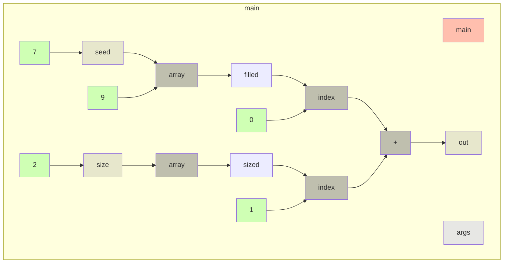

```mermaid
flowchart TD
  subgraph b0["main"]
    n1[main]:::RETURN
    n2[args]:::FUNC_PARAM
    n3[size]:::VARIABLE
    n4[2]:::LITERAL
    n5[sized]:::OBJ_VARIABLE
    n6[array]:::BIN_OP
    n7[seed]:::VARIABLE
    n8[7]:::LITERAL
    n9[filled]:::OBJ_VARIABLE
    n10[9]:::LITERAL
    n11[array]:::BIN_OP
    n12[out]:::VARIABLE
    n13[0]:::LITERAL
    n14[index]:::BIN_OP
    n15[1]:::LITERAL
    n16[index]:::BIN_OP
    n17[+]:::BIN_OP
    n3[size]:::VARIABLE --> n6[array]:::BIN_OP
    n4[2]:::LITERAL --> n3[size]:::VARIABLE
    n5[sized]:::OBJ_VARIABLE --> n16[index]:::BIN_OP
    n6[array]:::BIN_OP --> n5[sized]:::OBJ_VARIABLE
    n7[seed]:::VARIABLE --> n11[array]:::BIN_OP
    n8[7]:::LITERAL --> n7[seed]:::VARIABLE
    n9[filled]:::OBJ_VARIABLE --> n14[index]:::BIN_OP
    n10[9]:::LITERAL --> n11[array]:::BIN_OP
    n11[array]:::BIN_OP --> n9[filled]:::OBJ_VARIABLE
    n13[0]:::LITERAL --> n14[index]:::BIN_OP
    n14[index]:::BIN_OP --> n17[+]:::BIN_OP
    n15[1]:::LITERAL --> n16[index]:::BIN_OP
    n16[index]:::BIN_OP --> n17[+]:::BIN_OP
    n17[+]:::BIN_OP --> n12[out]:::VARIABLE
  end
  classDef LITERAL fill:#00FF0030
  classDef VARIABLE fill:#80808030
  classDef BIN_OP fill:#80808080
  classDef FUNC_PARAM fill:#8080FF30
  classDef RETURN fill:#FF808080
  classDef EXTERNAL fill:#FFA50040
```
