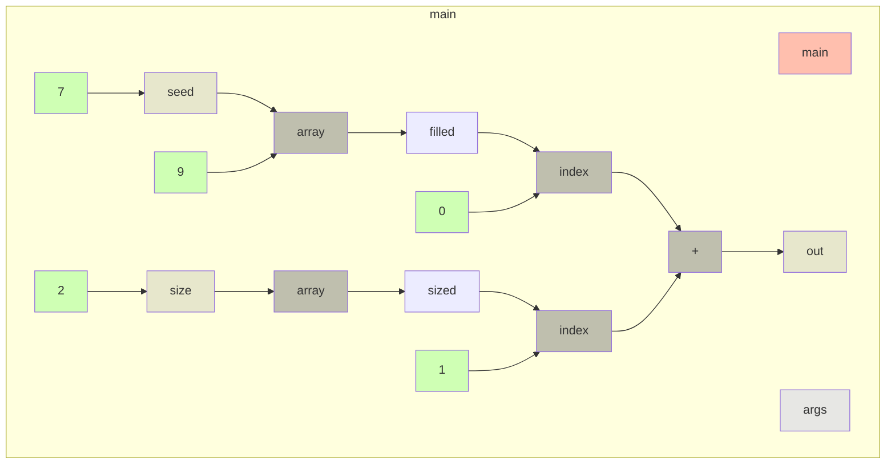

```mermaid
flowchart TD
  subgraph b0["main"]
    n1[main]:::RETURN
    n2[args]:::FUNC_PARAM
    n3[2]:::LITERAL
    n4[size]:::VARIABLE
    n5[array]:::BIN_OP
    n6[sized]:::OBJ_VARIABLE
    n7[7]:::LITERAL
    n8[seed]:::VARIABLE
    n9[9]:::LITERAL
    n10[array]:::BIN_OP
    n11[filled]:::OBJ_VARIABLE
    n12[0]:::LITERAL
    n13[index]:::BIN_OP
    n14[1]:::LITERAL
    n15[index]:::BIN_OP
    n16[+]:::BIN_OP
    n17[out]:::VARIABLE
    n3[2]:::LITERAL --> n4[size]:::VARIABLE
    n4[size]:::VARIABLE --> n5[array]:::BIN_OP
    n5[array]:::BIN_OP --> n6[sized]:::OBJ_VARIABLE
    n6[sized]:::OBJ_VARIABLE --> n15[index]:::BIN_OP
    n7[7]:::LITERAL --> n8[seed]:::VARIABLE
    n8[seed]:::VARIABLE --> n10[array]:::BIN_OP
    n9[9]:::LITERAL --> n10[array]:::BIN_OP
    n10[array]:::BIN_OP --> n11[filled]:::OBJ_VARIABLE
    n11[filled]:::OBJ_VARIABLE --> n13[index]:::BIN_OP
    n12[0]:::LITERAL --> n13[index]:::BIN_OP
    n13[index]:::BIN_OP --> n16[+]:::BIN_OP
    n14[1]:::LITERAL --> n15[index]:::BIN_OP
    n15[index]:::BIN_OP --> n16[+]:::BIN_OP
    n16[+]:::BIN_OP --> n17[out]:::VARIABLE
  end
  classDef LITERAL fill:#00FF0030
  classDef VARIABLE fill:#80808030
  classDef BIN_OP fill:#80808080
  classDef FUNC_PARAM fill:#8080FF30
  classDef RETURN fill:#FF808080
  classDef EXTERNAL fill:#FFA50040
  classDef UNMODELLED fill:#FF000030,stroke-dasharray: 4 2
```
