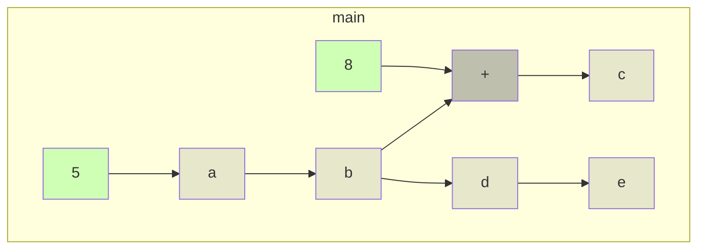

# base: spike value graph (condensed)

```mermaid
flowchart TD
  subgraph m0["main"]
    n0["+"]:::BIN_OP
    n1["5"]:::LITERAL
    n2["8"]:::LITERAL
    n3["a"]:::VARIABLE
    n4["b"]:::VARIABLE
    n5["c"]:::VARIABLE
    n6["d"]:::VARIABLE
    n7["e"]:::VARIABLE
  end
  n0 --> n5
  n1 --> n3
  n2 --> n0
  n3 --> n4
  n4 --> n0
  n4 --> n6
  n6 --> n7
  classDef LITERAL fill:#00FF0030
  classDef VARIABLE fill:#80808030
  classDef BIN_OP fill:#80808080
  classDef FUNC_PARAM fill:#8080FF30
  classDef RETURN fill:#FF808080
  classDef EXTERNAL fill:#FFA50040
  classDef UNMODELLED fill:#FF000030,stroke-dasharray: 4 2
```
