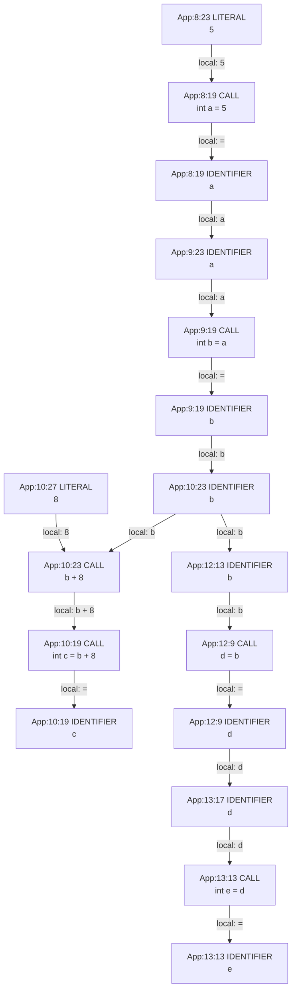

# base: spike value graph

```mermaid
flowchart TD
  n0["App:10:19 CALL<br/>int c = b + 8"]
  n1["App:10:19 IDENTIFIER<br/>c"]
  n2["App:10:23 CALL<br/>b + 8"]
  n3["App:10:23 IDENTIFIER<br/>b"]
  n4["App:10:27 LITERAL<br/>8"]
  n5["App:12:13 IDENTIFIER<br/>b"]
  n6["App:12:9 CALL<br/>d = b"]
  n7["App:12:9 IDENTIFIER<br/>d"]
  n8["App:13:13 CALL<br/>int e = d"]
  n9["App:13:13 IDENTIFIER<br/>e"]
  n10["App:13:17 IDENTIFIER<br/>d"]
  n11["App:8:19 CALL<br/>int a = 5"]
  n12["App:8:19 IDENTIFIER<br/>a"]
  n13["App:8:23 LITERAL<br/>5"]
  n14["App:9:19 CALL<br/>int b = a"]
  n15["App:9:19 IDENTIFIER<br/>b"]
  n16["App:9:23 IDENTIFIER<br/>a"]
  n0 -->|"local: ="| n1
  n10 -->|"local: d"| n8
  n11 -->|"local: ="| n12
  n12 -->|"local: a"| n16
  n13 -->|"local: 5"| n11
  n14 -->|"local: ="| n15
  n15 -->|"local: b"| n3
  n16 -->|"local: a"| n14
  n2 -->|"local: b + 8"| n0
  n3 -->|"local: b"| n2
  n3 -->|"local: b"| n5
  n4 -->|"local: 8"| n2
  n5 -->|"local: b"| n6
  n6 -->|"local: ="| n7
  n7 -->|"local: d"| n10
  n8 -->|"local: ="| n9
```
