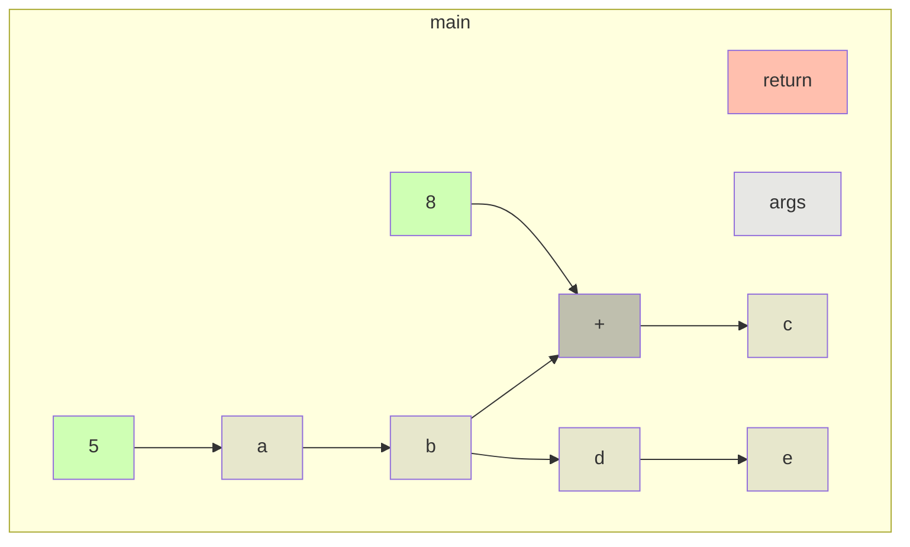

```mermaid
flowchart TD
  subgraph main
    75665666[return]:::RETURN
    75665690[args]:::FUNC_PARAM
    75665715[a]:::VARIABLE
    75665729[5]:::LITERAL
    75665740[b]:::VARIABLE
    75665765[c]:::VARIABLE
    75665779[+]:::BIN_OP
    75665783[8]:::LITERAL
    75665809[d]:::VARIABLE
    75665824[e]:::VARIABLE
    75665715[a]:::VARIABLE --> 75665740[b]:::VARIABLE
    75665729[5]:::LITERAL --> 75665715[a]:::VARIABLE
    75665740[b]:::VARIABLE --> 75665779[+]:::BIN_OP
    75665740[b]:::VARIABLE --> 75665809[d]:::VARIABLE
    75665779[+]:::BIN_OP --> 75665765[c]:::VARIABLE
    75665783[8]:::LITERAL --> 75665779[+]:::BIN_OP
    75665809[d]:::VARIABLE --> 75665824[e]:::VARIABLE
  end
  classDef LITERAL fill:#00FF0030
  classDef VARIABLE fill:#80808030
  classDef BIN_OP fill:#80808080
  classDef FUNC_PARAM fill:#8080FF30
  classDef RETURN fill:#FF808080
```
