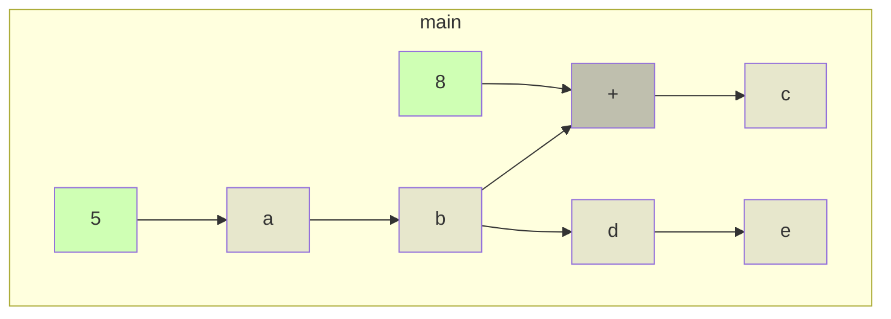

```mermaid
flowchart TD
  subgraph main
    8[5]:::LITERAL --> 9[a]:::VARIABLE
    9[a]:::VARIABLE --> 10[b]:::VARIABLE
    10[b]:::VARIABLE --> 12[+]:::BIN_OP
    10[b]:::VARIABLE --> 14[d]:::VARIABLE
    11[8]:::LITERAL --> 12[+]:::BIN_OP
    12[+]:::BIN_OP --> 13[c]:::VARIABLE
    14[d]:::VARIABLE --> 15[e]:::VARIABLE
  end
  classDef LITERAL fill:#00FF0030
  classDef VARIABLE fill:#80808030
  classDef BIN_OP fill:#80808080
  classDef FUNC_PARAM fill:#8080FF30
  classDef RETURN fill:#FF808080
```
