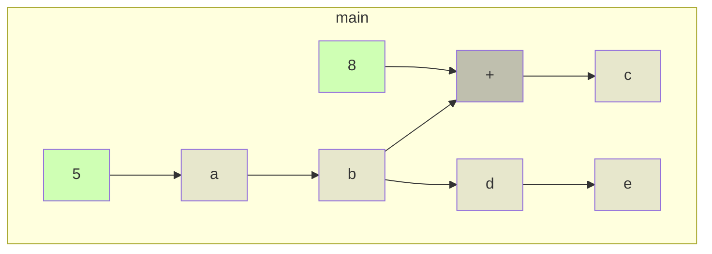

```mermaid
flowchart TD
  subgraph main
    2[5]:::LITERAL --> 3[a]:::VARIABLE
    3[a]:::VARIABLE --> 4[b]:::VARIABLE
    4[b]:::VARIABLE --> 6[+]:::BIN_OP
    4[b]:::VARIABLE --> 8[d]:::VARIABLE
    5[8]:::LITERAL --> 6[+]:::BIN_OP
    6[+]:::BIN_OP --> 7[c]:::VARIABLE
    8[d]:::VARIABLE --> 9[e]:::VARIABLE
  end
  classDef LITERAL fill:#00FF0030
  classDef VARIABLE fill:#80808030
  classDef BIN_OP fill:#80808080
  classDef FUNC_PARAM fill:#8080FF30
  classDef RETURN fill:#FF808080
```
