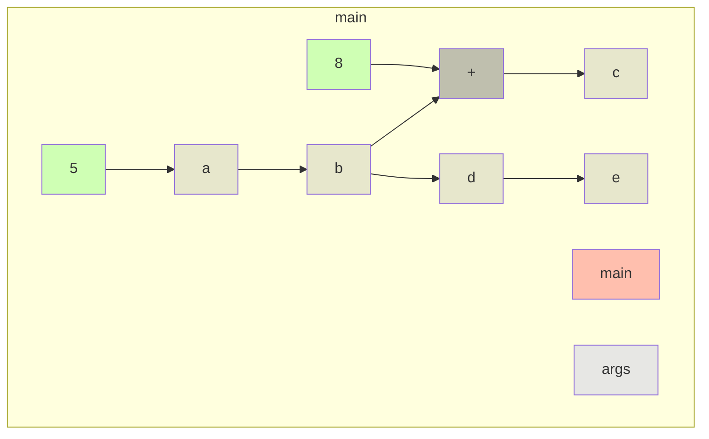

```mermaid
flowchart TD
  subgraph 4308940["main"]
    202069[a]:::VARIABLE
    205367[5]:::LITERAL
    209311[b]:::VARIABLE
    216553[c]:::VARIABLE
    219647[+]:::BIN_OP
    221024[8]:::LITERAL
    229286[d]:::VARIABLE
    233638[e]:::VARIABLE
    56996632[main]:::RETURN
    1296518992[args]:::FUNC_PARAM
    202069[a]:::VARIABLE --> 209311[b]:::VARIABLE
    205367[5]:::LITERAL --> 202069[a]:::VARIABLE
    209311[b]:::VARIABLE --> 219647[+]:::BIN_OP
    209311[b]:::VARIABLE --> 229286[d]:::VARIABLE
    219647[+]:::BIN_OP --> 216553[c]:::VARIABLE
    221024[8]:::LITERAL --> 219647[+]:::BIN_OP
    229286[d]:::VARIABLE --> 233638[e]:::VARIABLE
  end
  classDef LITERAL fill:#00FF0030
  classDef VARIABLE fill:#80808030
  classDef BIN_OP fill:#80808080
  classDef FUNC_PARAM fill:#8080FF30
  classDef RETURN fill:#FF808080
```
