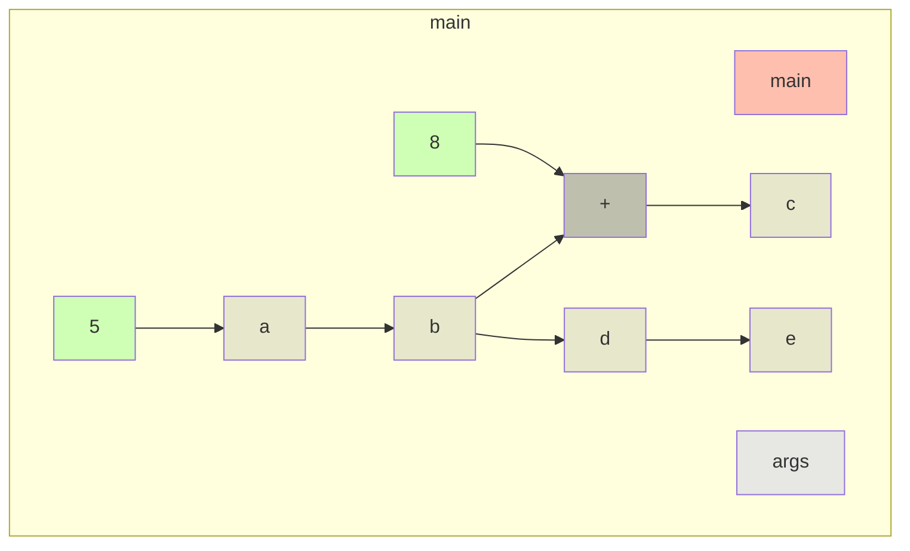

```mermaid
flowchart TD
  subgraph 4309014["main"]
    12536[d]:::VARIABLE
    56853577[main]:::RETURN
    390731536[5]:::LITERAL
    390732172[+]:::BIN_OP
    390732249[a]:::VARIABLE
    390732333[b]:::VARIABLE
    390732397[8]:::LITERAL
    390733089[c]:::VARIABLE
    390733287[e]:::VARIABLE
    441716369[args]:::FUNC_PARAM
    12536[d]:::VARIABLE --> 390733287[e]:::VARIABLE
    390731536[5]:::LITERAL --> 390732249[a]:::VARIABLE
    390732172[+]:::BIN_OP --> 390733089[c]:::VARIABLE
    390732249[a]:::VARIABLE --> 390732333[b]:::VARIABLE
    390732333[b]:::VARIABLE --> 390732172[+]:::BIN_OP
    390732333[b]:::VARIABLE --> 12536[d]:::VARIABLE
    390732397[8]:::LITERAL --> 390732172[+]:::BIN_OP
  end
  classDef LITERAL fill:#00FF0030
  classDef VARIABLE fill:#80808030
  classDef BIN_OP fill:#80808080
  classDef FUNC_PARAM fill:#8080FF30
  classDef RETURN fill:#FF808080
```
