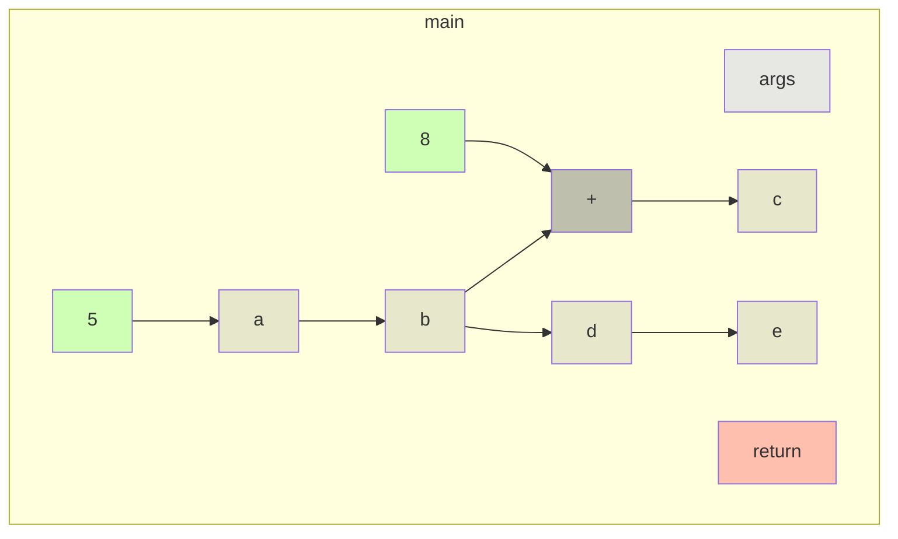

```mermaid
flowchart TD
  subgraph main
    13677[args]:::FUNC_PARAM
    13681[a]:::VARIABLE
    13682[b]:::VARIABLE
    13683[c]:::VARIABLE
    13684[d]:::VARIABLE
    13685[e]:::VARIABLE
    142168[+]:::BIN_OP
    429539[8]:::LITERAL
    463044[5]:::LITERAL
    826030[return]:::RETURN
    13681[a]:::VARIABLE --> 13682[b]:::VARIABLE
    13682[b]:::VARIABLE --> 142168[+]:::BIN_OP
    13682[b]:::VARIABLE --> 13684[d]:::VARIABLE
    13684[d]:::VARIABLE --> 13685[e]:::VARIABLE
    142168[+]:::BIN_OP --> 13683[c]:::VARIABLE
    429539[8]:::LITERAL --> 142168[+]:::BIN_OP
    463044[5]:::LITERAL --> 13681[a]:::VARIABLE
  end
  classDef LITERAL fill:#00FF0030
  classDef VARIABLE fill:#80808030
  classDef BIN_OP fill:#80808080
  classDef FUNC_PARAM fill:#8080FF30
  classDef RETURN fill:#FF808080
```
