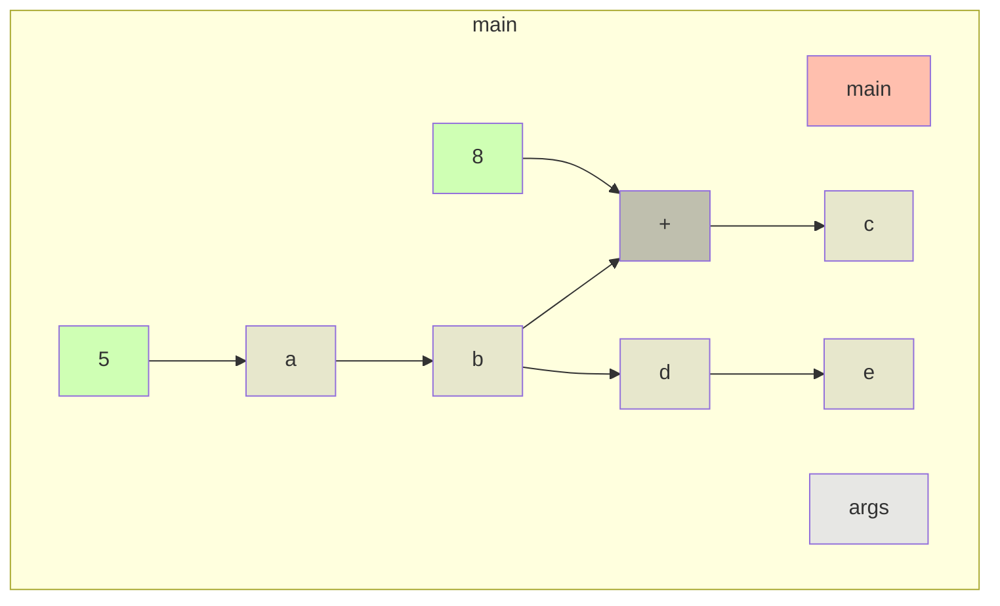

```mermaid
flowchart TD
  subgraph 4309014["main"]
    -774151513[a]:::VARIABLE
    -774148321[5]:::LITERAL
    -774143808[b]:::VARIABLE
    -774115897[c]:::VARIABLE
    -774092728[+]:::BIN_OP
    -774091480[8]:::LITERAL
    -774057327[e]:::VARIABLE
    -723195177[args]:::FUNC_PARAM
    12536[d]:::VARIABLE
    56853577[main]:::RETURN
    -774151513[a]:::VARIABLE --> -774143808[b]:::VARIABLE
    -774148321[5]:::LITERAL --> -774151513[a]:::VARIABLE
    -774143808[b]:::VARIABLE --> -774092728[+]:::BIN_OP
    -774143808[b]:::VARIABLE --> 12536[d]:::VARIABLE
    -774092728[+]:::BIN_OP --> -774115897[c]:::VARIABLE
    -774091480[8]:::LITERAL --> -774092728[+]:::BIN_OP
    12536[d]:::VARIABLE --> -774057327[e]:::VARIABLE
  end
  classDef LITERAL fill:#00FF0030
  classDef VARIABLE fill:#80808030
  classDef BIN_OP fill:#80808080
  classDef FUNC_PARAM fill:#8080FF30
  classDef RETURN fill:#FF808080
  classDef EXTERNAL fill:#FFA50040
```
