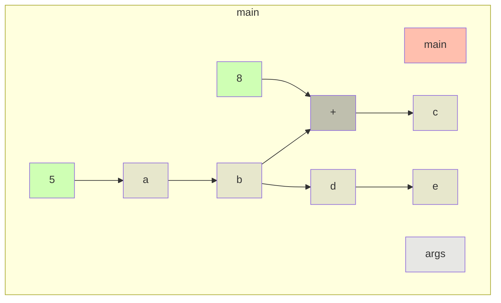

```mermaid
flowchart TD
  subgraph b0["main"]
    n1[main]:::RETURN
    n2[args]:::FUNC_PARAM
    n3[a]:::VARIABLE
    n4[5]:::LITERAL
    n5[b]:::VARIABLE
    n6[c]:::VARIABLE
    n7[8]:::LITERAL
    n8[+]:::BIN_OP
    n9[d]:::VARIABLE
    n10[e]:::VARIABLE
    n3[a]:::VARIABLE --> n5[b]:::VARIABLE
    n4[5]:::LITERAL --> n3[a]:::VARIABLE
    n5[b]:::VARIABLE --> n8[+]:::BIN_OP
    n5[b]:::VARIABLE --> n9[d]:::VARIABLE
    n7[8]:::LITERAL --> n8[+]:::BIN_OP
    n8[+]:::BIN_OP --> n6[c]:::VARIABLE
    n9[d]:::VARIABLE --> n10[e]:::VARIABLE
  end
  classDef LITERAL fill:#00FF0030
  classDef VARIABLE fill:#80808030
  classDef BIN_OP fill:#80808080
  classDef FUNC_PARAM fill:#8080FF30
  classDef RETURN fill:#FF808080
  classDef EXTERNAL fill:#FFA50040
```
