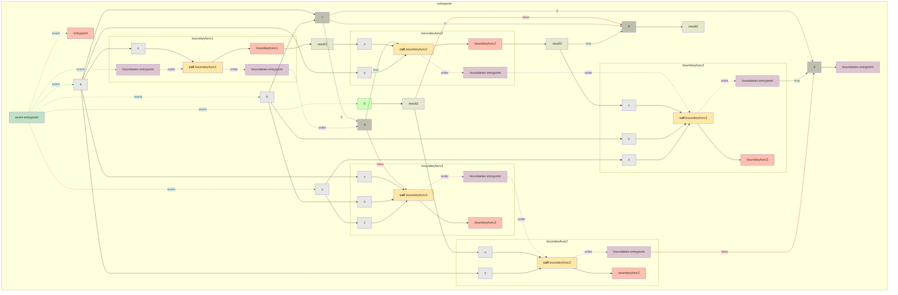

```mermaid
flowchart TD
  subgraph b0["entrypoint"]
    n1[event entrypoint]:::EVENT
    n2[entrypoint]:::RETURN
    n3[a]:::FUNC_PARAM
    n4[b]:::FUNC_PARAM
    n5[c]:::FUNC_PARAM
    n12[result1]:::VARIABLE
    n13[0]:::LITERAL
    n14[result2]:::VARIABLE
    n15[>]:::BIN_OP
    n20[if]:::BIN_OP
    n23[result2]:::VARIABLE
    n44[if]:::BIN_OP
    n45[result2]:::VARIABLE
    n46[if]:::BIN_OP
    n47[boundaries entrypoint]:::BOUNDARIES
    n1[event entrypoint]:::EVENT -. event .-> n2[entrypoint]:::RETURN
    n1[event entrypoint]:::EVENT -. event .-> n3[a]:::FUNC_PARAM
    n1[event entrypoint]:::EVENT -. event .-> n4[b]:::FUNC_PARAM
    n1[event entrypoint]:::EVENT -. event .-> n5[c]:::FUNC_PARAM
    n1[event entrypoint]:::EVENT -. event .-> n13[0]:::LITERAL
    n1[event entrypoint]:::EVENT -. event .-> n9[boundaries entrypoint]:::BOUNDARIES
    n3[a]:::FUNC_PARAM --> n8[x]:::FUNC_PARAM
    n3[a]:::FUNC_PARAM --> n15[>]:::BIN_OP
    n3[a]:::FUNC_PARAM --> n19[y]:::FUNC_PARAM
    n3[a]:::FUNC_PARAM --> n33[x]:::FUNC_PARAM
    n3[a]:::FUNC_PARAM --> n41[y]:::FUNC_PARAM
    n4[b]:::FUNC_PARAM --> n15[>]:::BIN_OP
    n4[b]:::FUNC_PARAM --> n27[y]:::FUNC_PARAM
    n4[b]:::FUNC_PARAM --> n34[y]:::FUNC_PARAM
    n5[c]:::FUNC_PARAM --> n28[z]:::FUNC_PARAM
    n5[c]:::FUNC_PARAM --> n35[z]:::FUNC_PARAM
    n12[result1]:::VARIABLE --> n18[x]:::FUNC_PARAM
    n13[0]:::LITERAL --> n14[result2]:::VARIABLE
    n14[result2]:::VARIABLE --> n40[x]:::FUNC_PARAM
    n14[result2]:::VARIABLE -->|false| n44[if]:::BIN_OP
    n15[>]:::BIN_OP -->|if| n20[if]:::BIN_OP
    n15[>]:::BIN_OP -->|if| n44[if]:::BIN_OP
    n15[>]:::BIN_OP -->|if| n46[if]:::BIN_OP
    n20[if]:::BIN_OP -->|true| n21["`**call** boundaryfunc2`"]:::EXTERNAL
    n20[if]:::BIN_OP -->|false| n36["`**call** boundaryfunc3`"]:::EXTERNAL
    n23[result2]:::VARIABLE --> n26[x]:::FUNC_PARAM
    n23[result2]:::VARIABLE -->|true| n44[if]:::BIN_OP
    n44[if]:::BIN_OP --> n45[result2]:::VARIABLE
    n46[if]:::BIN_OP --> n47[boundaries entrypoint]:::BOUNDARIES
    n7[boundaryfunc1]:::RETURN --> n12[result1]:::VARIABLE
    n11[boundaries entrypoint]:::BOUNDARIES -. order .-> n20[if]:::BIN_OP
    n17[boundaryfunc2]:::RETURN --> n23[result2]:::VARIABLE
    n22[boundaries entrypoint]:::BOUNDARIES -. order .-> n29["`**call** boundaryfunc3`"]:::EXTERNAL
    n30[boundaries entrypoint]:::BOUNDARIES -->|true| n46[if]:::BIN_OP
    n37[boundaries entrypoint]:::BOUNDARIES -. order .-> n42["`**call** boundaryfunc2`"]:::EXTERNAL
    n43[boundaries entrypoint]:::BOUNDARIES -->|false| n46[if]:::BIN_OP
    subgraph b6["boundaryfunc1"]
      n7[boundaryfunc1]:::RETURN
      n8[x]:::FUNC_PARAM
      n9[boundaries entrypoint]:::BOUNDARIES
      n10["`**call** boundaryfunc1`"]:::EXTERNAL
      n11[boundaries entrypoint]:::BOUNDARIES
      n8[x]:::FUNC_PARAM --> n10["`**call** boundaryfunc1`"]:::EXTERNAL
      n9[boundaries entrypoint]:::BOUNDARIES -. order .-> n10["`**call** boundaryfunc1`"]:::EXTERNAL
      n10["`**call** boundaryfunc1`"]:::EXTERNAL -. order .-> n11[boundaries entrypoint]:::BOUNDARIES
      n10["`**call** boundaryfunc1`"]:::EXTERNAL --> n7[boundaryfunc1]:::RETURN
    end
    subgraph b16["boundaryfunc2"]
      n17[boundaryfunc2]:::RETURN
      n18[x]:::FUNC_PARAM
      n19[y]:::FUNC_PARAM
      n21["`**call** boundaryfunc2`"]:::EXTERNAL
      n22[boundaries entrypoint]:::BOUNDARIES
      n18[x]:::FUNC_PARAM --> n21["`**call** boundaryfunc2`"]:::EXTERNAL
      n19[y]:::FUNC_PARAM --> n21["`**call** boundaryfunc2`"]:::EXTERNAL
      n21["`**call** boundaryfunc2`"]:::EXTERNAL -. order .-> n22[boundaries entrypoint]:::BOUNDARIES
      n21["`**call** boundaryfunc2`"]:::EXTERNAL --> n17[boundaryfunc2]:::RETURN
    end
    subgraph b24["boundaryfunc3"]
      n25[boundaryfunc3]:::RETURN
      n26[x]:::FUNC_PARAM
      n27[y]:::FUNC_PARAM
      n28[z]:::FUNC_PARAM
      n29["`**call** boundaryfunc3`"]:::EXTERNAL
      n30[boundaries entrypoint]:::BOUNDARIES
      n26[x]:::FUNC_PARAM --> n29["`**call** boundaryfunc3`"]:::EXTERNAL
      n27[y]:::FUNC_PARAM --> n29["`**call** boundaryfunc3`"]:::EXTERNAL
      n28[z]:::FUNC_PARAM --> n29["`**call** boundaryfunc3`"]:::EXTERNAL
      n29["`**call** boundaryfunc3`"]:::EXTERNAL -. order .-> n30[boundaries entrypoint]:::BOUNDARIES
      n29["`**call** boundaryfunc3`"]:::EXTERNAL --> n25[boundaryfunc3]:::RETURN
    end
    subgraph b31["boundaryfunc3"]
      n32[boundaryfunc3]:::RETURN
      n33[x]:::FUNC_PARAM
      n34[y]:::FUNC_PARAM
      n35[z]:::FUNC_PARAM
      n36["`**call** boundaryfunc3`"]:::EXTERNAL
      n37[boundaries entrypoint]:::BOUNDARIES
      n33[x]:::FUNC_PARAM --> n36["`**call** boundaryfunc3`"]:::EXTERNAL
      n34[y]:::FUNC_PARAM --> n36["`**call** boundaryfunc3`"]:::EXTERNAL
      n35[z]:::FUNC_PARAM --> n36["`**call** boundaryfunc3`"]:::EXTERNAL
      n36["`**call** boundaryfunc3`"]:::EXTERNAL -. order .-> n37[boundaries entrypoint]:::BOUNDARIES
      n36["`**call** boundaryfunc3`"]:::EXTERNAL --> n32[boundaryfunc3]:::RETURN
    end
    subgraph b38["boundaryfunc2"]
      n39[boundaryfunc2]:::RETURN
      n40[x]:::FUNC_PARAM
      n41[y]:::FUNC_PARAM
      n42["`**call** boundaryfunc2`"]:::EXTERNAL
      n43[boundaries entrypoint]:::BOUNDARIES
      n40[x]:::FUNC_PARAM --> n42["`**call** boundaryfunc2`"]:::EXTERNAL
      n41[y]:::FUNC_PARAM --> n42["`**call** boundaryfunc2`"]:::EXTERNAL
      n42["`**call** boundaryfunc2`"]:::EXTERNAL -. order .-> n43[boundaries entrypoint]:::BOUNDARIES
      n42["`**call** boundaryfunc2`"]:::EXTERNAL --> n39[boundaryfunc2]:::RETURN
    end
  end
  linkStyle 0 stroke:#00897b,color:#00897b
  linkStyle 1 stroke:#00897b,color:#00897b
  linkStyle 2 stroke:#00897b,color:#00897b
  linkStyle 3 stroke:#00897b,color:#00897b
  linkStyle 4 stroke:#00897b,color:#00897b
  linkStyle 5 stroke:#00897b,color:#00897b
  linkStyle 19 stroke:#c62828,color:#c62828
  linkStyle 20 stroke:#6a6a6a,color:#6a6a6a
  linkStyle 21 stroke:#6a6a6a,color:#6a6a6a
  linkStyle 22 stroke:#6a6a6a,color:#6a6a6a
  linkStyle 23 stroke:#2e7d32,color:#2e7d32
  linkStyle 24 stroke:#c62828,color:#c62828
  linkStyle 26 stroke:#2e7d32,color:#2e7d32
  linkStyle 30 stroke:#7b1fa2,color:#7b1fa2
  linkStyle 32 stroke:#7b1fa2,color:#7b1fa2
  linkStyle 33 stroke:#2e7d32,color:#2e7d32
  linkStyle 34 stroke:#7b1fa2,color:#7b1fa2
  linkStyle 35 stroke:#c62828,color:#c62828
  linkStyle 37 stroke:#7b1fa2,color:#7b1fa2
  linkStyle 38 stroke:#7b1fa2,color:#7b1fa2
  linkStyle 42 stroke:#7b1fa2,color:#7b1fa2
  linkStyle 47 stroke:#7b1fa2,color:#7b1fa2
  linkStyle 52 stroke:#7b1fa2,color:#7b1fa2
  linkStyle 56 stroke:#7b1fa2,color:#7b1fa2
  classDef LITERAL fill:#00FF0030
  classDef VARIABLE fill:#80808030
  classDef BIN_OP fill:#80808080
  classDef FUNC_PARAM fill:#8080FF30
  classDef RETURN fill:#FF808080
  classDef EXTERNAL fill:#FFA50040
  classDef UNMODELLED fill:#FF000030,stroke-dasharray: 4 2
  classDef EVENT fill:#00897B40
  classDef BOUNDARIES fill:#7B1FA240
```
