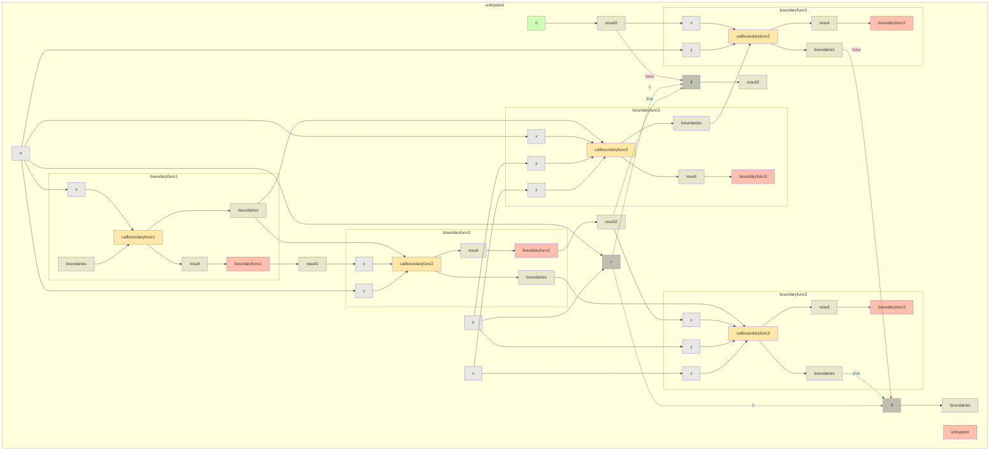

```mermaid
flowchart TD
  subgraph b0["entrypoint"]
    n1[entrypoint]:::RETURN
    n2[a]:::FUNC_PARAM
    n3[b]:::FUNC_PARAM
    n4[c]:::FUNC_PARAM
    n12[result1]:::VARIABLE
    n13[0]:::LITERAL
    n14[result2]:::VARIABLE
    n15[>]:::BIN_OP
    n23[result2]:::VARIABLE
    n47[if]:::BIN_OP
    n48[result2]:::VARIABLE
    n49[if]:::BIN_OP
    n50[boundaries]:::VARIABLE
    n2[a]:::FUNC_PARAM --> n7[x]:::FUNC_PARAM
    n2[a]:::FUNC_PARAM --> n15[>]:::BIN_OP
    n2[a]:::FUNC_PARAM --> n19[y]:::FUNC_PARAM
    n2[a]:::FUNC_PARAM --> n34[x]:::FUNC_PARAM
    n2[a]:::FUNC_PARAM --> n43[y]:::FUNC_PARAM
    n3[b]:::FUNC_PARAM --> n15[>]:::BIN_OP
    n3[b]:::FUNC_PARAM --> n27[y]:::FUNC_PARAM
    n3[b]:::FUNC_PARAM --> n35[y]:::FUNC_PARAM
    n4[c]:::FUNC_PARAM --> n28[z]:::FUNC_PARAM
    n4[c]:::FUNC_PARAM --> n36[z]:::FUNC_PARAM
    n12[result1]:::VARIABLE --> n18[x]:::FUNC_PARAM
    n13[0]:::LITERAL --> n14[result2]:::VARIABLE
    n14[result2]:::VARIABLE --> n42[x]:::FUNC_PARAM
    n14[result2]:::VARIABLE -->|false| n47[if]:::BIN_OP
    n15[>]:::BIN_OP -->|if| n47[if]:::BIN_OP
    n15[>]:::BIN_OP -->|if| n49[if]:::BIN_OP
    n23[result2]:::VARIABLE --> n26[x]:::FUNC_PARAM
    n23[result2]:::VARIABLE -->|true| n47[if]:::BIN_OP
    n47[if]:::BIN_OP --> n48[result2]:::VARIABLE
    n49[if]:::BIN_OP --> n50[boundaries]:::VARIABLE
    n6[boundaryfunc1]:::RETURN --> n12[result1]:::VARIABLE
    n10[boundaries]:::VARIABLE --> n20[callboundaryfunc2]:::EXTERNAL
    n10[boundaries]:::VARIABLE --> n37[callboundaryfunc3]:::EXTERNAL
    n17[boundaryfunc2]:::RETURN --> n23[result2]:::VARIABLE
    n21[boundaries]:::VARIABLE --> n29[callboundaryfunc3]:::EXTERNAL
    n30[boundaries]:::VARIABLE -->|true| n49[if]:::BIN_OP
    n38[boundaries]:::VARIABLE --> n44[callboundaryfunc2]:::EXTERNAL
    n45[boundaries]:::VARIABLE -->|false| n49[if]:::BIN_OP
    subgraph b5["boundaryfunc1"]
      n6[boundaryfunc1]:::RETURN
      n7[x]:::FUNC_PARAM
      n8[boundaries]:::VARIABLE
      n9[callboundaryfunc1]:::EXTERNAL
      n10[boundaries]:::VARIABLE
      n11[result]:::VARIABLE
      n7[x]:::FUNC_PARAM --> n9[callboundaryfunc1]:::EXTERNAL
      n8[boundaries]:::VARIABLE --> n9[callboundaryfunc1]:::EXTERNAL
      n9[callboundaryfunc1]:::EXTERNAL --> n10[boundaries]:::VARIABLE
      n9[callboundaryfunc1]:::EXTERNAL --> n11[result]:::VARIABLE
      n11[result]:::VARIABLE --> n6[boundaryfunc1]:::RETURN
    end
    subgraph b16["boundaryfunc2"]
      n17[boundaryfunc2]:::RETURN
      n18[x]:::FUNC_PARAM
      n19[y]:::FUNC_PARAM
      n20[callboundaryfunc2]:::EXTERNAL
      n21[boundaries]:::VARIABLE
      n22[result]:::VARIABLE
      n18[x]:::FUNC_PARAM --> n20[callboundaryfunc2]:::EXTERNAL
      n19[y]:::FUNC_PARAM --> n20[callboundaryfunc2]:::EXTERNAL
      n20[callboundaryfunc2]:::EXTERNAL --> n21[boundaries]:::VARIABLE
      n20[callboundaryfunc2]:::EXTERNAL --> n22[result]:::VARIABLE
      n22[result]:::VARIABLE --> n17[boundaryfunc2]:::RETURN
    end
    subgraph b24["boundaryfunc3"]
      n25[boundaryfunc3]:::RETURN
      n26[x]:::FUNC_PARAM
      n27[y]:::FUNC_PARAM
      n28[z]:::FUNC_PARAM
      n29[callboundaryfunc3]:::EXTERNAL
      n30[boundaries]:::VARIABLE
      n31[result]:::VARIABLE
      n26[x]:::FUNC_PARAM --> n29[callboundaryfunc3]:::EXTERNAL
      n27[y]:::FUNC_PARAM --> n29[callboundaryfunc3]:::EXTERNAL
      n28[z]:::FUNC_PARAM --> n29[callboundaryfunc3]:::EXTERNAL
      n29[callboundaryfunc3]:::EXTERNAL --> n30[boundaries]:::VARIABLE
      n29[callboundaryfunc3]:::EXTERNAL --> n31[result]:::VARIABLE
      n31[result]:::VARIABLE --> n25[boundaryfunc3]:::RETURN
    end
    subgraph b32["boundaryfunc3"]
      n33[boundaryfunc3]:::RETURN
      n34[x]:::FUNC_PARAM
      n35[y]:::FUNC_PARAM
      n36[z]:::FUNC_PARAM
      n37[callboundaryfunc3]:::EXTERNAL
      n38[boundaries]:::VARIABLE
      n39[result]:::VARIABLE
      n34[x]:::FUNC_PARAM --> n37[callboundaryfunc3]:::EXTERNAL
      n35[y]:::FUNC_PARAM --> n37[callboundaryfunc3]:::EXTERNAL
      n36[z]:::FUNC_PARAM --> n37[callboundaryfunc3]:::EXTERNAL
      n37[callboundaryfunc3]:::EXTERNAL --> n38[boundaries]:::VARIABLE
      n37[callboundaryfunc3]:::EXTERNAL --> n39[result]:::VARIABLE
      n39[result]:::VARIABLE --> n33[boundaryfunc3]:::RETURN
    end
    subgraph b40["boundaryfunc2"]
      n41[boundaryfunc2]:::RETURN
      n42[x]:::FUNC_PARAM
      n43[y]:::FUNC_PARAM
      n44[callboundaryfunc2]:::EXTERNAL
      n45[boundaries]:::VARIABLE
      n46[result]:::VARIABLE
      n42[x]:::FUNC_PARAM --> n44[callboundaryfunc2]:::EXTERNAL
      n43[y]:::FUNC_PARAM --> n44[callboundaryfunc2]:::EXTERNAL
      n44[callboundaryfunc2]:::EXTERNAL --> n45[boundaries]:::VARIABLE
      n44[callboundaryfunc2]:::EXTERNAL --> n46[result]:::VARIABLE
      n46[result]:::VARIABLE --> n41[boundaryfunc2]:::RETURN
    end
  end
  linkStyle 13 stroke:#c62828,color:#c62828
  linkStyle 14 stroke:#6a6a6a,color:#6a6a6a
  linkStyle 15 stroke:#6a6a6a,color:#6a6a6a
  linkStyle 17 stroke:#2e7d32,color:#2e7d32
  linkStyle 25 stroke:#2e7d32,color:#2e7d32
  linkStyle 27 stroke:#c62828,color:#c62828
  classDef LITERAL fill:#00FF0030
  classDef VARIABLE fill:#80808030
  classDef BIN_OP fill:#80808080
  classDef FUNC_PARAM fill:#8080FF30
  classDef RETURN fill:#FF808080
  classDef EXTERNAL fill:#FFA50040
  classDef UNMODELLED fill:#FF000030,stroke-dasharray: 4 2
```
