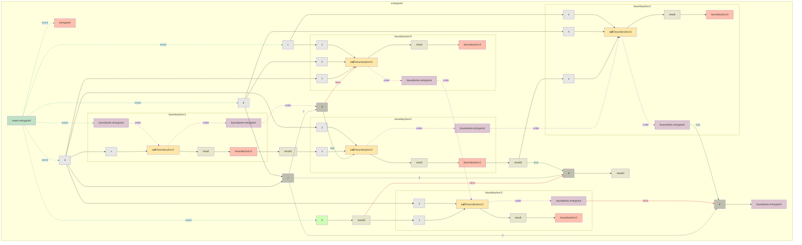

```mermaid
flowchart TD
  subgraph b0["entrypoint"]
    n1[event entrypoint]:::EVENT
    n2[entrypoint]:::RETURN
    n3[a]:::FUNC_PARAM
    n4[b]:::FUNC_PARAM
    n5[c]:::FUNC_PARAM
    n13[result1]:::VARIABLE
    n14[0]:::LITERAL
    n15[result2]:::VARIABLE
    n16[>]:::BIN_OP
    n21[if]:::BIN_OP
    n25[result2]:::VARIABLE
    n49[if]:::BIN_OP
    n50[result2]:::VARIABLE
    n51[if]:::BIN_OP
    n52[boundaries entrypoint]:::BOUNDARIES
    n1[event entrypoint]:::EVENT -. event .-> n2[entrypoint]:::RETURN
    n1[event entrypoint]:::EVENT -. event .-> n3[a]:::FUNC_PARAM
    n1[event entrypoint]:::EVENT -. event .-> n4[b]:::FUNC_PARAM
    n1[event entrypoint]:::EVENT -. event .-> n5[c]:::FUNC_PARAM
    n1[event entrypoint]:::EVENT -. event .-> n14[0]:::LITERAL
    n1[event entrypoint]:::EVENT -. event .-> n9[boundaries entrypoint]:::BOUNDARIES
    n3[a]:::FUNC_PARAM --> n8[x]:::FUNC_PARAM
    n3[a]:::FUNC_PARAM --> n16[>]:::BIN_OP
    n3[a]:::FUNC_PARAM --> n20[y]:::FUNC_PARAM
    n3[a]:::FUNC_PARAM --> n36[x]:::FUNC_PARAM
    n3[a]:::FUNC_PARAM --> n45[y]:::FUNC_PARAM
    n4[b]:::FUNC_PARAM --> n16[>]:::BIN_OP
    n4[b]:::FUNC_PARAM --> n29[y]:::FUNC_PARAM
    n4[b]:::FUNC_PARAM --> n37[y]:::FUNC_PARAM
    n5[c]:::FUNC_PARAM --> n30[z]:::FUNC_PARAM
    n5[c]:::FUNC_PARAM --> n38[z]:::FUNC_PARAM
    n13[result1]:::VARIABLE --> n19[x]:::FUNC_PARAM
    n14[0]:::LITERAL --> n15[result2]:::VARIABLE
    n15[result2]:::VARIABLE --> n44[x]:::FUNC_PARAM
    n15[result2]:::VARIABLE -->|false| n49[if]:::BIN_OP
    n16[>]:::BIN_OP -->|if| n21[if]:::BIN_OP
    n16[>]:::BIN_OP -->|if| n49[if]:::BIN_OP
    n16[>]:::BIN_OP -->|if| n51[if]:::BIN_OP
    n21[if]:::BIN_OP -->|true| n22["`**call** boundaryfunc2`"]:::EXTERNAL
    n21[if]:::BIN_OP -->|false| n39["`**call** boundaryfunc3`"]:::EXTERNAL
    n25[result2]:::VARIABLE --> n28[x]:::FUNC_PARAM
    n25[result2]:::VARIABLE -->|true| n49[if]:::BIN_OP
    n49[if]:::BIN_OP --> n50[result2]:::VARIABLE
    n51[if]:::BIN_OP --> n52[boundaries entrypoint]:::BOUNDARIES
    n7[boundaryfunc1]:::RETURN --> n13[result1]:::VARIABLE
    n11[boundaries entrypoint]:::BOUNDARIES -. order .-> n21[if]:::BIN_OP
    n18[boundaryfunc2]:::RETURN --> n25[result2]:::VARIABLE
    n23[boundaries entrypoint]:::BOUNDARIES -. order .-> n31["`**call** boundaryfunc3`"]:::EXTERNAL
    n32[boundaries entrypoint]:::BOUNDARIES -->|true| n51[if]:::BIN_OP
    n40[boundaries entrypoint]:::BOUNDARIES -. order .-> n46["`**call** boundaryfunc2`"]:::EXTERNAL
    n47[boundaries entrypoint]:::BOUNDARIES -->|false| n51[if]:::BIN_OP
    subgraph b6["boundaryfunc1"]
      n7[boundaryfunc1]:::RETURN
      n8[x]:::FUNC_PARAM
      n9[boundaries entrypoint]:::BOUNDARIES
      n10["`**call** boundaryfunc1`"]:::EXTERNAL
      n11[boundaries entrypoint]:::BOUNDARIES
      n12[result]:::VARIABLE
      n8[x]:::FUNC_PARAM --> n10["`**call** boundaryfunc1`"]:::EXTERNAL
      n9[boundaries entrypoint]:::BOUNDARIES -. order .-> n10["`**call** boundaryfunc1`"]:::EXTERNAL
      n10["`**call** boundaryfunc1`"]:::EXTERNAL -. order .-> n11[boundaries entrypoint]:::BOUNDARIES
      n10["`**call** boundaryfunc1`"]:::EXTERNAL --> n12[result]:::VARIABLE
      n12[result]:::VARIABLE --> n7[boundaryfunc1]:::RETURN
    end
    subgraph b17["boundaryfunc2"]
      n18[boundaryfunc2]:::RETURN
      n19[x]:::FUNC_PARAM
      n20[y]:::FUNC_PARAM
      n22["`**call** boundaryfunc2`"]:::EXTERNAL
      n23[boundaries entrypoint]:::BOUNDARIES
      n24[result]:::VARIABLE
      n19[x]:::FUNC_PARAM --> n22["`**call** boundaryfunc2`"]:::EXTERNAL
      n20[y]:::FUNC_PARAM --> n22["`**call** boundaryfunc2`"]:::EXTERNAL
      n22["`**call** boundaryfunc2`"]:::EXTERNAL -. order .-> n23[boundaries entrypoint]:::BOUNDARIES
      n22["`**call** boundaryfunc2`"]:::EXTERNAL --> n24[result]:::VARIABLE
      n24[result]:::VARIABLE --> n18[boundaryfunc2]:::RETURN
    end
    subgraph b26["boundaryfunc3"]
      n27[boundaryfunc3]:::RETURN
      n28[x]:::FUNC_PARAM
      n29[y]:::FUNC_PARAM
      n30[z]:::FUNC_PARAM
      n31["`**call** boundaryfunc3`"]:::EXTERNAL
      n32[boundaries entrypoint]:::BOUNDARIES
      n33[result]:::VARIABLE
      n28[x]:::FUNC_PARAM --> n31["`**call** boundaryfunc3`"]:::EXTERNAL
      n29[y]:::FUNC_PARAM --> n31["`**call** boundaryfunc3`"]:::EXTERNAL
      n30[z]:::FUNC_PARAM --> n31["`**call** boundaryfunc3`"]:::EXTERNAL
      n31["`**call** boundaryfunc3`"]:::EXTERNAL -. order .-> n32[boundaries entrypoint]:::BOUNDARIES
      n31["`**call** boundaryfunc3`"]:::EXTERNAL --> n33[result]:::VARIABLE
      n33[result]:::VARIABLE --> n27[boundaryfunc3]:::RETURN
    end
    subgraph b34["boundaryfunc3"]
      n35[boundaryfunc3]:::RETURN
      n36[x]:::FUNC_PARAM
      n37[y]:::FUNC_PARAM
      n38[z]:::FUNC_PARAM
      n39["`**call** boundaryfunc3`"]:::EXTERNAL
      n40[boundaries entrypoint]:::BOUNDARIES
      n41[result]:::VARIABLE
      n36[x]:::FUNC_PARAM --> n39["`**call** boundaryfunc3`"]:::EXTERNAL
      n37[y]:::FUNC_PARAM --> n39["`**call** boundaryfunc3`"]:::EXTERNAL
      n38[z]:::FUNC_PARAM --> n39["`**call** boundaryfunc3`"]:::EXTERNAL
      n39["`**call** boundaryfunc3`"]:::EXTERNAL -. order .-> n40[boundaries entrypoint]:::BOUNDARIES
      n39["`**call** boundaryfunc3`"]:::EXTERNAL --> n41[result]:::VARIABLE
      n41[result]:::VARIABLE --> n35[boundaryfunc3]:::RETURN
    end
    subgraph b42["boundaryfunc2"]
      n43[boundaryfunc2]:::RETURN
      n44[x]:::FUNC_PARAM
      n45[y]:::FUNC_PARAM
      n46["`**call** boundaryfunc2`"]:::EXTERNAL
      n47[boundaries entrypoint]:::BOUNDARIES
      n48[result]:::VARIABLE
      n44[x]:::FUNC_PARAM --> n46["`**call** boundaryfunc2`"]:::EXTERNAL
      n45[y]:::FUNC_PARAM --> n46["`**call** boundaryfunc2`"]:::EXTERNAL
      n46["`**call** boundaryfunc2`"]:::EXTERNAL -. order .-> n47[boundaries entrypoint]:::BOUNDARIES
      n46["`**call** boundaryfunc2`"]:::EXTERNAL --> n48[result]:::VARIABLE
      n48[result]:::VARIABLE --> n43[boundaryfunc2]:::RETURN
    end
  end
  linkStyle 0 stroke:#00897b,color:#00897b
  linkStyle 1 stroke:#00897b,color:#00897b
  linkStyle 2 stroke:#00897b,color:#00897b
  linkStyle 3 stroke:#00897b,color:#00897b
  linkStyle 4 stroke:#00897b,color:#00897b
  linkStyle 5 stroke:#00897b,color:#00897b
  linkStyle 19 stroke:#c62828,color:#c62828
  linkStyle 20 stroke:#6a6a6a,color:#6a6a6a
  linkStyle 21 stroke:#6a6a6a,color:#6a6a6a
  linkStyle 22 stroke:#6a6a6a,color:#6a6a6a
  linkStyle 23 stroke:#2e7d32,color:#2e7d32
  linkStyle 24 stroke:#c62828,color:#c62828
  linkStyle 26 stroke:#2e7d32,color:#2e7d32
  linkStyle 30 stroke:#7b1fa2,color:#7b1fa2
  linkStyle 32 stroke:#7b1fa2,color:#7b1fa2
  linkStyle 33 stroke:#2e7d32,color:#2e7d32
  linkStyle 34 stroke:#7b1fa2,color:#7b1fa2
  linkStyle 35 stroke:#c62828,color:#c62828
  linkStyle 37 stroke:#7b1fa2,color:#7b1fa2
  linkStyle 38 stroke:#7b1fa2,color:#7b1fa2
  linkStyle 43 stroke:#7b1fa2,color:#7b1fa2
  linkStyle 49 stroke:#7b1fa2,color:#7b1fa2
  linkStyle 55 stroke:#7b1fa2,color:#7b1fa2
  linkStyle 60 stroke:#7b1fa2,color:#7b1fa2
  classDef LITERAL fill:#00FF0030
  classDef VARIABLE fill:#80808030
  classDef BIN_OP fill:#80808080
  classDef FUNC_PARAM fill:#8080FF30
  classDef RETURN fill:#FF808080
  classDef EXTERNAL fill:#FFA50040
  classDef UNMODELLED fill:#FF000030,stroke-dasharray: 4 2
  classDef EVENT fill:#00897B40
  classDef BOUNDARIES fill:#7B1FA240
```
