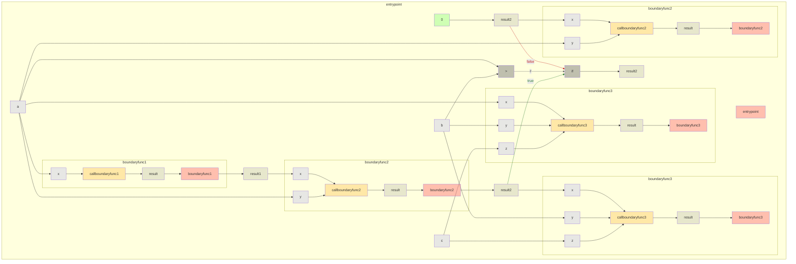

```mermaid
flowchart TD
  subgraph b0["entrypoint"]
    n1[entrypoint]:::RETURN
    n2[a]:::FUNC_PARAM
    n3[b]:::FUNC_PARAM
    n4[c]:::FUNC_PARAM
    n10[result1]:::VARIABLE
    n11[0]:::LITERAL
    n12[result2]:::VARIABLE
    n13[>]:::BIN_OP
    n20[result2]:::VARIABLE
    n41[if]:::BIN_OP
    n42[result2]:::VARIABLE
    n2[a]:::FUNC_PARAM --> n7[x]:::FUNC_PARAM
    n2[a]:::FUNC_PARAM --> n13[>]:::BIN_OP
    n2[a]:::FUNC_PARAM --> n17[y]:::FUNC_PARAM
    n2[a]:::FUNC_PARAM --> n30[x]:::FUNC_PARAM
    n2[a]:::FUNC_PARAM --> n38[y]:::FUNC_PARAM
    n3[b]:::FUNC_PARAM --> n13[>]:::BIN_OP
    n3[b]:::FUNC_PARAM --> n24[y]:::FUNC_PARAM
    n3[b]:::FUNC_PARAM --> n31[y]:::FUNC_PARAM
    n4[c]:::FUNC_PARAM --> n25[z]:::FUNC_PARAM
    n4[c]:::FUNC_PARAM --> n32[z]:::FUNC_PARAM
    n10[result1]:::VARIABLE --> n16[x]:::FUNC_PARAM
    n11[0]:::LITERAL --> n12[result2]:::VARIABLE
    n12[result2]:::VARIABLE --> n37[x]:::FUNC_PARAM
    n12[result2]:::VARIABLE -->|false| n41[if]:::BIN_OP
    n13[>]:::BIN_OP -->|if| n41[if]:::BIN_OP
    n20[result2]:::VARIABLE --> n23[x]:::FUNC_PARAM
    n20[result2]:::VARIABLE -->|true| n41[if]:::BIN_OP
    n41[if]:::BIN_OP --> n42[result2]:::VARIABLE
    n6[boundaryfunc1]:::RETURN --> n10[result1]:::VARIABLE
    n15[boundaryfunc2]:::RETURN --> n20[result2]:::VARIABLE
    subgraph b5["boundaryfunc1"]
      n6[boundaryfunc1]:::RETURN
      n7[x]:::FUNC_PARAM
      n8[callboundaryfunc1]:::EXTERNAL
      n9[result]:::VARIABLE
      n7[x]:::FUNC_PARAM --> n8[callboundaryfunc1]:::EXTERNAL
      n8[callboundaryfunc1]:::EXTERNAL --> n9[result]:::VARIABLE
      n9[result]:::VARIABLE --> n6[boundaryfunc1]:::RETURN
    end
    subgraph b14["boundaryfunc2"]
      n15[boundaryfunc2]:::RETURN
      n16[x]:::FUNC_PARAM
      n17[y]:::FUNC_PARAM
      n18[callboundaryfunc2]:::EXTERNAL
      n19[result]:::VARIABLE
      n16[x]:::FUNC_PARAM --> n18[callboundaryfunc2]:::EXTERNAL
      n17[y]:::FUNC_PARAM --> n18[callboundaryfunc2]:::EXTERNAL
      n18[callboundaryfunc2]:::EXTERNAL --> n19[result]:::VARIABLE
      n19[result]:::VARIABLE --> n15[boundaryfunc2]:::RETURN
    end
    subgraph b21["boundaryfunc3"]
      n22[boundaryfunc3]:::RETURN
      n23[x]:::FUNC_PARAM
      n24[y]:::FUNC_PARAM
      n25[z]:::FUNC_PARAM
      n26[callboundaryfunc3]:::EXTERNAL
      n27[result]:::VARIABLE
      n23[x]:::FUNC_PARAM --> n26[callboundaryfunc3]:::EXTERNAL
      n24[y]:::FUNC_PARAM --> n26[callboundaryfunc3]:::EXTERNAL
      n25[z]:::FUNC_PARAM --> n26[callboundaryfunc3]:::EXTERNAL
      n26[callboundaryfunc3]:::EXTERNAL --> n27[result]:::VARIABLE
      n27[result]:::VARIABLE --> n22[boundaryfunc3]:::RETURN
    end
    subgraph b28["boundaryfunc3"]
      n29[boundaryfunc3]:::RETURN
      n30[x]:::FUNC_PARAM
      n31[y]:::FUNC_PARAM
      n32[z]:::FUNC_PARAM
      n33[callboundaryfunc3]:::EXTERNAL
      n34[result]:::VARIABLE
      n30[x]:::FUNC_PARAM --> n33[callboundaryfunc3]:::EXTERNAL
      n31[y]:::FUNC_PARAM --> n33[callboundaryfunc3]:::EXTERNAL
      n32[z]:::FUNC_PARAM --> n33[callboundaryfunc3]:::EXTERNAL
      n33[callboundaryfunc3]:::EXTERNAL --> n34[result]:::VARIABLE
      n34[result]:::VARIABLE --> n29[boundaryfunc3]:::RETURN
    end
    subgraph b35["boundaryfunc2"]
      n36[boundaryfunc2]:::RETURN
      n37[x]:::FUNC_PARAM
      n38[y]:::FUNC_PARAM
      n39[callboundaryfunc2]:::EXTERNAL
      n40[result]:::VARIABLE
      n37[x]:::FUNC_PARAM --> n39[callboundaryfunc2]:::EXTERNAL
      n38[y]:::FUNC_PARAM --> n39[callboundaryfunc2]:::EXTERNAL
      n39[callboundaryfunc2]:::EXTERNAL --> n40[result]:::VARIABLE
      n40[result]:::VARIABLE --> n36[boundaryfunc2]:::RETURN
    end
  end
  linkStyle 13 stroke:#c62828,color:#c62828
  linkStyle 14 stroke:#6a6a6a,color:#6a6a6a
  linkStyle 16 stroke:#2e7d32,color:#2e7d32
  classDef LITERAL fill:#00FF0030
  classDef VARIABLE fill:#80808030
  classDef BIN_OP fill:#80808080
  classDef FUNC_PARAM fill:#8080FF30
  classDef RETURN fill:#FF808080
  classDef EXTERNAL fill:#FFA50040
  classDef UNMODELLED fill:#FF000030,stroke-dasharray: 4 2
```
