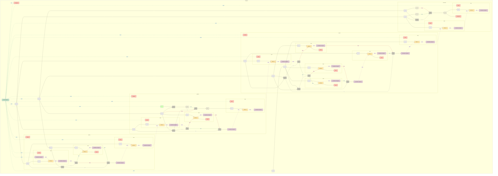

```mermaid
flowchart TD
  subgraph b0["entrypoint"]
    n1[event entrypoint]:::EVENT
    n2[entrypoint]:::RETURN
    n3[a]:::FUNC_PARAM
    n4[b]:::FUNC_PARAM
    n5[c]:::FUNC_PARAM
    n1[event entrypoint]:::EVENT -. event .-> n2[entrypoint]:::RETURN
    n1[event entrypoint]:::EVENT -. event .-> n3[a]:::FUNC_PARAM
    n1[event entrypoint]:::EVENT -. event .-> n4[b]:::FUNC_PARAM
    n1[event entrypoint]:::EVENT -. event .-> n5[c]:::FUNC_PARAM
    n1[event entrypoint]:::EVENT -. event .-> n7[noElse]:::RETURN
    n1[event entrypoint]:::EVENT -. event .-> n11[open]:::RETURN
    n1[event entrypoint]:::EVENT -. event .-> n13[boundaries entrypoint]:::BOUNDARIES
    n1[event entrypoint]:::EVENT -. event .-> n26[close]:::RETURN
    n1[event entrypoint]:::EVENT -. event .-> n31[onlyElse]:::RETURN
    n1[event entrypoint]:::EVENT -. event .-> n40[1]:::LITERAL
    n1[event entrypoint]:::EVENT -. event .-> n35[open]:::RETURN
    n1[event entrypoint]:::EVENT -. event .-> n54[close]:::RETURN
    n1[event entrypoint]:::EVENT -. event .-> n59[nested]:::RETURN
    n1[event entrypoint]:::EVENT -. event .-> n64[open]:::RETURN
    n1[event entrypoint]:::EVENT -. event .-> n97[close]:::RETURN
    n1[event entrypoint]:::EVENT -. event .-> n106[open]:::RETURN
    n1[event entrypoint]:::EVENT -. event .-> n116[close]:::RETURN
    n3[a]:::FUNC_PARAM --> n8[a]:::FUNC_PARAM
    n3[a]:::FUNC_PARAM --> n32[a]:::FUNC_PARAM
    n3[a]:::FUNC_PARAM --> n60[a]:::FUNC_PARAM
    n3[a]:::FUNC_PARAM --> n103[a]:::FUNC_PARAM
    n4[b]:::FUNC_PARAM --> n9[b]:::FUNC_PARAM
    n4[b]:::FUNC_PARAM --> n33[b]:::FUNC_PARAM
    n4[b]:::FUNC_PARAM --> n61[b]:::FUNC_PARAM
    n4[b]:::FUNC_PARAM --> n104[b]:::FUNC_PARAM
    n5[c]:::FUNC_PARAM --> n62[c]:::FUNC_PARAM
    n29[boundaries entrypoint]:::BOUNDARIES -. order .-> n37["`**call** open`"]:::EXTERNAL
    n57[boundaries entrypoint]:::BOUNDARIES -. order .-> n66["`**call** open`"]:::EXTERNAL
    n100[boundaries entrypoint]:::BOUNDARIES -. order .-> n108["`**call** open`"]:::EXTERNAL
    subgraph b6["noElse"]
      n7[noElse]:::RETURN
      n8[a]:::FUNC_PARAM
      n9[b]:::FUNC_PARAM
      n16[>]:::BIN_OP
      n20[if]:::BIN_OP
      n23[if]:::BIN_OP
      n24[boundaries entrypoint]:::BOUNDARIES
      n8[a]:::FUNC_PARAM --> n12[x]:::FUNC_PARAM
      n8[a]:::FUNC_PARAM --> n16[>]:::BIN_OP
      n8[a]:::FUNC_PARAM --> n27[x]:::FUNC_PARAM
      n9[b]:::FUNC_PARAM --> n16[>]:::BIN_OP
      n9[b]:::FUNC_PARAM --> n19[x]:::FUNC_PARAM
      n16[>]:::BIN_OP -->|if| n20[if]:::BIN_OP
      n16[>]:::BIN_OP -->|if| n23[if]:::BIN_OP
      n20[if]:::BIN_OP -->|true| n21["`**call** send`"]:::EXTERNAL
      n20[if]:::BIN_OP -->|false| n23[if]:::BIN_OP
      n23[if]:::BIN_OP --> n24[boundaries entrypoint]:::BOUNDARIES
      n24[boundaries entrypoint]:::BOUNDARIES -. order .-> n28["`**call** close`"]:::EXTERNAL
      n15[boundaries entrypoint]:::BOUNDARIES -. order .-> n20[if]:::BIN_OP
      n22[boundaries entrypoint]:::BOUNDARIES -->|true| n23[if]:::BIN_OP
      subgraph b10["open"]
        n11[open]:::RETURN
        n12[x]:::FUNC_PARAM
        n13[boundaries entrypoint]:::BOUNDARIES
        n14["`**call** open`"]:::EXTERNAL
        n15[boundaries entrypoint]:::BOUNDARIES
        n12[x]:::FUNC_PARAM --> n14["`**call** open`"]:::EXTERNAL
        n13[boundaries entrypoint]:::BOUNDARIES -. order .-> n14["`**call** open`"]:::EXTERNAL
        n14["`**call** open`"]:::EXTERNAL -. order .-> n15[boundaries entrypoint]:::BOUNDARIES
      end
      subgraph b17["send"]
        n18[send]:::RETURN
        n19[x]:::FUNC_PARAM
        n21["`**call** send`"]:::EXTERNAL
        n22[boundaries entrypoint]:::BOUNDARIES
        n19[x]:::FUNC_PARAM --> n21["`**call** send`"]:::EXTERNAL
        n21["`**call** send`"]:::EXTERNAL -. order .-> n22[boundaries entrypoint]:::BOUNDARIES
        n21["`**call** send`"]:::EXTERNAL --> n18[send]:::RETURN
      end
      subgraph b25["close"]
        n26[close]:::RETURN
        n27[x]:::FUNC_PARAM
        n28["`**call** close`"]:::EXTERNAL
        n29[boundaries entrypoint]:::BOUNDARIES
        n27[x]:::FUNC_PARAM --> n28["`**call** close`"]:::EXTERNAL
        n28["`**call** close`"]:::EXTERNAL -. order .-> n29[boundaries entrypoint]:::BOUNDARIES
      end
    end
    subgraph b30["onlyElse"]
      n31[onlyElse]:::RETURN
      n32[a]:::FUNC_PARAM
      n33[b]:::FUNC_PARAM
      n39[<]:::BIN_OP
      n40[1]:::LITERAL
      n41[+]:::BIN_OP
      n42[b]:::VARIABLE
      n46[if]:::BIN_OP
      n49[if]:::BIN_OP
      n50[b]:::VARIABLE
      n51[if]:::BIN_OP
      n52[boundaries entrypoint]:::BOUNDARIES
      n32[a]:::FUNC_PARAM --> n36[x]:::FUNC_PARAM
      n32[a]:::FUNC_PARAM --> n39[<]:::BIN_OP
      n33[b]:::FUNC_PARAM --> n39[<]:::BIN_OP
      n33[b]:::FUNC_PARAM --> n41[+]:::BIN_OP
      n33[b]:::FUNC_PARAM --> n45[x]:::FUNC_PARAM
      n33[b]:::FUNC_PARAM -->|false| n49[if]:::BIN_OP
      n39[<]:::BIN_OP -->|if| n46[if]:::BIN_OP
      n39[<]:::BIN_OP -->|if| n49[if]:::BIN_OP
      n39[<]:::BIN_OP -->|if| n51[if]:::BIN_OP
      n40[1]:::LITERAL --> n41[+]:::BIN_OP
      n41[+]:::BIN_OP --> n42[b]:::VARIABLE
      n42[b]:::VARIABLE -->|true| n49[if]:::BIN_OP
      n46[if]:::BIN_OP -->|false| n47["`**call** send`"]:::EXTERNAL
      n46[if]:::BIN_OP -->|true| n51[if]:::BIN_OP
      n49[if]:::BIN_OP --> n50[b]:::VARIABLE
      n50[b]:::VARIABLE --> n55[x]:::FUNC_PARAM
      n51[if]:::BIN_OP --> n52[boundaries entrypoint]:::BOUNDARIES
      n52[boundaries entrypoint]:::BOUNDARIES -. order .-> n56["`**call** close`"]:::EXTERNAL
      n38[boundaries entrypoint]:::BOUNDARIES -. order .-> n46[if]:::BIN_OP
      n48[boundaries entrypoint]:::BOUNDARIES -->|false| n51[if]:::BIN_OP
      subgraph b34["open"]
        n35[open]:::RETURN
        n36[x]:::FUNC_PARAM
        n37["`**call** open`"]:::EXTERNAL
        n38[boundaries entrypoint]:::BOUNDARIES
        n36[x]:::FUNC_PARAM --> n37["`**call** open`"]:::EXTERNAL
        n37["`**call** open`"]:::EXTERNAL -. order .-> n38[boundaries entrypoint]:::BOUNDARIES
      end
      subgraph b43["send"]
        n44[send]:::RETURN
        n45[x]:::FUNC_PARAM
        n47["`**call** send`"]:::EXTERNAL
        n48[boundaries entrypoint]:::BOUNDARIES
        n45[x]:::FUNC_PARAM --> n47["`**call** send`"]:::EXTERNAL
        n47["`**call** send`"]:::EXTERNAL -. order .-> n48[boundaries entrypoint]:::BOUNDARIES
        n47["`**call** send`"]:::EXTERNAL --> n44[send]:::RETURN
      end
      subgraph b53["close"]
        n54[close]:::RETURN
        n55[x]:::FUNC_PARAM
        n56["`**call** close`"]:::EXTERNAL
        n57[boundaries entrypoint]:::BOUNDARIES
        n55[x]:::FUNC_PARAM --> n56["`**call** close`"]:::EXTERNAL
        n56["`**call** close`"]:::EXTERNAL -. order .-> n57[boundaries entrypoint]:::BOUNDARIES
      end
    end
    subgraph b58["nested"]
      n59[nested]:::RETURN
      n60[a]:::FUNC_PARAM
      n61[b]:::FUNC_PARAM
      n62[c]:::FUNC_PARAM
      n68[>=]:::BIN_OP
      n69[<=]:::BIN_OP
      n73[if]:::BIN_OP
      n74[if]:::BIN_OP
      n82[if]:::BIN_OP
      n83[boundaries entrypoint]:::BOUNDARIES
      n94[if]:::BIN_OP
      n95[boundaries entrypoint]:::BOUNDARIES
      n60[a]:::FUNC_PARAM --> n65[x]:::FUNC_PARAM
      n60[a]:::FUNC_PARAM --> n68[>=]:::BIN_OP
      n60[a]:::FUNC_PARAM --> n86[x]:::FUNC_PARAM
      n61[b]:::FUNC_PARAM --> n68[>=]:::BIN_OP
      n61[b]:::FUNC_PARAM --> n69[<=]:::BIN_OP
      n61[b]:::FUNC_PARAM --> n91[x]:::FUNC_PARAM
      n62[c]:::FUNC_PARAM --> n69[<=]:::BIN_OP
      n62[c]:::FUNC_PARAM --> n72[x]:::FUNC_PARAM
      n62[c]:::FUNC_PARAM --> n79[x]:::FUNC_PARAM
      n62[c]:::FUNC_PARAM --> n98[x]:::FUNC_PARAM
      n68[>=]:::BIN_OP -->|if| n73[if]:::BIN_OP
      n68[>=]:::BIN_OP -->|if| n94[if]:::BIN_OP
      n69[<=]:::BIN_OP -->|if| n74[if]:::BIN_OP
      n69[<=]:::BIN_OP -->|if| n82[if]:::BIN_OP
      n73[if]:::BIN_OP -->|true| n74[if]:::BIN_OP
      n73[if]:::BIN_OP -->|false| n92["`**call** flush`"]:::EXTERNAL
      n74[if]:::BIN_OP -->|true| n75["`**call** send`"]:::EXTERNAL
      n74[if]:::BIN_OP -->|false| n80["`**call** flush`"]:::EXTERNAL
      n82[if]:::BIN_OP --> n83[boundaries entrypoint]:::BOUNDARIES
      n83[boundaries entrypoint]:::BOUNDARIES -. order .-> n87["`**call** send`"]:::EXTERNAL
      n94[if]:::BIN_OP --> n95[boundaries entrypoint]:::BOUNDARIES
      n95[boundaries entrypoint]:::BOUNDARIES -. order .-> n99["`**call** close`"]:::EXTERNAL
      n67[boundaries entrypoint]:::BOUNDARIES -. order .-> n73[if]:::BIN_OP
      n76[boundaries entrypoint]:::BOUNDARIES -->|true| n82[if]:::BIN_OP
      n81[boundaries entrypoint]:::BOUNDARIES -->|false| n82[if]:::BIN_OP
      n88[boundaries entrypoint]:::BOUNDARIES -->|true| n94[if]:::BIN_OP
      n93[boundaries entrypoint]:::BOUNDARIES -->|false| n94[if]:::BIN_OP
      subgraph b63["open"]
        n64[open]:::RETURN
        n65[x]:::FUNC_PARAM
        n66["`**call** open`"]:::EXTERNAL
        n67[boundaries entrypoint]:::BOUNDARIES
        n65[x]:::FUNC_PARAM --> n66["`**call** open`"]:::EXTERNAL
        n66["`**call** open`"]:::EXTERNAL -. order .-> n67[boundaries entrypoint]:::BOUNDARIES
      end
      subgraph b70["send"]
        n71[send]:::RETURN
        n72[x]:::FUNC_PARAM
        n75["`**call** send`"]:::EXTERNAL
        n76[boundaries entrypoint]:::BOUNDARIES
        n72[x]:::FUNC_PARAM --> n75["`**call** send`"]:::EXTERNAL
        n75["`**call** send`"]:::EXTERNAL -. order .-> n76[boundaries entrypoint]:::BOUNDARIES
        n75["`**call** send`"]:::EXTERNAL --> n71[send]:::RETURN
      end
      subgraph b77["flush"]
        n78[flush]:::RETURN
        n79[x]:::FUNC_PARAM
        n80["`**call** flush`"]:::EXTERNAL
        n81[boundaries entrypoint]:::BOUNDARIES
        n79[x]:::FUNC_PARAM --> n80["`**call** flush`"]:::EXTERNAL
        n80["`**call** flush`"]:::EXTERNAL -. order .-> n81[boundaries entrypoint]:::BOUNDARIES
        n80["`**call** flush`"]:::EXTERNAL --> n78[flush]:::RETURN
      end
      subgraph b84["send"]
        n85[send]:::RETURN
        n86[x]:::FUNC_PARAM
        n87["`**call** send`"]:::EXTERNAL
        n88[boundaries entrypoint]:::BOUNDARIES
        n86[x]:::FUNC_PARAM --> n87["`**call** send`"]:::EXTERNAL
        n87["`**call** send`"]:::EXTERNAL -. order .-> n88[boundaries entrypoint]:::BOUNDARIES
        n87["`**call** send`"]:::EXTERNAL --> n85[send]:::RETURN
      end
      subgraph b89["flush"]
        n90[flush]:::RETURN
        n91[x]:::FUNC_PARAM
        n92["`**call** flush`"]:::EXTERNAL
        n93[boundaries entrypoint]:::BOUNDARIES
        n91[x]:::FUNC_PARAM --> n92["`**call** flush`"]:::EXTERNAL
        n92["`**call** flush`"]:::EXTERNAL -. order .-> n93[boundaries entrypoint]:::BOUNDARIES
        n92["`**call** flush`"]:::EXTERNAL --> n90[flush]:::RETURN
      end
      subgraph b96["close"]
        n97[close]:::RETURN
        n98[x]:::FUNC_PARAM
        n99["`**call** close`"]:::EXTERNAL
        n100[boundaries entrypoint]:::BOUNDARIES
        n98[x]:::FUNC_PARAM --> n99["`**call** close`"]:::EXTERNAL
        n99["`**call** close`"]:::EXTERNAL -. order .-> n100[boundaries entrypoint]:::BOUNDARIES
      end
    end
    subgraph b101["untouched"]
      n102[untouched]:::RETURN
      n103[a]:::FUNC_PARAM
      n104[b]:::FUNC_PARAM
      n110[==]:::BIN_OP
      n111[r]:::VARIABLE
      n112[r]:::VARIABLE
      n113[if]:::BIN_OP
      n114[r]:::VARIABLE
      n103[a]:::FUNC_PARAM --> n107[x]:::FUNC_PARAM
      n103[a]:::FUNC_PARAM --> n110[==]:::BIN_OP
      n103[a]:::FUNC_PARAM --> n111[r]:::VARIABLE
      n104[b]:::FUNC_PARAM --> n110[==]:::BIN_OP
      n104[b]:::FUNC_PARAM --> n112[r]:::VARIABLE
      n110[==]:::BIN_OP -->|if| n113[if]:::BIN_OP
      n111[r]:::VARIABLE -->|true| n113[if]:::BIN_OP
      n112[r]:::VARIABLE -->|false| n113[if]:::BIN_OP
      n113[if]:::BIN_OP --> n114[r]:::VARIABLE
      n114[r]:::VARIABLE --> n117[x]:::FUNC_PARAM
      n114[r]:::VARIABLE --> n102[untouched]:::RETURN
      n109[boundaries entrypoint]:::BOUNDARIES -. order .-> n118["`**call** close`"]:::EXTERNAL
      subgraph b105["open"]
        n106[open]:::RETURN
        n107[x]:::FUNC_PARAM
        n108["`**call** open`"]:::EXTERNAL
        n109[boundaries entrypoint]:::BOUNDARIES
        n107[x]:::FUNC_PARAM --> n108["`**call** open`"]:::EXTERNAL
        n108["`**call** open`"]:::EXTERNAL -. order .-> n109[boundaries entrypoint]:::BOUNDARIES
      end
      subgraph b115["close"]
        n116[close]:::RETURN
        n117[x]:::FUNC_PARAM
        n118["`**call** close`"]:::EXTERNAL
        n119[boundaries entrypoint]:::BOUNDARIES
        n117[x]:::FUNC_PARAM --> n118["`**call** close`"]:::EXTERNAL
        n118["`**call** close`"]:::EXTERNAL -. order .-> n119[boundaries entrypoint]:::BOUNDARIES
      end
    end
  end
  linkStyle 0 stroke:#00897b,color:#00897b
  linkStyle 1 stroke:#00897b,color:#00897b
  linkStyle 2 stroke:#00897b,color:#00897b
  linkStyle 3 stroke:#00897b,color:#00897b
  linkStyle 4 stroke:#00897b,color:#00897b
  linkStyle 5 stroke:#00897b,color:#00897b
  linkStyle 6 stroke:#00897b,color:#00897b
  linkStyle 7 stroke:#00897b,color:#00897b
  linkStyle 8 stroke:#00897b,color:#00897b
  linkStyle 9 stroke:#00897b,color:#00897b
  linkStyle 10 stroke:#00897b,color:#00897b
  linkStyle 11 stroke:#00897b,color:#00897b
  linkStyle 12 stroke:#00897b,color:#00897b
  linkStyle 13 stroke:#00897b,color:#00897b
  linkStyle 14 stroke:#00897b,color:#00897b
  linkStyle 15 stroke:#00897b,color:#00897b
  linkStyle 16 stroke:#00897b,color:#00897b
  linkStyle 26 stroke:#7b1fa2,color:#7b1fa2
  linkStyle 27 stroke:#7b1fa2,color:#7b1fa2
  linkStyle 28 stroke:#7b1fa2,color:#7b1fa2
  linkStyle 34 stroke:#6a6a6a,color:#6a6a6a
  linkStyle 35 stroke:#6a6a6a,color:#6a6a6a
  linkStyle 36 stroke:#2e7d32,color:#2e7d32
  linkStyle 37 stroke:#c62828,color:#c62828
  linkStyle 39 stroke:#7b1fa2,color:#7b1fa2
  linkStyle 40 stroke:#7b1fa2,color:#7b1fa2
  linkStyle 41 stroke:#2e7d32,color:#2e7d32
  linkStyle 43 stroke:#7b1fa2,color:#7b1fa2
  linkStyle 44 stroke:#7b1fa2,color:#7b1fa2
  linkStyle 46 stroke:#7b1fa2,color:#7b1fa2
  linkStyle 49 stroke:#7b1fa2,color:#7b1fa2
  linkStyle 55 stroke:#c62828,color:#c62828
  linkStyle 56 stroke:#6a6a6a,color:#6a6a6a
  linkStyle 57 stroke:#6a6a6a,color:#6a6a6a
  linkStyle 58 stroke:#6a6a6a,color:#6a6a6a
  linkStyle 61 stroke:#2e7d32,color:#2e7d32
  linkStyle 62 stroke:#c62828,color:#c62828
  linkStyle 63 stroke:#2e7d32,color:#2e7d32
  linkStyle 67 stroke:#7b1fa2,color:#7b1fa2
  linkStyle 68 stroke:#7b1fa2,color:#7b1fa2
  linkStyle 69 stroke:#c62828,color:#c62828
  linkStyle 71 stroke:#7b1fa2,color:#7b1fa2
  linkStyle 73 stroke:#7b1fa2,color:#7b1fa2
  linkStyle 76 stroke:#7b1fa2,color:#7b1fa2
  linkStyle 87 stroke:#6a6a6a,color:#6a6a6a
  linkStyle 88 stroke:#6a6a6a,color:#6a6a6a
  linkStyle 89 stroke:#6a6a6a,color:#6a6a6a
  linkStyle 90 stroke:#6a6a6a,color:#6a6a6a
  linkStyle 91 stroke:#2e7d32,color:#2e7d32
  linkStyle 92 stroke:#c62828,color:#c62828
  linkStyle 93 stroke:#2e7d32,color:#2e7d32
  linkStyle 94 stroke:#c62828,color:#c62828
  linkStyle 96 stroke:#7b1fa2,color:#7b1fa2
  linkStyle 98 stroke:#7b1fa2,color:#7b1fa2
  linkStyle 99 stroke:#7b1fa2,color:#7b1fa2
  linkStyle 100 stroke:#2e7d32,color:#2e7d32
  linkStyle 101 stroke:#c62828,color:#c62828
  linkStyle 102 stroke:#2e7d32,color:#2e7d32
  linkStyle 103 stroke:#c62828,color:#c62828
  linkStyle 105 stroke:#7b1fa2,color:#7b1fa2
  linkStyle 107 stroke:#7b1fa2,color:#7b1fa2
  linkStyle 110 stroke:#7b1fa2,color:#7b1fa2
  linkStyle 113 stroke:#7b1fa2,color:#7b1fa2
  linkStyle 116 stroke:#7b1fa2,color:#7b1fa2
  linkStyle 119 stroke:#7b1fa2,color:#7b1fa2
  linkStyle 125 stroke:#6a6a6a,color:#6a6a6a
  linkStyle 126 stroke:#2e7d32,color:#2e7d32
  linkStyle 127 stroke:#c62828,color:#c62828
  linkStyle 131 stroke:#7b1fa2,color:#7b1fa2
  linkStyle 133 stroke:#7b1fa2,color:#7b1fa2
  linkStyle 135 stroke:#7b1fa2,color:#7b1fa2
  classDef LITERAL fill:#00FF0030
  classDef VARIABLE fill:#80808030
  classDef BIN_OP fill:#80808080
  classDef FUNC_PARAM fill:#8080FF30
  classDef RETURN fill:#FF808080
  classDef EXTERNAL fill:#FFA50040
  classDef UNMODELLED fill:#FF000030,stroke-dasharray: 4 2
  classDef EVENT fill:#00897B40
  classDef BOUNDARIES fill:#7B1FA240
```
