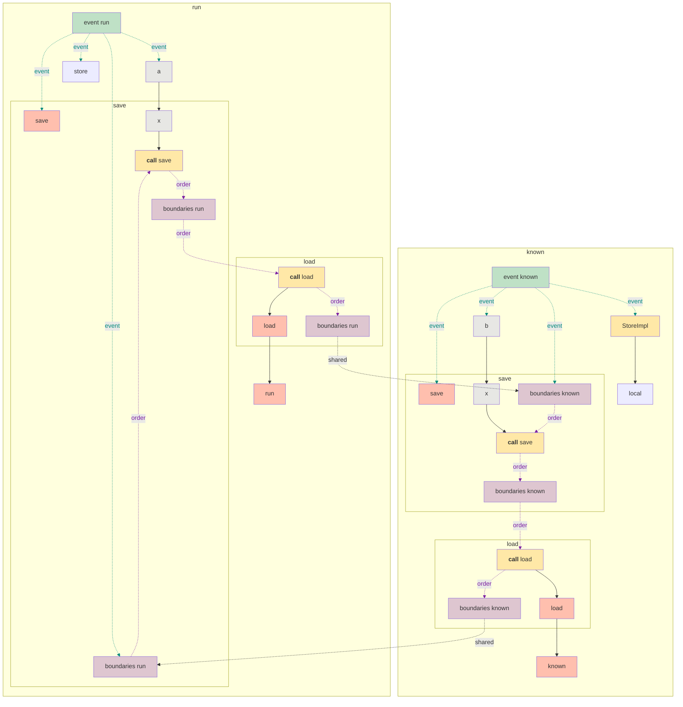

```mermaid
flowchart TD
  subgraph b0["run"]
    n1[event run]:::EVENT
    n2[run]:::RETURN
    n3[a]:::FUNC_PARAM
    n4[store]:::OBJ_VARIABLE
    n1[event run]:::EVENT -. event .-> n3[a]:::FUNC_PARAM
    n1[event run]:::EVENT -. event .-> n4[store]:::OBJ_VARIABLE
    n1[event run]:::EVENT -. event .-> n6[save]:::RETURN
    n1[event run]:::EVENT -. event .-> n8[boundaries run]:::BOUNDARIES
    n3[a]:::FUNC_PARAM --> n7[x]:::FUNC_PARAM
    n10[boundaries run]:::BOUNDARIES -. order .-> n13["`**call** load`"]:::EXTERNAL
    n12[load]:::RETURN --> n2[run]:::RETURN
    subgraph b5["save"]
      n6[save]:::RETURN
      n7[x]:::FUNC_PARAM
      n8[boundaries run]:::BOUNDARIES
      n9["`**call** save`"]:::EXTERNAL
      n10[boundaries run]:::BOUNDARIES
      n7[x]:::FUNC_PARAM --> n9["`**call** save`"]:::EXTERNAL
      n8[boundaries run]:::BOUNDARIES -. order .-> n9["`**call** save`"]:::EXTERNAL
      n9["`**call** save`"]:::EXTERNAL -. order .-> n10[boundaries run]:::BOUNDARIES
    end
    subgraph b11["load"]
      n12[load]:::RETURN
      n13["`**call** load`"]:::EXTERNAL
      n14[boundaries run]:::BOUNDARIES
      n13["`**call** load`"]:::EXTERNAL -. order .-> n14[boundaries run]:::BOUNDARIES
      n13["`**call** load`"]:::EXTERNAL --> n12[load]:::RETURN
    end
  end
  subgraph b15["known"]
    n16[event known]:::EVENT
    n17[known]:::RETURN
    n18[b]:::FUNC_PARAM
    n19[StoreImpl]:::EXTERNAL
    n20[local]:::OBJ_VARIABLE
    n16[event known]:::EVENT -. event .-> n18[b]:::FUNC_PARAM
    n16[event known]:::EVENT -. event .-> n19[StoreImpl]:::EXTERNAL
    n16[event known]:::EVENT -. event .-> n22[save]:::RETURN
    n16[event known]:::EVENT -. event .-> n24[boundaries known]:::BOUNDARIES
    n18[b]:::FUNC_PARAM --> n23[x]:::FUNC_PARAM
    n19[StoreImpl]:::EXTERNAL --> n20[local]:::OBJ_VARIABLE
    n26[boundaries known]:::BOUNDARIES -. order .-> n29["`**call** load`"]:::EXTERNAL
    n28[load]:::RETURN --> n17[known]:::RETURN
    subgraph b21["save"]
      n22[save]:::RETURN
      n23[x]:::FUNC_PARAM
      n24[boundaries known]:::BOUNDARIES
      n25["`**call** save`"]:::EXTERNAL
      n26[boundaries known]:::BOUNDARIES
      n23[x]:::FUNC_PARAM --> n25["`**call** save`"]:::EXTERNAL
      n24[boundaries known]:::BOUNDARIES -. order .-> n25["`**call** save`"]:::EXTERNAL
      n25["`**call** save`"]:::EXTERNAL -. order .-> n26[boundaries known]:::BOUNDARIES
    end
    subgraph b27["load"]
      n28[load]:::RETURN
      n29["`**call** load`"]:::EXTERNAL
      n30[boundaries known]:::BOUNDARIES
      n29["`**call** load`"]:::EXTERNAL -. order .-> n30[boundaries known]:::BOUNDARIES
      n29["`**call** load`"]:::EXTERNAL --> n28[load]:::RETURN
    end
  end
  n14[boundaries run]:::BOUNDARIES -. shared .-> n24[boundaries known]:::BOUNDARIES
  n30[boundaries known]:::BOUNDARIES -. shared .-> n8[boundaries run]:::BOUNDARIES
  linkStyle 0 stroke:#00897b,color:#00897b
  linkStyle 1 stroke:#00897b,color:#00897b
  linkStyle 2 stroke:#00897b,color:#00897b
  linkStyle 3 stroke:#00897b,color:#00897b
  linkStyle 5 stroke:#7b1fa2,color:#7b1fa2
  linkStyle 8 stroke:#7b1fa2,color:#7b1fa2
  linkStyle 9 stroke:#7b1fa2,color:#7b1fa2
  linkStyle 10 stroke:#7b1fa2,color:#7b1fa2
  linkStyle 12 stroke:#00897b,color:#00897b
  linkStyle 13 stroke:#00897b,color:#00897b
  linkStyle 14 stroke:#00897b,color:#00897b
  linkStyle 15 stroke:#00897b,color:#00897b
  linkStyle 18 stroke:#7b1fa2,color:#7b1fa2
  linkStyle 21 stroke:#7b1fa2,color:#7b1fa2
  linkStyle 22 stroke:#7b1fa2,color:#7b1fa2
  linkStyle 23 stroke:#7b1fa2,color:#7b1fa2
  classDef LITERAL fill:#00FF0030
  classDef VARIABLE fill:#80808030
  classDef BIN_OP fill:#80808080
  classDef FUNC_PARAM fill:#8080FF30
  classDef RETURN fill:#FF808080
  classDef EXTERNAL fill:#FFA50040
  classDef UNMODELLED fill:#FF000030,stroke-dasharray: 4 2
  classDef EVENT fill:#00897B40
  classDef BOUNDARIES fill:#7B1FA240
```
