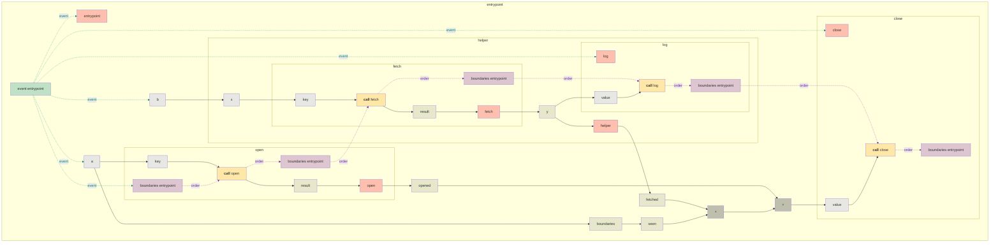

```mermaid
flowchart TD
  subgraph b0["entrypoint"]
    n1[event entrypoint]:::EVENT
    n2[entrypoint]:::RETURN
    n3[a]:::FUNC_PARAM
    n4[b]:::FUNC_PARAM
    n12[opened]:::VARIABLE
    n28[fetched]:::VARIABLE
    n29[boundaries]:::VARIABLE
    n30[seen]:::VARIABLE
    n31[+]:::BIN_OP
    n32[+]:::BIN_OP
    n1[event entrypoint]:::EVENT -. event .-> n2[entrypoint]:::RETURN
    n1[event entrypoint]:::EVENT -. event .-> n3[a]:::FUNC_PARAM
    n1[event entrypoint]:::EVENT -. event .-> n4[b]:::FUNC_PARAM
    n1[event entrypoint]:::EVENT -. event .-> n8[boundaries entrypoint]:::BOUNDARIES
    n1[event entrypoint]:::EVENT -. event .-> n24[log]:::RETURN
    n1[event entrypoint]:::EVENT -. event .-> n34[close]:::RETURN
    n3[a]:::FUNC_PARAM --> n7[key]:::FUNC_PARAM
    n3[a]:::FUNC_PARAM --> n29[boundaries]:::VARIABLE
    n4[b]:::FUNC_PARAM --> n15[x]:::FUNC_PARAM
    n12[opened]:::VARIABLE --> n32[+]:::BIN_OP
    n28[fetched]:::VARIABLE --> n31[+]:::BIN_OP
    n29[boundaries]:::VARIABLE --> n30[seen]:::VARIABLE
    n30[seen]:::VARIABLE --> n31[+]:::BIN_OP
    n31[+]:::BIN_OP --> n32[+]:::BIN_OP
    n32[+]:::BIN_OP --> n35[value]:::FUNC_PARAM
    n6[open]:::RETURN --> n12[opened]:::VARIABLE
    n10[boundaries entrypoint]:::BOUNDARIES -. order .-> n19["`**call** fetch`"]:::EXTERNAL
    n14[helper]:::RETURN --> n28[fetched]:::VARIABLE
    n27[boundaries entrypoint]:::BOUNDARIES -. order .-> n36["`**call** close`"]:::EXTERNAL
    subgraph b5["open"]
      n6[open]:::RETURN
      n7[key]:::FUNC_PARAM
      n8[boundaries entrypoint]:::BOUNDARIES
      n9["`**call** open`"]:::EXTERNAL
      n10[boundaries entrypoint]:::BOUNDARIES
      n11[result]:::VARIABLE
      n7[key]:::FUNC_PARAM --> n9["`**call** open`"]:::EXTERNAL
      n8[boundaries entrypoint]:::BOUNDARIES -. order .-> n9["`**call** open`"]:::EXTERNAL
      n9["`**call** open`"]:::EXTERNAL -. order .-> n10[boundaries entrypoint]:::BOUNDARIES
      n9["`**call** open`"]:::EXTERNAL --> n11[result]:::VARIABLE
      n11[result]:::VARIABLE --> n6[open]:::RETURN
    end
    subgraph b13["helper"]
      n14[helper]:::RETURN
      n15[x]:::FUNC_PARAM
      n22[y]:::VARIABLE
      n15[x]:::FUNC_PARAM --> n18[key]:::FUNC_PARAM
      n22[y]:::VARIABLE --> n25[value]:::FUNC_PARAM
      n22[y]:::VARIABLE --> n14[helper]:::RETURN
      n17[fetch]:::RETURN --> n22[y]:::VARIABLE
      n20[boundaries entrypoint]:::BOUNDARIES -. order .-> n26["`**call** log`"]:::EXTERNAL
      subgraph b16["fetch"]
        n17[fetch]:::RETURN
        n18[key]:::FUNC_PARAM
        n19["`**call** fetch`"]:::EXTERNAL
        n20[boundaries entrypoint]:::BOUNDARIES
        n21[result]:::VARIABLE
        n18[key]:::FUNC_PARAM --> n19["`**call** fetch`"]:::EXTERNAL
        n19["`**call** fetch`"]:::EXTERNAL -. order .-> n20[boundaries entrypoint]:::BOUNDARIES
        n19["`**call** fetch`"]:::EXTERNAL --> n21[result]:::VARIABLE
        n21[result]:::VARIABLE --> n17[fetch]:::RETURN
      end
      subgraph b23["log"]
        n24[log]:::RETURN
        n25[value]:::FUNC_PARAM
        n26["`**call** log`"]:::EXTERNAL
        n27[boundaries entrypoint]:::BOUNDARIES
        n25[value]:::FUNC_PARAM --> n26["`**call** log`"]:::EXTERNAL
        n26["`**call** log`"]:::EXTERNAL -. order .-> n27[boundaries entrypoint]:::BOUNDARIES
      end
    end
    subgraph b33["close"]
      n34[close]:::RETURN
      n35[value]:::FUNC_PARAM
      n36["`**call** close`"]:::EXTERNAL
      n37[boundaries entrypoint]:::BOUNDARIES
      n35[value]:::FUNC_PARAM --> n36["`**call** close`"]:::EXTERNAL
      n36["`**call** close`"]:::EXTERNAL -. order .-> n37[boundaries entrypoint]:::BOUNDARIES
    end
  end
  linkStyle 0 stroke:#00897b,color:#00897b
  linkStyle 1 stroke:#00897b,color:#00897b
  linkStyle 2 stroke:#00897b,color:#00897b
  linkStyle 3 stroke:#00897b,color:#00897b
  linkStyle 4 stroke:#00897b,color:#00897b
  linkStyle 5 stroke:#00897b,color:#00897b
  linkStyle 16 stroke:#7b1fa2,color:#7b1fa2
  linkStyle 18 stroke:#7b1fa2,color:#7b1fa2
  linkStyle 20 stroke:#7b1fa2,color:#7b1fa2
  linkStyle 21 stroke:#7b1fa2,color:#7b1fa2
  linkStyle 28 stroke:#7b1fa2,color:#7b1fa2
  linkStyle 30 stroke:#7b1fa2,color:#7b1fa2
  linkStyle 34 stroke:#7b1fa2,color:#7b1fa2
  linkStyle 36 stroke:#7b1fa2,color:#7b1fa2
  classDef LITERAL fill:#00FF0030
  classDef VARIABLE fill:#80808030
  classDef BIN_OP fill:#80808080
  classDef FUNC_PARAM fill:#8080FF30
  classDef RETURN fill:#FF808080
  classDef EXTERNAL fill:#FFA50040
  classDef UNMODELLED fill:#FF000030,stroke-dasharray: 4 2
  classDef EVENT fill:#00897B40
  classDef BOUNDARIES fill:#7B1FA240
```
