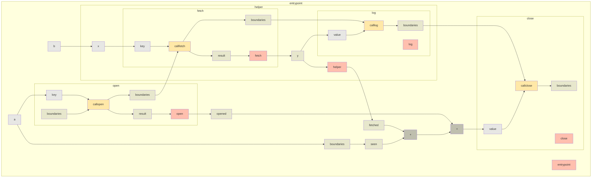

```mermaid
flowchart TD
  subgraph b0["entrypoint"]
    n1[entrypoint]:::RETURN
    n2[a]:::FUNC_PARAM
    n3[b]:::FUNC_PARAM
    n11[opened]:::VARIABLE
    n27[fetched]:::VARIABLE
    n28[boundaries]:::VARIABLE
    n29[seen]:::VARIABLE
    n30[+]:::BIN_OP
    n31[+]:::BIN_OP
    n2[a]:::FUNC_PARAM --> n6[key]:::FUNC_PARAM
    n2[a]:::FUNC_PARAM --> n28[boundaries]:::VARIABLE
    n3[b]:::FUNC_PARAM --> n14[x]:::FUNC_PARAM
    n11[opened]:::VARIABLE --> n31[+]:::BIN_OP
    n27[fetched]:::VARIABLE --> n30[+]:::BIN_OP
    n28[boundaries]:::VARIABLE --> n29[seen]:::VARIABLE
    n29[seen]:::VARIABLE --> n30[+]:::BIN_OP
    n30[+]:::BIN_OP --> n31[+]:::BIN_OP
    n31[+]:::BIN_OP --> n34[value]:::FUNC_PARAM
    n5[open]:::RETURN --> n11[opened]:::VARIABLE
    n9[boundaries]:::VARIABLE --> n18[callfetch]:::EXTERNAL
    n13[helper]:::RETURN --> n27[fetched]:::VARIABLE
    n26[boundaries]:::VARIABLE --> n35[callclose]:::EXTERNAL
    subgraph b4["open"]
      n5[open]:::RETURN
      n6[key]:::FUNC_PARAM
      n7[boundaries]:::VARIABLE
      n8[callopen]:::EXTERNAL
      n9[boundaries]:::VARIABLE
      n10[result]:::VARIABLE
      n6[key]:::FUNC_PARAM --> n8[callopen]:::EXTERNAL
      n7[boundaries]:::VARIABLE --> n8[callopen]:::EXTERNAL
      n8[callopen]:::EXTERNAL --> n9[boundaries]:::VARIABLE
      n8[callopen]:::EXTERNAL --> n10[result]:::VARIABLE
      n10[result]:::VARIABLE --> n5[open]:::RETURN
    end
    subgraph b12["helper"]
      n13[helper]:::RETURN
      n14[x]:::FUNC_PARAM
      n21[y]:::VARIABLE
      n14[x]:::FUNC_PARAM --> n17[key]:::FUNC_PARAM
      n21[y]:::VARIABLE --> n24[value]:::FUNC_PARAM
      n21[y]:::VARIABLE --> n13[helper]:::RETURN
      n16[fetch]:::RETURN --> n21[y]:::VARIABLE
      n19[boundaries]:::VARIABLE --> n25[calllog]:::EXTERNAL
      subgraph b15["fetch"]
        n16[fetch]:::RETURN
        n17[key]:::FUNC_PARAM
        n18[callfetch]:::EXTERNAL
        n19[boundaries]:::VARIABLE
        n20[result]:::VARIABLE
        n17[key]:::FUNC_PARAM --> n18[callfetch]:::EXTERNAL
        n18[callfetch]:::EXTERNAL --> n19[boundaries]:::VARIABLE
        n18[callfetch]:::EXTERNAL --> n20[result]:::VARIABLE
        n20[result]:::VARIABLE --> n16[fetch]:::RETURN
      end
      subgraph b22["log"]
        n23[log]:::RETURN
        n24[value]:::FUNC_PARAM
        n25[calllog]:::EXTERNAL
        n26[boundaries]:::VARIABLE
        n24[value]:::FUNC_PARAM --> n25[calllog]:::EXTERNAL
        n25[calllog]:::EXTERNAL --> n26[boundaries]:::VARIABLE
      end
    end
    subgraph b32["close"]
      n33[close]:::RETURN
      n34[value]:::FUNC_PARAM
      n35[callclose]:::EXTERNAL
      n36[boundaries]:::VARIABLE
      n34[value]:::FUNC_PARAM --> n35[callclose]:::EXTERNAL
      n35[callclose]:::EXTERNAL --> n36[boundaries]:::VARIABLE
    end
  end
  classDef LITERAL fill:#00FF0030
  classDef VARIABLE fill:#80808030
  classDef BIN_OP fill:#80808080
  classDef FUNC_PARAM fill:#8080FF30
  classDef RETURN fill:#FF808080
  classDef EXTERNAL fill:#FFA50040
  classDef UNMODELLED fill:#FF000030,stroke-dasharray: 4 2
```
