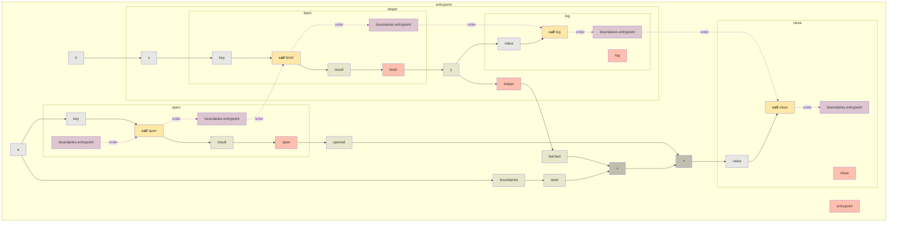

```mermaid
flowchart TD
  subgraph b0["entrypoint"]
    n1[entrypoint]:::RETURN
    n2[a]:::FUNC_PARAM
    n3[b]:::FUNC_PARAM
    n11[opened]:::VARIABLE
    n27[fetched]:::VARIABLE
    n28[boundaries]:::VARIABLE
    n29[seen]:::VARIABLE
    n30[+]:::BIN_OP
    n31[+]:::BIN_OP
    n2[a]:::FUNC_PARAM --> n6[key]:::FUNC_PARAM
    n2[a]:::FUNC_PARAM --> n28[boundaries]:::VARIABLE
    n3[b]:::FUNC_PARAM --> n14[x]:::FUNC_PARAM
    n11[opened]:::VARIABLE --> n31[+]:::BIN_OP
    n27[fetched]:::VARIABLE --> n30[+]:::BIN_OP
    n28[boundaries]:::VARIABLE --> n29[seen]:::VARIABLE
    n29[seen]:::VARIABLE --> n30[+]:::BIN_OP
    n30[+]:::BIN_OP --> n31[+]:::BIN_OP
    n31[+]:::BIN_OP --> n34[value]:::FUNC_PARAM
    n5[open]:::RETURN --> n11[opened]:::VARIABLE
    n9[boundaries entrypoint]:::BOUNDARIES -. order .-> n18["`**call** fetch`"]:::EXTERNAL
    n13[helper]:::RETURN --> n27[fetched]:::VARIABLE
    n26[boundaries entrypoint]:::BOUNDARIES -. order .-> n35["`**call** close`"]:::EXTERNAL
    subgraph b4["open"]
      n5[open]:::RETURN
      n6[key]:::FUNC_PARAM
      n7[boundaries entrypoint]:::BOUNDARIES
      n8["`**call** open`"]:::EXTERNAL
      n9[boundaries entrypoint]:::BOUNDARIES
      n10[result]:::VARIABLE
      n6[key]:::FUNC_PARAM --> n8["`**call** open`"]:::EXTERNAL
      n7[boundaries entrypoint]:::BOUNDARIES -. order .-> n8["`**call** open`"]:::EXTERNAL
      n8["`**call** open`"]:::EXTERNAL -. order .-> n9[boundaries entrypoint]:::BOUNDARIES
      n8["`**call** open`"]:::EXTERNAL --> n10[result]:::VARIABLE
      n10[result]:::VARIABLE --> n5[open]:::RETURN
    end
    subgraph b12["helper"]
      n13[helper]:::RETURN
      n14[x]:::FUNC_PARAM
      n21[y]:::VARIABLE
      n14[x]:::FUNC_PARAM --> n17[key]:::FUNC_PARAM
      n21[y]:::VARIABLE --> n24[value]:::FUNC_PARAM
      n21[y]:::VARIABLE --> n13[helper]:::RETURN
      n16[fetch]:::RETURN --> n21[y]:::VARIABLE
      n19[boundaries entrypoint]:::BOUNDARIES -. order .-> n25["`**call** log`"]:::EXTERNAL
      subgraph b15["fetch"]
        n16[fetch]:::RETURN
        n17[key]:::FUNC_PARAM
        n18["`**call** fetch`"]:::EXTERNAL
        n19[boundaries entrypoint]:::BOUNDARIES
        n20[result]:::VARIABLE
        n17[key]:::FUNC_PARAM --> n18["`**call** fetch`"]:::EXTERNAL
        n18["`**call** fetch`"]:::EXTERNAL -. order .-> n19[boundaries entrypoint]:::BOUNDARIES
        n18["`**call** fetch`"]:::EXTERNAL --> n20[result]:::VARIABLE
        n20[result]:::VARIABLE --> n16[fetch]:::RETURN
      end
      subgraph b22["log"]
        n23[log]:::RETURN
        n24[value]:::FUNC_PARAM
        n25["`**call** log`"]:::EXTERNAL
        n26[boundaries entrypoint]:::BOUNDARIES
        n24[value]:::FUNC_PARAM --> n25["`**call** log`"]:::EXTERNAL
        n25["`**call** log`"]:::EXTERNAL -. order .-> n26[boundaries entrypoint]:::BOUNDARIES
      end
    end
    subgraph b32["close"]
      n33[close]:::RETURN
      n34[value]:::FUNC_PARAM
      n35["`**call** close`"]:::EXTERNAL
      n36[boundaries entrypoint]:::BOUNDARIES
      n34[value]:::FUNC_PARAM --> n35["`**call** close`"]:::EXTERNAL
      n35["`**call** close`"]:::EXTERNAL -. order .-> n36[boundaries entrypoint]:::BOUNDARIES
    end
  end
  linkStyle 10 stroke:#7b1fa2,color:#7b1fa2
  linkStyle 12 stroke:#7b1fa2,color:#7b1fa2
  linkStyle 14 stroke:#7b1fa2,color:#7b1fa2
  linkStyle 15 stroke:#7b1fa2,color:#7b1fa2
  linkStyle 22 stroke:#7b1fa2,color:#7b1fa2
  linkStyle 24 stroke:#7b1fa2,color:#7b1fa2
  linkStyle 28 stroke:#7b1fa2,color:#7b1fa2
  linkStyle 30 stroke:#7b1fa2,color:#7b1fa2
  classDef LITERAL fill:#00FF0030
  classDef VARIABLE fill:#80808030
  classDef BIN_OP fill:#80808080
  classDef FUNC_PARAM fill:#8080FF30
  classDef RETURN fill:#FF808080
  classDef EXTERNAL fill:#FFA50040
  classDef UNMODELLED fill:#FF000030,stroke-dasharray: 4 2
  classDef BOUNDARIES fill:#7B1FA240
```
