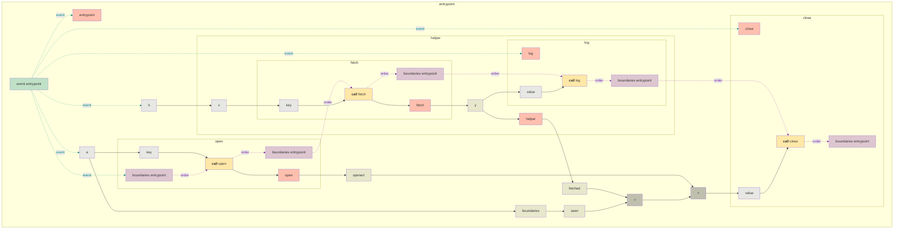

```mermaid
flowchart TD
  subgraph b0["entrypoint"]
    n1[event entrypoint]:::EVENT
    n2[entrypoint]:::RETURN
    n3[a]:::FUNC_PARAM
    n4[b]:::FUNC_PARAM
    n11[opened]:::VARIABLE
    n26[fetched]:::VARIABLE
    n27[boundaries]:::VARIABLE
    n28[seen]:::VARIABLE
    n29[+]:::BIN_OP
    n30[+]:::BIN_OP
    n1[event entrypoint]:::EVENT -. event .-> n2[entrypoint]:::RETURN
    n1[event entrypoint]:::EVENT -. event .-> n3[a]:::FUNC_PARAM
    n1[event entrypoint]:::EVENT -. event .-> n4[b]:::FUNC_PARAM
    n1[event entrypoint]:::EVENT -. event .-> n8[boundaries entrypoint]:::BOUNDARIES
    n1[event entrypoint]:::EVENT -. event .-> n22[log]:::RETURN
    n1[event entrypoint]:::EVENT -. event .-> n32[close]:::RETURN
    n3[a]:::FUNC_PARAM --> n7[key]:::FUNC_PARAM
    n3[a]:::FUNC_PARAM --> n27[boundaries]:::VARIABLE
    n4[b]:::FUNC_PARAM --> n14[x]:::FUNC_PARAM
    n11[opened]:::VARIABLE --> n30[+]:::BIN_OP
    n26[fetched]:::VARIABLE --> n29[+]:::BIN_OP
    n27[boundaries]:::VARIABLE --> n28[seen]:::VARIABLE
    n28[seen]:::VARIABLE --> n29[+]:::BIN_OP
    n29[+]:::BIN_OP --> n30[+]:::BIN_OP
    n30[+]:::BIN_OP --> n33[value]:::FUNC_PARAM
    n6[open]:::RETURN --> n11[opened]:::VARIABLE
    n10[boundaries entrypoint]:::BOUNDARIES -. order .-> n18["`**call** fetch`"]:::EXTERNAL
    n13[helper]:::RETURN --> n26[fetched]:::VARIABLE
    n25[boundaries entrypoint]:::BOUNDARIES -. order .-> n34["`**call** close`"]:::EXTERNAL
    subgraph b5["open"]
      n6[open]:::RETURN
      n7[key]:::FUNC_PARAM
      n8[boundaries entrypoint]:::BOUNDARIES
      n9["`**call** open`"]:::EXTERNAL
      n10[boundaries entrypoint]:::BOUNDARIES
      n7[key]:::FUNC_PARAM --> n9["`**call** open`"]:::EXTERNAL
      n8[boundaries entrypoint]:::BOUNDARIES -. order .-> n9["`**call** open`"]:::EXTERNAL
      n9["`**call** open`"]:::EXTERNAL -. order .-> n10[boundaries entrypoint]:::BOUNDARIES
      n9["`**call** open`"]:::EXTERNAL --> n6[open]:::RETURN
    end
    subgraph b12["helper"]
      n13[helper]:::RETURN
      n14[x]:::FUNC_PARAM
      n20[y]:::VARIABLE
      n14[x]:::FUNC_PARAM --> n17[key]:::FUNC_PARAM
      n20[y]:::VARIABLE --> n23[value]:::FUNC_PARAM
      n20[y]:::VARIABLE --> n13[helper]:::RETURN
      n16[fetch]:::RETURN --> n20[y]:::VARIABLE
      n19[boundaries entrypoint]:::BOUNDARIES -. order .-> n24["`**call** log`"]:::EXTERNAL
      subgraph b15["fetch"]
        n16[fetch]:::RETURN
        n17[key]:::FUNC_PARAM
        n18["`**call** fetch`"]:::EXTERNAL
        n19[boundaries entrypoint]:::BOUNDARIES
        n17[key]:::FUNC_PARAM --> n18["`**call** fetch`"]:::EXTERNAL
        n18["`**call** fetch`"]:::EXTERNAL -. order .-> n19[boundaries entrypoint]:::BOUNDARIES
        n18["`**call** fetch`"]:::EXTERNAL --> n16[fetch]:::RETURN
      end
      subgraph b21["log"]
        n22[log]:::RETURN
        n23[value]:::FUNC_PARAM
        n24["`**call** log`"]:::EXTERNAL
        n25[boundaries entrypoint]:::BOUNDARIES
        n23[value]:::FUNC_PARAM --> n24["`**call** log`"]:::EXTERNAL
        n24["`**call** log`"]:::EXTERNAL -. order .-> n25[boundaries entrypoint]:::BOUNDARIES
      end
    end
    subgraph b31["close"]
      n32[close]:::RETURN
      n33[value]:::FUNC_PARAM
      n34["`**call** close`"]:::EXTERNAL
      n35[boundaries entrypoint]:::BOUNDARIES
      n33[value]:::FUNC_PARAM --> n34["`**call** close`"]:::EXTERNAL
      n34["`**call** close`"]:::EXTERNAL -. order .-> n35[boundaries entrypoint]:::BOUNDARIES
    end
  end
  linkStyle 0 stroke:#00897b,color:#00897b
  linkStyle 1 stroke:#00897b,color:#00897b
  linkStyle 2 stroke:#00897b,color:#00897b
  linkStyle 3 stroke:#00897b,color:#00897b
  linkStyle 4 stroke:#00897b,color:#00897b
  linkStyle 5 stroke:#00897b,color:#00897b
  linkStyle 16 stroke:#7b1fa2,color:#7b1fa2
  linkStyle 18 stroke:#7b1fa2,color:#7b1fa2
  linkStyle 20 stroke:#7b1fa2,color:#7b1fa2
  linkStyle 21 stroke:#7b1fa2,color:#7b1fa2
  linkStyle 27 stroke:#7b1fa2,color:#7b1fa2
  linkStyle 29 stroke:#7b1fa2,color:#7b1fa2
  linkStyle 32 stroke:#7b1fa2,color:#7b1fa2
  linkStyle 34 stroke:#7b1fa2,color:#7b1fa2
  classDef LITERAL fill:#00FF0030
  classDef VARIABLE fill:#80808030
  classDef BIN_OP fill:#80808080
  classDef FUNC_PARAM fill:#8080FF30
  classDef RETURN fill:#FF808080
  classDef EXTERNAL fill:#FFA50040
  classDef UNMODELLED fill:#FF000030,stroke-dasharray: 4 2
  classDef EVENT fill:#00897B40
  classDef BOUNDARIES fill:#7B1FA240
```
