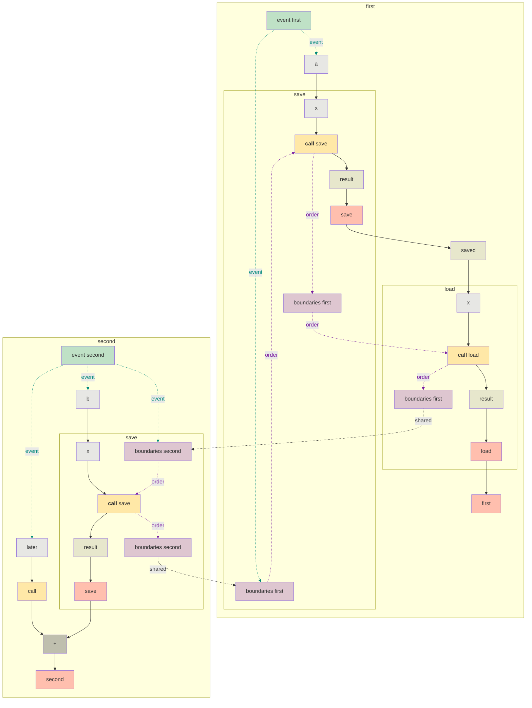

```mermaid
flowchart TD
  subgraph b0["first"]
    n1[event first]:::EVENT
    n2[first]:::RETURN
    n3[a]:::FUNC_PARAM
    n11[saved]:::VARIABLE
    n1[event first]:::EVENT -. event .-> n3[a]:::FUNC_PARAM
    n1[event first]:::EVENT -. event .-> n7[boundaries first]:::BOUNDARIES
    n3[a]:::FUNC_PARAM --> n6[x]:::FUNC_PARAM
    n11[saved]:::VARIABLE --> n14[x]:::FUNC_PARAM
    n5[save]:::RETURN --> n11[saved]:::VARIABLE
    n9[boundaries first]:::BOUNDARIES -. order .-> n15["`**call** load`"]:::EXTERNAL
    n13[load]:::RETURN --> n2[first]:::RETURN
    subgraph b4["save"]
      n5[save]:::RETURN
      n6[x]:::FUNC_PARAM
      n7[boundaries first]:::BOUNDARIES
      n8["`**call** save`"]:::EXTERNAL
      n9[boundaries first]:::BOUNDARIES
      n10[result]:::VARIABLE
      n6[x]:::FUNC_PARAM --> n8["`**call** save`"]:::EXTERNAL
      n7[boundaries first]:::BOUNDARIES -. order .-> n8["`**call** save`"]:::EXTERNAL
      n8["`**call** save`"]:::EXTERNAL -. order .-> n9[boundaries first]:::BOUNDARIES
      n8["`**call** save`"]:::EXTERNAL --> n10[result]:::VARIABLE
      n10[result]:::VARIABLE --> n5[save]:::RETURN
    end
    subgraph b12["load"]
      n13[load]:::RETURN
      n14[x]:::FUNC_PARAM
      n15["`**call** load`"]:::EXTERNAL
      n16[boundaries first]:::BOUNDARIES
      n17[result]:::VARIABLE
      n14[x]:::FUNC_PARAM --> n15["`**call** load`"]:::EXTERNAL
      n15["`**call** load`"]:::EXTERNAL -. order .-> n16[boundaries first]:::BOUNDARIES
      n15["`**call** load`"]:::EXTERNAL --> n17[result]:::VARIABLE
      n17[result]:::VARIABLE --> n13[load]:::RETURN
    end
  end
  subgraph b18["second"]
    n19[event second]:::EVENT
    n20[second]:::RETURN
    n21[b]:::FUNC_PARAM
    n22[later]:::FUNC_PARAM
    n30[call]:::EXTERNAL
    n31[+]:::BIN_OP
    n19[event second]:::EVENT -. event .-> n21[b]:::FUNC_PARAM
    n19[event second]:::EVENT -. event .-> n22[later]:::FUNC_PARAM
    n19[event second]:::EVENT -. event .-> n26[boundaries second]:::BOUNDARIES
    n21[b]:::FUNC_PARAM --> n25[x]:::FUNC_PARAM
    n22[later]:::FUNC_PARAM --> n30[call]:::EXTERNAL
    n30[call]:::EXTERNAL --> n31[+]:::BIN_OP
    n31[+]:::BIN_OP --> n20[second]:::RETURN
    n24[save]:::RETURN --> n31[+]:::BIN_OP
    subgraph b23["save"]
      n24[save]:::RETURN
      n25[x]:::FUNC_PARAM
      n26[boundaries second]:::BOUNDARIES
      n27["`**call** save`"]:::EXTERNAL
      n28[boundaries second]:::BOUNDARIES
      n29[result]:::VARIABLE
      n25[x]:::FUNC_PARAM --> n27["`**call** save`"]:::EXTERNAL
      n26[boundaries second]:::BOUNDARIES -. order .-> n27["`**call** save`"]:::EXTERNAL
      n27["`**call** save`"]:::EXTERNAL -. order .-> n28[boundaries second]:::BOUNDARIES
      n27["`**call** save`"]:::EXTERNAL --> n29[result]:::VARIABLE
      n29[result]:::VARIABLE --> n24[save]:::RETURN
    end
  end
  n16[boundaries first]:::BOUNDARIES -. shared .-> n26[boundaries second]:::BOUNDARIES
  n28[boundaries second]:::BOUNDARIES -. shared .-> n7[boundaries first]:::BOUNDARIES
  linkStyle 0 stroke:#00897b,color:#00897b
  linkStyle 1 stroke:#00897b,color:#00897b
  linkStyle 5 stroke:#7b1fa2,color:#7b1fa2
  linkStyle 8 stroke:#7b1fa2,color:#7b1fa2
  linkStyle 9 stroke:#7b1fa2,color:#7b1fa2
  linkStyle 13 stroke:#7b1fa2,color:#7b1fa2
  linkStyle 16 stroke:#00897b,color:#00897b
  linkStyle 17 stroke:#00897b,color:#00897b
  linkStyle 18 stroke:#00897b,color:#00897b
  linkStyle 25 stroke:#7b1fa2,color:#7b1fa2
  linkStyle 26 stroke:#7b1fa2,color:#7b1fa2
  classDef LITERAL fill:#00FF0030
  classDef VARIABLE fill:#80808030
  classDef BIN_OP fill:#80808080
  classDef FUNC_PARAM fill:#8080FF30
  classDef RETURN fill:#FF808080
  classDef EXTERNAL fill:#FFA50040
  classDef UNMODELLED fill:#FF000030,stroke-dasharray: 4 2
  classDef EVENT fill:#00897B40
  classDef BOUNDARIES fill:#7B1FA240
```
