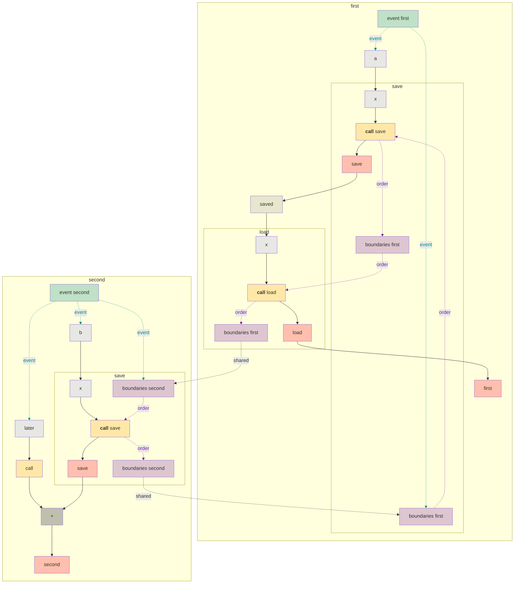

```mermaid
flowchart TD
  subgraph b0["first"]
    n1[event first]:::EVENT
    n2[first]:::RETURN
    n3[a]:::FUNC_PARAM
    n10[saved]:::VARIABLE
    n1[event first]:::EVENT -. event .-> n3[a]:::FUNC_PARAM
    n1[event first]:::EVENT -. event .-> n7[boundaries first]:::BOUNDARIES
    n3[a]:::FUNC_PARAM --> n6[x]:::FUNC_PARAM
    n10[saved]:::VARIABLE --> n13[x]:::FUNC_PARAM
    n5[save]:::RETURN --> n10[saved]:::VARIABLE
    n9[boundaries first]:::BOUNDARIES -. order .-> n14["`**call** load`"]:::EXTERNAL
    n12[load]:::RETURN --> n2[first]:::RETURN
    subgraph b4["save"]
      n5[save]:::RETURN
      n6[x]:::FUNC_PARAM
      n7[boundaries first]:::BOUNDARIES
      n8["`**call** save`"]:::EXTERNAL
      n9[boundaries first]:::BOUNDARIES
      n6[x]:::FUNC_PARAM --> n8["`**call** save`"]:::EXTERNAL
      n7[boundaries first]:::BOUNDARIES -. order .-> n8["`**call** save`"]:::EXTERNAL
      n8["`**call** save`"]:::EXTERNAL -. order .-> n9[boundaries first]:::BOUNDARIES
      n8["`**call** save`"]:::EXTERNAL --> n5[save]:::RETURN
    end
    subgraph b11["load"]
      n12[load]:::RETURN
      n13[x]:::FUNC_PARAM
      n14["`**call** load`"]:::EXTERNAL
      n15[boundaries first]:::BOUNDARIES
      n13[x]:::FUNC_PARAM --> n14["`**call** load`"]:::EXTERNAL
      n14["`**call** load`"]:::EXTERNAL -. order .-> n15[boundaries first]:::BOUNDARIES
      n14["`**call** load`"]:::EXTERNAL --> n12[load]:::RETURN
    end
  end
  subgraph b16["second"]
    n17[event second]:::EVENT
    n18[second]:::RETURN
    n19[b]:::FUNC_PARAM
    n20[later]:::FUNC_PARAM
    n27[call]:::EXTERNAL
    n28[+]:::BIN_OP
    n17[event second]:::EVENT -. event .-> n19[b]:::FUNC_PARAM
    n17[event second]:::EVENT -. event .-> n20[later]:::FUNC_PARAM
    n17[event second]:::EVENT -. event .-> n24[boundaries second]:::BOUNDARIES
    n19[b]:::FUNC_PARAM --> n23[x]:::FUNC_PARAM
    n20[later]:::FUNC_PARAM --> n27[call]:::EXTERNAL
    n27[call]:::EXTERNAL --> n28[+]:::BIN_OP
    n28[+]:::BIN_OP --> n18[second]:::RETURN
    n22[save]:::RETURN --> n28[+]:::BIN_OP
    subgraph b21["save"]
      n22[save]:::RETURN
      n23[x]:::FUNC_PARAM
      n24[boundaries second]:::BOUNDARIES
      n25["`**call** save`"]:::EXTERNAL
      n26[boundaries second]:::BOUNDARIES
      n23[x]:::FUNC_PARAM --> n25["`**call** save`"]:::EXTERNAL
      n24[boundaries second]:::BOUNDARIES -. order .-> n25["`**call** save`"]:::EXTERNAL
      n25["`**call** save`"]:::EXTERNAL -. order .-> n26[boundaries second]:::BOUNDARIES
      n25["`**call** save`"]:::EXTERNAL --> n22[save]:::RETURN
    end
  end
  n15[boundaries first]:::BOUNDARIES -. shared .-> n24[boundaries second]:::BOUNDARIES
  n26[boundaries second]:::BOUNDARIES -. shared .-> n7[boundaries first]:::BOUNDARIES
  linkStyle 0 stroke:#00897b,color:#00897b
  linkStyle 1 stroke:#00897b,color:#00897b
  linkStyle 5 stroke:#7b1fa2,color:#7b1fa2
  linkStyle 8 stroke:#7b1fa2,color:#7b1fa2
  linkStyle 9 stroke:#7b1fa2,color:#7b1fa2
  linkStyle 12 stroke:#7b1fa2,color:#7b1fa2
  linkStyle 14 stroke:#00897b,color:#00897b
  linkStyle 15 stroke:#00897b,color:#00897b
  linkStyle 16 stroke:#00897b,color:#00897b
  linkStyle 23 stroke:#7b1fa2,color:#7b1fa2
  linkStyle 24 stroke:#7b1fa2,color:#7b1fa2
  classDef LITERAL fill:#00FF0030
  classDef VARIABLE fill:#80808030
  classDef BIN_OP fill:#80808080
  classDef FUNC_PARAM fill:#8080FF30
  classDef RETURN fill:#FF808080
  classDef EXTERNAL fill:#FFA50040
  classDef UNMODELLED fill:#FF000030,stroke-dasharray: 4 2
  classDef EVENT fill:#00897B40
  classDef BOUNDARIES fill:#7B1FA240
```
