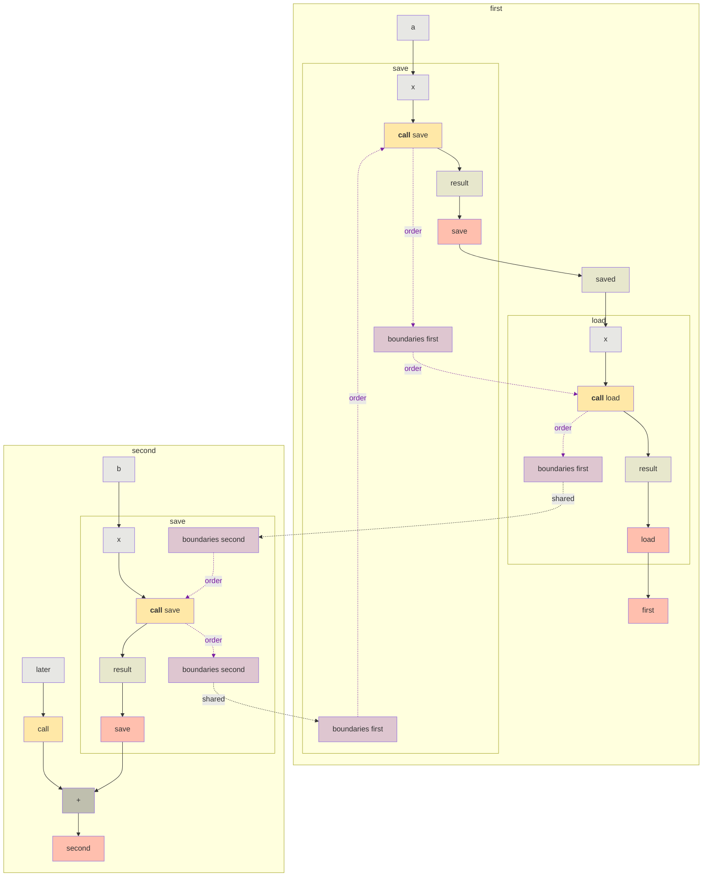

```mermaid
flowchart TD
  subgraph b0["first"]
    n1[first]:::RETURN
    n2[a]:::FUNC_PARAM
    n10[saved]:::VARIABLE
    n2[a]:::FUNC_PARAM --> n5[x]:::FUNC_PARAM
    n10[saved]:::VARIABLE --> n13[x]:::FUNC_PARAM
    n4[save]:::RETURN --> n10[saved]:::VARIABLE
    n8[boundaries first]:::BOUNDARIES -. order .-> n14["`**call** load`"]:::EXTERNAL
    n12[load]:::RETURN --> n1[first]:::RETURN
    subgraph b3["save"]
      n4[save]:::RETURN
      n5[x]:::FUNC_PARAM
      n6[boundaries first]:::BOUNDARIES
      n7["`**call** save`"]:::EXTERNAL
      n8[boundaries first]:::BOUNDARIES
      n9[result]:::VARIABLE
      n5[x]:::FUNC_PARAM --> n7["`**call** save`"]:::EXTERNAL
      n6[boundaries first]:::BOUNDARIES -. order .-> n7["`**call** save`"]:::EXTERNAL
      n7["`**call** save`"]:::EXTERNAL -. order .-> n8[boundaries first]:::BOUNDARIES
      n7["`**call** save`"]:::EXTERNAL --> n9[result]:::VARIABLE
      n9[result]:::VARIABLE --> n4[save]:::RETURN
    end
    subgraph b11["load"]
      n12[load]:::RETURN
      n13[x]:::FUNC_PARAM
      n14["`**call** load`"]:::EXTERNAL
      n15[boundaries first]:::BOUNDARIES
      n16[result]:::VARIABLE
      n13[x]:::FUNC_PARAM --> n14["`**call** load`"]:::EXTERNAL
      n14["`**call** load`"]:::EXTERNAL -. order .-> n15[boundaries first]:::BOUNDARIES
      n14["`**call** load`"]:::EXTERNAL --> n16[result]:::VARIABLE
      n16[result]:::VARIABLE --> n12[load]:::RETURN
    end
  end
  subgraph b17["second"]
    n18[second]:::RETURN
    n19[b]:::FUNC_PARAM
    n20[later]:::FUNC_PARAM
    n28[call]:::EXTERNAL
    n29[+]:::BIN_OP
    n19[b]:::FUNC_PARAM --> n23[x]:::FUNC_PARAM
    n20[later]:::FUNC_PARAM --> n28[call]:::EXTERNAL
    n28[call]:::EXTERNAL --> n29[+]:::BIN_OP
    n29[+]:::BIN_OP --> n18[second]:::RETURN
    n22[save]:::RETURN --> n29[+]:::BIN_OP
    subgraph b21["save"]
      n22[save]:::RETURN
      n23[x]:::FUNC_PARAM
      n24[boundaries second]:::BOUNDARIES
      n25["`**call** save`"]:::EXTERNAL
      n26[boundaries second]:::BOUNDARIES
      n27[result]:::VARIABLE
      n23[x]:::FUNC_PARAM --> n25["`**call** save`"]:::EXTERNAL
      n24[boundaries second]:::BOUNDARIES -. order .-> n25["`**call** save`"]:::EXTERNAL
      n25["`**call** save`"]:::EXTERNAL -. order .-> n26[boundaries second]:::BOUNDARIES
      n25["`**call** save`"]:::EXTERNAL --> n27[result]:::VARIABLE
      n27[result]:::VARIABLE --> n22[save]:::RETURN
    end
  end
  n15[boundaries first]:::BOUNDARIES -. shared .-> n24[boundaries second]:::BOUNDARIES
  n26[boundaries second]:::BOUNDARIES -. shared .-> n6[boundaries first]:::BOUNDARIES
  linkStyle 3 stroke:#7b1fa2,color:#7b1fa2
  linkStyle 6 stroke:#7b1fa2,color:#7b1fa2
  linkStyle 7 stroke:#7b1fa2,color:#7b1fa2
  linkStyle 11 stroke:#7b1fa2,color:#7b1fa2
  linkStyle 20 stroke:#7b1fa2,color:#7b1fa2
  linkStyle 21 stroke:#7b1fa2,color:#7b1fa2
  classDef LITERAL fill:#00FF0030
  classDef VARIABLE fill:#80808030
  classDef BIN_OP fill:#80808080
  classDef FUNC_PARAM fill:#8080FF30
  classDef RETURN fill:#FF808080
  classDef EXTERNAL fill:#FFA50040
  classDef UNMODELLED fill:#FF000030,stroke-dasharray: 4 2
  classDef BOUNDARIES fill:#7B1FA240
```
