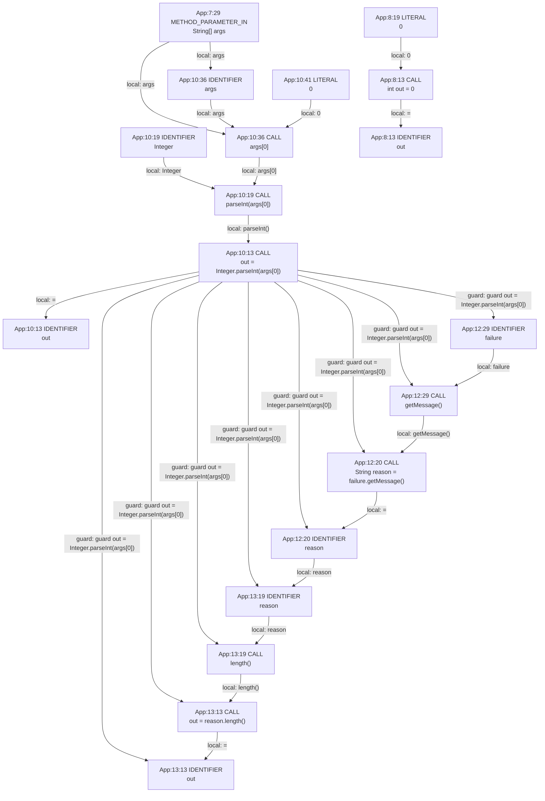

# catchParameter: spike value graph

```mermaid
flowchart TD
  n0["App:10:13 CALL<br/>out = Integer.parseInt(args[0])"]
  n1["App:10:13 IDENTIFIER<br/>out"]
  n2["App:10:19 CALL<br/>parseInt(args[0])"]
  n3["App:10:19 IDENTIFIER<br/>Integer"]
  n4["App:10:36 CALL<br/>args[0]"]
  n5["App:10:36 IDENTIFIER<br/>args"]
  n6["App:10:41 LITERAL<br/>0"]
  n7["App:12:20 CALL<br/>String reason = failure.getMessage()"]
  n8["App:12:20 IDENTIFIER<br/>reason"]
  n9["App:12:29 CALL<br/>getMessage()"]
  n10["App:12:29 IDENTIFIER<br/>failure"]
  n11["App:13:13 CALL<br/>out = reason.length()"]
  n12["App:13:13 IDENTIFIER<br/>out"]
  n13["App:13:19 CALL<br/>length()"]
  n14["App:13:19 IDENTIFIER<br/>reason"]
  n15["App:7:29 METHOD_PARAMETER_IN<br/>String[] args"]
  n16["App:8:13 CALL<br/>int out = 0"]
  n17["App:8:13 IDENTIFIER<br/>out"]
  n18["App:8:19 LITERAL<br/>0"]
  n0 -->|"guard: guard out = Integer.parseInt(args[0])"| n10
  n0 -->|"guard: guard out = Integer.parseInt(args[0])"| n11
  n0 -->|"guard: guard out = Integer.parseInt(args[0])"| n12
  n0 -->|"guard: guard out = Integer.parseInt(args[0])"| n13
  n0 -->|"guard: guard out = Integer.parseInt(args[0])"| n14
  n0 -->|"guard: guard out = Integer.parseInt(args[0])"| n7
  n0 -->|"guard: guard out = Integer.parseInt(args[0])"| n8
  n0 -->|"guard: guard out = Integer.parseInt(args[0])"| n9
  n0 -->|"local: ="| n1
  n10 -->|"local: failure"| n9
  n11 -->|"local: ="| n12
  n13 -->|"local: length()"| n11
  n14 -->|"local: reason"| n13
  n15 -->|"local: args"| n4
  n15 -->|"local: args"| n5
  n16 -->|"local: ="| n17
  n18 -->|"local: 0"| n16
  n2 -->|"local: parseInt()"| n0
  n3 -->|"local: Integer"| n2
  n4 -->|"local: args[0]"| n2
  n5 -->|"local: args"| n4
  n6 -->|"local: 0"| n4
  n7 -->|"local: ="| n8
  n8 -->|"local: reason"| n14
  n9 -->|"local: getMessage()"| n7
```
