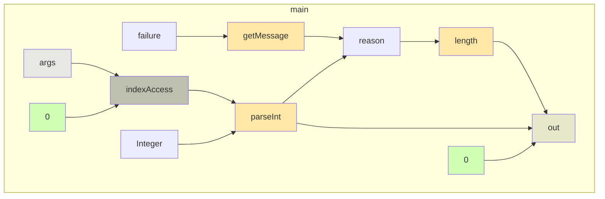

# catchParameter: spike value graph (condensed)

```mermaid
flowchart TD
  subgraph m0["main"]
    n0["indexAccess"]:::BIN_OP
    n1["getMessage"]:::EXTERNAL
    n2["length"]:::EXTERNAL
    n3["parseInt"]:::EXTERNAL
    n4["args"]:::FUNC_PARAM
    n5["0"]:::LITERAL
    n6["0"]:::LITERAL
    n7["Integer"]:::OBJ_VARIABLE
    n8["failure"]:::OBJ_VARIABLE
    n9["out"]:::VARIABLE
    n10["reason"]:::OBJ_VARIABLE
  end
  n0 --> n3
  n1 --> n10
  n10 --> n2
  n2 --> n9
  n3 --> n10
  n3 --> n9
  n4 --> n0
  n5 --> n0
  n6 --> n9
  n7 --> n3
  n8 --> n1
  classDef LITERAL fill:#00FF0030
  classDef VARIABLE fill:#80808030
  classDef BIN_OP fill:#80808080
  classDef FUNC_PARAM fill:#8080FF30
  classDef RETURN fill:#FF808080
  classDef EXTERNAL fill:#FFA50040
  classDef UNMODELLED fill:#FF000030,stroke-dasharray: 4 2
```
