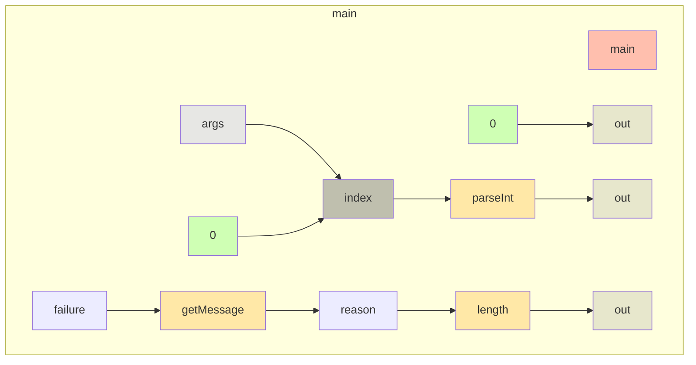

```mermaid
flowchart TD
  subgraph b0["main"]
    n1[main]:::RETURN
    n2[args]:::FUNC_PARAM
    n3[out]:::VARIABLE
    n4[0]:::LITERAL
    n5[out]:::VARIABLE
    n6[0]:::LITERAL
    n7[index]:::BIN_OP
    n8[parseInt]:::EXTERNAL
    n9[failure]:::OBJ_VARIABLE
    n10[reason]:::OBJ_VARIABLE
    n11[getMessage]:::EXTERNAL
    n12[out]:::VARIABLE
    n13[length]:::EXTERNAL
    n2[args]:::FUNC_PARAM --> n7[index]:::BIN_OP
    n4[0]:::LITERAL --> n3[out]:::VARIABLE
    n6[0]:::LITERAL --> n7[index]:::BIN_OP
    n7[index]:::BIN_OP --> n8[parseInt]:::EXTERNAL
    n8[parseInt]:::EXTERNAL --> n5[out]:::VARIABLE
    n9[failure]:::OBJ_VARIABLE --> n11[getMessage]:::EXTERNAL
    n10[reason]:::OBJ_VARIABLE --> n13[length]:::EXTERNAL
    n11[getMessage]:::EXTERNAL --> n10[reason]:::OBJ_VARIABLE
    n13[length]:::EXTERNAL --> n12[out]:::VARIABLE
  end
  classDef LITERAL fill:#00FF0030
  classDef VARIABLE fill:#80808030
  classDef BIN_OP fill:#80808080
  classDef FUNC_PARAM fill:#8080FF30
  classDef RETURN fill:#FF808080
  classDef EXTERNAL fill:#FFA50040
```
